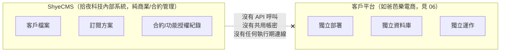

# 01 - ShyeCMS 定位與邊界 (Scope Boundary)

## 異動紀錄
| 版本 | 日期 | 作者 | 說明 |
|---|---|---|---|
| v0.1 | 2026-09-08 | ordinarycas | 初版建立，規劃 ShyeCMS 與客戶部署之間的功能開關查詢/用量拉取連線（決策 C：fail-open+快取） |
| v0.2 | 2026-09-08 | ordinarycas | **使用者推翻 v0.1 設計**：確認 ShyeCMS 不與任何客戶平台連接。整份文件改寫，原本的架構圖、控制平面/資料平面劃分、功能開關查詢流程、用量彙總拉取流程全數移除，改為說明「零連接」的邊界與其後果 |
| v0.3 | 2026-09-08 | ordinarycas | 關係圖改用 Mermaid 繪製 |
| v0.4 | 2026-09-08 | ordinarycas | §3 具體定義功能開關落地的實際存放位置與命名慣例（先前只有原則性的一句話，[06-ecommerce-platform-architecture.md](06-ecommerce-platform-architecture.md) §9 同步更新），解決 [10-gap-analysis.md](10-gap-analysis.md) §13 已列的「文件互相引用但沒有一處真正說清楚」的缺口 |

## 1. 為什麼原本的設計被推翻

v0.1 版本規劃「客戶部署的 Open API Gateway 定期向 ShyeCMS 查詢功能開關狀態」「ShyeCMS 定期向客戶部署拉取用量彙總數據」，等於在白牌模式裡新增了一條所有客戶站台都必須連回拾夜科技中央系統的執行期依賴。

使用者第二輪明確給出更簡單、風險更低的方向：**ShyeCMS 就是一套獨立賣給廠商的系統**，本質上等同一般軟體公司的內部 CRM／訂閱管理系統——賣出去之後，不會因為賣了這套系統，就要求客戶的平台反過來跟它連線、或把客戶的營運資料回傳給它。這個決策直接排除了 v0.1 版本的技術複雜度（fail-open 設計、內部服務憑證、輪詢頻率等），也完全避開了個資與資料主權的疑慮。

## 2. 現在的關係圖

ShyeCMS 與任何客戶部署之間：
- 沒有網路連線需求（ShyeCMS 甚至可以跟客戶環境部署在完全不同、互不相通的網路）
- 沒有共用的認證機制、沒有內部服務憑證
- 客戶平台的程式碼裡**不存在**任何呼叫 ShyeCMS 的邏輯

## 3. 「功能授權」在沒有連接的前提下如何運作

ShyeCMS 裡的 `ClientFeatureEntitlement`（見 [02-data-model.md](02-data-model.md)）記錄的是「這個客戶的合約內含哪些功能」——這**只是一筆商業紀錄**，性質等同合約書的條款清單，用途是：
- 業務/財務對照客戶付的錢，合約應該包含哪些功能/方案
- 客服/維運人員在部署或調整客戶環境時，知道「這個客戶該開哪些功能」

**實際落地方式**：維運人員在幫客戶開通或調整環境時，依 ShyeCMS 裡記錄的合約內容，**手動修改該客戶環境自己的設定檔/環境變數**。這個過程是人工的，ShyeCMS 不會、也不能自動把設定推送到客戶環境。

**具體存放位置與格式**：這些屬於「合約層級的功能開關」（決定某功能在這個客戶部署裡整個開不開放，不是賣家自己的營運選項——後者是 [08-vendor-admin-requirements.md](08-vendor-admin-requirements.md) §2 的 `StoreSettings`，兩者是不同層級，見該文件的說明），統一以環境變數存放在 `ecommerce-deploy-<客戶代稱>` repo（見 [26-project-structure.md](26-project-structure.md) §3.4）的 `.env` 檔案裡，命名慣例 `FEATUREFLAGS__<FlagName>`（雙底線對應 ASP.NET Core `IConfiguration` 的階層式綁定，如 `FEATUREFLAGS__COUPONMODULE=true`），透過 `docker-compose.yml` 的 `env_file` 注入到需要判斷該開關的服務容器。**不放在各服務自己的 `appsettings.{Environment}.json`**——那個檔案隨原始碼一起 commit 進 `ecommerce-services` repo，若把客戶差異寫在裡面，等於要為每個客戶各自建置不同的映像檔，牴觸「同一份映像檔靠環境變數部署到任何客戶」的既有原則（比照 [06](06-ecommerce-platform-architecture.md) §5 Next.js Route Handler 對 API 位址的處理方式，同一套邏輯用在功能開關上）。`.env` 本身依 [26](26-project-structure.md) §3.4 既有慣例不進版控。

## 4. 這個決策放棄了什麼（誠實記錄取捨）

- **技術層面的授權強制**：客戶部署後，理論上維運人員或客戶自己都可以修改設定檔，不受 ShyeCMS 任何檢查。防止「超用/盜用」目前完全依賴合約與人工稽核，不是技術手段——License / 授權驗證機制**依然是未解決的缺口**，本輪明確選擇不用技術手段解決它。
- **用量計費的資料來源**：GMV 超額抽成需要用量數據作依據，但 ShyeCMS 不取得客戶資料，代表這個計費子系統的資料從何而來**仍是完全空白**，需要另外設計（例如客戶自行申報、或財務人員定期人工詢問），不在本輪範圍。

這些取捨是使用者在「降低複雜度與資料風險」與「技術強制力」之間做出的明確選擇，不是遺漏。

## 5. 待決議事項
- [ ] 若未來出現實際的濫用/超用糾紛，要靠什麼機制舉證（合約條款？人工稽核頻率？）
- [ ] GMV 計費若要恢復可行性，需要客戶方同意的資料申報機制設計（不透過 ShyeCMS 直接連線取得）
