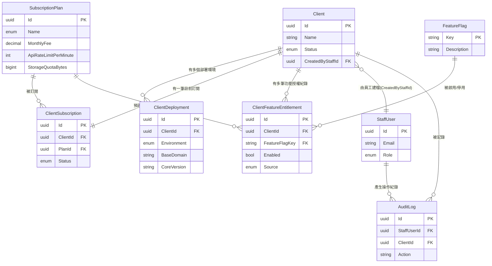

# 02 - ShyeCMS 資料模型 (Data Model)

## 異動紀錄
| 版本 | 日期 | 作者 | 說明 |
|---|---|---|---|
| v0.1 | 2026-09-08 | ordinarycas | 初版建立 |
| v0.2 | 2026-09-08 | ordinarycas | 因應決策 C、D 推翻：`ClientDeployment` 移除連線用欄位（`GatewayEndpoint`/`InternalServiceCredentialRef`），改純盤點用途；`ClientFeatureEntitlement` 註記為商業紀錄非技術強制；移除 §5 `UsageSnapshot`（ShyeCMS 不取得客戶用量資料） |
| v0.3 | 2026-09-08 | ordinarycas | 新增 §0 ERD（Mermaid），彙整本文件所有實體關聯 |
| v0.4 | 2026-09-10 | ordinarycas | §6 `PastDue` SOP 待決議項已解決：定案採分階段處理流程（提醒信→人工聯繫→視情況暫停功能→轉終止評估）；GMV 抽成計算依據維持開放，標記為需要業主決策，回應「將待決議事項列出來實作」需求 |

> 本文件列出 ShyeCMS 自己的資料庫實體，與 v1（`docs/02-data-model.md`）的客戶端資料庫**完全分開、互不共用**——ShyeCMS 只儲存「關於客戶的管理資訊」，不儲存客戶自己的商品/訂單/會員資料。型別為建議型別。

## 0. ERD

## 1. 客戶與員工

### Client（客戶檔案）
| 欄位 | 型別 | 說明 |
|---|---|---|
| Id | uuid | 主鍵 |
| Name | string | 客戶名稱，如「爸芭樂」 |
| ContactName / ContactEmail / ContactPhone | string | 業務聯絡窗口 |
| Status | enum | Prospect（洽談中）/ Active（營運中）/ Suspended（暫停）/ Terminated（終止合作） |
| CreatedByStaffId | uuid | FK → StaffUser，建檔的拾夜科技員工 |
| CreatedAt / UpdatedAt | timestamp | |

> 決策 B：`Client` 沒有對應的登入帳號欄位——客戶本身不是 ShyeCMS 的使用者，一律由拾夜科技員工建立與維護此筆記錄。

### StaffUser（拾夜科技內部操作人員）
| 欄位 | 型別 | 說明 |
|---|---|---|
| Id | uuid | |
| Email | string | 內部登入帳號 |
| Role | enum | SalesOps（業務/開通）/ SupportOps（客服/維運）/ Finance（財務/計費）/ SuperAdmin |
| Status | enum | Active / Disabled |

### AuditLog（ShyeCMS 操作稽核）
| 欄位 | 型別 | 說明 |
|---|---|---|
| Id | uuid | |
| StaffUserId | uuid | 操作者 |
| ClientId | uuid, nullable | 被操作的客戶（若適用） |
| Action | string | 如 `Client.StatusChanged`、`FeatureEntitlement.Updated` |
| DetailJson | jsonb | 變更前後值 |
| CreatedAt | timestamp | |

> 這裡稽核的是拾夜科技員工在 ShyeCMS 的操作，非客戶站台管理員的操作（客戶站台自己的稽核紀錄設計見 [08-vendor-admin-requirements.md](08-vendor-admin-requirements.md) §4.4）。

## 2. 部署清冊

### ClientDeployment（客戶部署環境——純內部盤點紀錄，非連線端點）
| 欄位 | 型別 | 說明 |
|---|---|---|
| Id | uuid | |
| ClientId | uuid | FK → Client |
| Environment | enum | Dev / Staging / Production |
| BaseDomain | string | 客戶站台網域，供拾夜科技內部掌握現況（如客服查詢時知道要看哪個網址），**不做為任何連線目標** |
| CoreVersion | string | 目前執行的核心版本號，供內部盤點客戶部署現況用 |
| DeployedAt / LastCheckedInByStaffAt | timestamp | 後者為人工巡檢/最後一次聯繫客戶確認現況的時間，非自動化健康檢查 |

> v0.2 移除 `GatewayEndpoint`、`InternalServiceCredentialRef` 兩個欄位——這兩者是 v0.1 為了讓 ShyeCMS 連線客戶 Gateway 而設計，決策 C 推翻連線設計後已無存在意義，見 [01-architecture.md](01-architecture.md)。

## 3. 訂閱與計費

### SubscriptionPlan（訂閱方案定義，跨客戶共用的方案樣板）
| 欄位 | 型別 | 說明 |
|---|---|---|
| Id | uuid | |
| Name | enum | 入門版 / 成長版 / 企業版分級方案 |
| MonthlyFee | decimal, nullable | 企業版為 null（客製報價） |
| IncludedGmvPerMonth | decimal | 涵蓋 GMV 額度 |
| OverageGmvRatePercent | decimal | 超額 GMV 抽成費率 |
| ApiRateLimitPerMinute | int | 對應既有 `ApiKey.RateLimitPerMinute` 欄位（見 `docs/09` §9.1） |
| StorageQuotaBytes | bigint | 對應既有 `VendorStorageQuota` 欄位 |
| DefaultFeatureFlagKeys | string[] | 此方案預設啟用的功能清單 |

### ClientSubscription（客戶目前的訂閱狀態）
| 欄位 | 型別 | 說明 |
|---|---|---|
| Id | uuid | |
| ClientId | uuid | FK → Client |
| PlanId | uuid | FK → SubscriptionPlan |
| StartAt / RenewalAt | timestamp | |
| Status | enum | Active / PastDue / Cancelled |

## 4. 功能開關

### FeatureFlag（功能定義，全平台共用的功能清單）
| 欄位 | 型別 | 說明 |
|---|---|---|
| Key | string | 主鍵，如 `storefront.enabled`、`checkout.enabled`、`vendor.analytics.enabled`、`openapi.gateway.enabled` |
| Description | string | |

### ClientFeatureEntitlement（客戶合約內含的功能——商業紀錄，非技術強制）
| 欄位 | 型別 | 說明 |
|---|---|---|
| Id | uuid | |
| ClientId | uuid | FK → Client |
| FeatureFlagKey | string | FK → FeatureFlag |
| Enabled | bool | |
| Source | enum | FromPlan（繼承自訂閱方案預設值）/ Override（拾夜科技員工個別調整） |
| UpdatedByStaffId | uuid | |
| UpdatedAt | timestamp | |

> 建立客戶訂閱時，依 `SubscriptionPlan.DefaultFeatureFlagKeys` 產生一組 `Source=FromPlan` 的預設記錄；員工可個別覆寫為 `Source=Override`。**此表純粹是 ShyeCMS 內部的合約紀錄**，不會被推送、同步或查詢到客戶平台——客戶環境實際要開通哪些功能，由維運人員依這份紀錄手動設定客戶自己的環境設定檔，見 [01-architecture.md](01-architecture.md) §3。

## 5. 與 v1 既有欄位的對照

| v1 既有欄位/表 | v2 對應 | 說明 |
|---|---|---|
| `ApiKey.RateLimitPerMinute`（docs/09 §9.1） | `SubscriptionPlan.ApiRateLimitPerMinute` | v2 只是把方案層級的預設值記錄下來供合約對照，實際限流設定仍由維運人員手動配置到客戶部署的 Open API Gateway，兩邊沒有自動同步 |
| `VendorStorageQuota`（docs/09 §9.1） | `SubscriptionPlan.StorageQuotaBytes` | 同上，僅為合約紀錄，實際配額仍在客戶部署內手動設定 |

## 6. 待決議事項
- [x] ~~`ClientSubscription.Status = PastDue` 時，ShyeCMS 只能記錄該狀態並提醒業務/客服人員手動處理——是否需要一套標準作業流程（SOP）而非個案處理~~——**已解決：需要，定案採業界常見的分階段 SOP**（沿用一般 SaaS 逾期收款慣例，非本平台獨創，正式上線前建議業主/財務確認實際天數）：
  1. 逾期第 1 天：`Status` 自動轉 `PastDue`，系統寄出提醒信給客戶帳單聯絡人（沿用一般帳單提醒慣例）。
  2. 逾期第 7 天：業務/客服人員人工聯繫客戶（電話/Email 雙軌），ShyeCMS 記錄一筆聯繫紀錄（`AuditLog`）。
  3. 逾期第 14 天仍未處理：業務主管決定是否請維運人員暫停該客戶站台功能（`ClientFeatureEntitlement` 手動關閉，比照既有的功能開通流程，人工操作，非自動化）。
  4. 逾期第 30 天：轉客戶終止合作流程評估（見 [03-client-lifecycle.md](03-client-lifecycle.md) §6）。
  
  ShyeCMS 本身只需要能記錄每個階段的處理狀態與時間點（`AuditLog` 已有的機制即可涵蓋），不需要新增自動化排程執行前兩階段以外的動作——第 3、4 階段刻意保留人工判斷空間，避免自動停用正在跟客戶協商中的帳號。
- [ ] **需要業主決策（非技術判斷）**：GMV 超額抽成的計算依據完全空白（決策 D 排除了拉取客戶用量資料的路徑）——這是具體的抽成比例/計費模式，屬於商業模式本身，與 [01-architecture.md](01-architecture.md) §5「GMV 計費資料申報機制」是同一組待決議的兩面（一個問「怎麼拿到數字」、一個問「拿到數字後怎麼算錢」），建議業主一併決策，不在本表範圍內單方面回答
