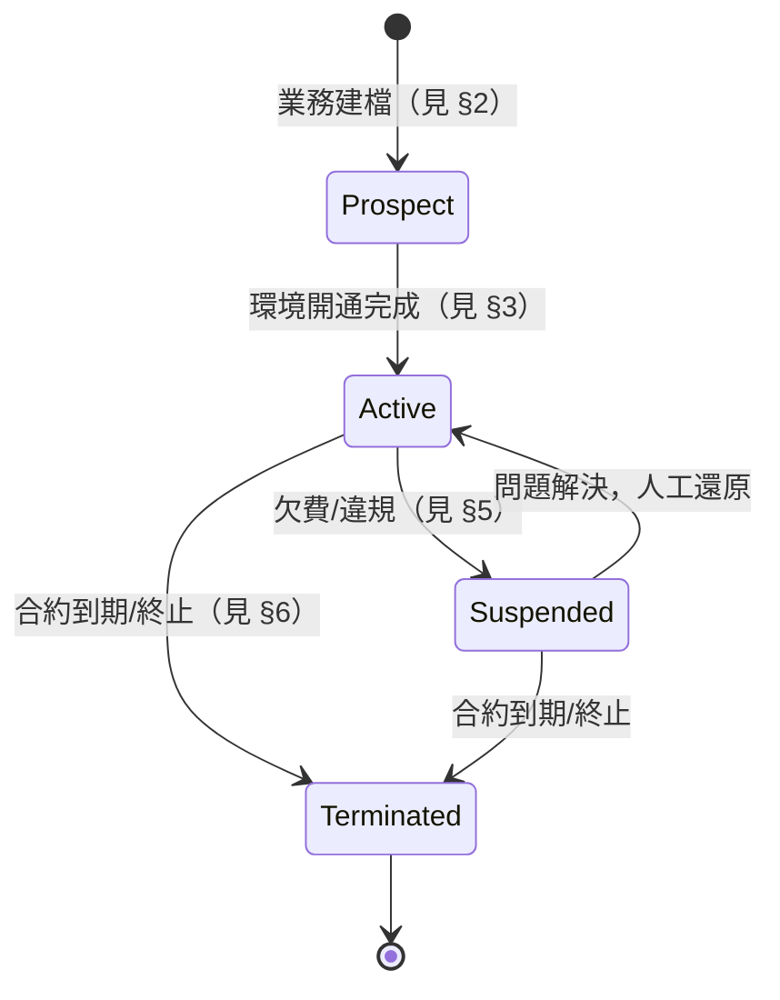

# 03 - 客戶生命週期與維運流程 (Client Lifecycle)

## 異動紀錄
| 版本 | 日期 | 作者 | 說明 |
|---|---|---|---|
| v0.1 | 2026-09-08 | ordinarycas | 初版建立 |
| v0.2 | 2026-09-08 | ordinarycas | 因應決策 C（ShyeCMS 不連接客戶平台）移除 §3 建立內部服務憑證/Entitlement 供 Gateway 查詢的步驟，改為純人工設定說明 |
| v0.3 | 2026-09-08 | ordinarycas | §1 生命週期總覽改用 Mermaid 狀態圖繪製 |

> 本文件描述拾夜科技員工在 ShyeCMS 上，從一個客戶（如「爸芭樂」）洽談到終止合作的完整操作流程。全程由拾夜科技員工在 ShyeCMS 執行——依決策 B，客戶本身不操作此系統。

## 1. 生命週期總覽

對應 [02-data-model.md](02-data-model.md) 的 `Client.Status`。

## 2. 階段一：建檔（Prospect）

1. 業務（SalesOps）與客戶談定合作後，在 ShyeCMS 建立一筆 `Client` 記錄（名稱、聯絡窗口）。
2. 選擇 `SubscriptionPlan`（入門/成長/企業），建立對應的 `ClientSubscription`（`Status=Active`，但此時客戶部署尚未存在）。
3. 此階段**不建立** `ClientDeployment` 記錄——要等實際開通環境後才建立。

## 3. 階段二：開通部署（Provisioning）

依「新客戶上線 SOP」（環境建置 → 資料庫初始化 → 品牌/主題設定 → 金流物流串接測試 → 教育訓練 → 正式上線），**本輪 ShyeCMS 不做自動化開通**（不含 IaC 自動建環境的腳本觸發），而是：

1. 維運人員依既有 SOP 人工/半自動建立客戶的實際部署環境（見 [06-ecommerce-platform-architecture.md](06-ecommerce-platform-architecture.md) 的獨立微服務電商平台）。
2. 依 `ClientSubscription.PlanId` 對應的 `SubscriptionPlan.DefaultFeatureFlagKeys`，在 ShyeCMS 批次產生該客戶的 `ClientFeatureEntitlement` 商業紀錄（`Source=FromPlan`）——這一步**只更新 ShyeCMS 自己的資料庫**，不會、也無法推送到客戶環境。
3. 維運人員依第 2 步的紀錄，**手動**設定客戶環境自己的功能開關設定檔/環境變數（見 [01-architecture.md](01-architecture.md) §3），完成後才代表功能實際生效。
4. 環境就緒後，在 ShyeCMS 建立對應的 `ClientDeployment` 記錄（網域、核心版本號）供內部盤點——純紀錄用途，非連線設定。
5. `Client.Status` 由 `Prospect` 轉為 `Active`。

> 自動化 Provisioning（腳本一鍵建環境）不在本輪範圍，列入 [05-scope-and-open-items.md](05-scope-and-open-items.md)。第 2、3 步之間存在人工落差（ShyeCMS 紀錄與客戶環境實際設定可能不同步），這是決策 C（不連接）的已知取捨，見 [01-architecture.md](01-architecture.md) §4。

## 4. 階段三：營運中（Active）

- **功能調整**：客戶升級/降級方案，或個別功能需求（如臨時關閉某功能進行維護），由 SupportOps 在 ShyeCMS 調整 `ClientFeatureEntitlement`（`Source=Override`）——這只更新 ShyeCMS 的紀錄，**還需要維運人員額外手動到客戶環境調整設定檔才會實際生效**，兩個動作沒有自動連動（見 [01-architecture.md](01-architecture.md) §3）。
- **用量/超額判斷**：因決策 D（不取得客戶資料），ShyeCMS **沒有**客戶用量數據可看；是否超額、是否該建議升級方案，需 SalesOps 另行向客戶詢問或由客戶自行申報，非本輪範圍。
- **續約**：`ClientSubscription.RenewalAt` 到期前提醒；續約失敗（逾期未繳）則 `ClientSubscription.Status = PastDue`，是否連動調整功能紀錄列為待決議（見 [02-data-model.md](02-data-model.md) §6）。
- **SLA 對應**：客戶回報問題的嚴重度分級與回應時間另訂 SLA 表，不在 ShyeCMS 重複定義（ShyeCMS 不是工單系統）。

## 5. 階段四：暫停（Suspended）

- 適用情境：客戶欠費、違反使用條款、或客戶主動要求暫停營運但保留資料。
- 操作：`Client.Status = Suspended`；建議連動將所有 `ClientFeatureEntitlement.Enabled` 批次設為 `false`（等同全站功能關閉，但**部署環境與資料庫不刪除**）。
- 可恢復：清償/問題解決後，人工將狀態改回 `Active` 並還原功能開關。

## 6. 階段五：終止合作（Terminated）

- 操作：`Client.Status = Terminated`。
- **本輪僅記錄狀態變更**，實際的環境下線、備份保留與刪除流程**不在本輪規劃範圍內**，需要另外制定政策（涉及個資法下的資料保留義務與客戶合約條款，終止合作是整個客戶環境層級，規模與複雜度需要獨立規格）。**商品資料的交還已有部分解法**：客戶可在終止前透過賣家後台的 WooCommerce CSV 匯出功能（[08-vendor-admin-requirements.md](08-vendor-admin-requirements.md) §6）自行取得商品資料，會員/訂單資料的交還仍未解決。

## 7. 待決議事項
- [ ] 開通部署（Provisioning）是否要自動化，或維持人工 SOP + ShyeCMS 僅作記錄
- [ ] `Suspended` 狀態下客戶站台應顯示什麼訊息給該客戶的買家/賣家（而非直接讓功能消失、體驗突兀）
- [ ] 客戶終止合作的資料交還/刪除政策（見第 6 節）
