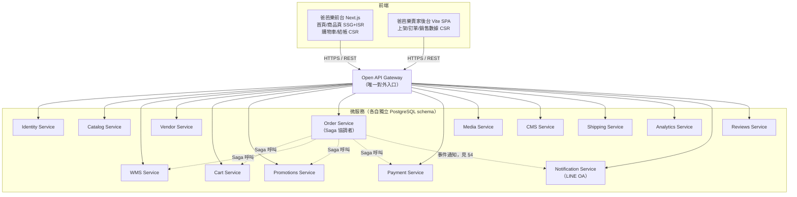
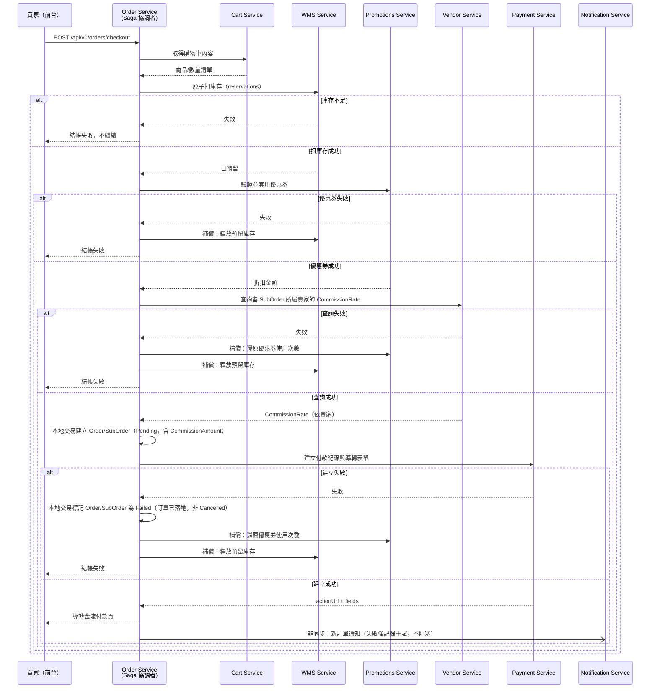

# 06 - 電商平台架構：以「爸芭樂」為案例 (Ecommerce Platform Architecture)

## 異動紀錄
| 版本 | 日期 | 作者 | 說明 |
|---|---|---|---|
| v0.1 | 2026-09-08 | ordinarycas | 初版建立，回應「用電商（爸芭樂案例）設計一個微服務的店商平台，技術以 C# .NET 10、React（須可生成靜態頁面）、PostgreSQL」需求 |
| v0.2 | 2026-09-08 | ordinarycas | 因應「API 文件需含 WMS」需求，新增獨立的 WMS Service（原庫存邏輯從 Catalog 分離），並修正結帳 Saga 第 2 步改呼叫 WMS 扣庫存；新增文件索引指向 [07](07-storefront-requirements.md)–[10](10-gap-analysis.md) |
| v0.3 | 2026-09-08 | ordinarycas | 比對後補正：§4 服務清單漏列 **Notification Service**（LINE 官方帳號整合）與 **Reviews Service**（商品評價），本輪補回；§5 補回 Route Handler API 代理做法（原稿漏提）；架構圖、Saga 流程圖改用 Mermaid 繪製；新增 §12 其餘仍適用規格的交叉引用（非功能需求/設計系統/金流/儲存/資料保存） |
| v0.4 | 2026-09-08 | ordinarycas | 回應「架構須支援 Docker」「客戶預期為單一虛擬主機部署，DB 可選外部/內部/Docker」需求：§2、§6 補充部署拓樸與資料庫三種連線模式 |
| v0.5 | 2026-09-08 | ordinarycas | §6.2 補充「外部 DB」的具體選型：以 **Supabase** 為優先推薦，自建 PostgreSQL 為備選；新增 Supabase 連線池對 EF Core Migration 的已知眉角 |
| v0.6 | 2026-09-08 | ordinarycas | 使用者刪除前身規格（原 `docs/01`、`16` 等）並將本文件集更名為 `docs/`，移除所有對已刪除文件的引用，改為自我完整敘述 |
| v0.7 | 2026-09-08 | ordinarycas | §2、§5 新增動畫效果技術棧決策：前台動畫主要使用 CSS，回應「程式碼撰寫動畫效果主要使用 CSS」需求 |
| v0.8 | 2026-09-08 | ordinarycas | §2 新增 RWD/PWA 技術棧決策，回應「畫面支援 RWD 與 PWA」需求，詳細規格拆分至新文件 [27-pwa-and-accessibility.md](27-pwa-and-accessibility.md) |
| v0.9 | 2026-09-08 | ordinarycas | §2 新增圖表函式庫（TradingView Lightweight Charts）與多語系（繁中/英/日）技術棧決策，詳見 [22-service-analytics.md](22-service-analytics.md)、[28-i18n.md](28-i18n.md) |
| v0.10 | 2026-09-08 | ordinarycas | §6.3 重新評估多語系對主機規格的影響：執行期規格不受影響，僅 Next.js 建置步驟受影響，決定將建置移出正式環境 VPS、改在 CI/CD 執行 |
| v0.11 | 2026-09-08 | ordinarycas | §6.1 更新：因應前後端拆成多個 repo（[26-project-structure.md](26-project-structure.md) 決策 H），VPS 上實際 clone 的是新增的 `ecommerce-deploy` repo，不是原始碼 repo |
| v0.12 | 2026-09-08 | ordinarycas | [10-gap-analysis.md](10-gap-analysis.md) 第八輪複查發現 §6.1、§6.3 的「15 個服務 + Gateway」講法與 §4 服務清單（Gateway 本來就是 15 列裡的其中一列）重複計算 Gateway，統一改為「14 個領域服務 + Gateway（共 15 個服務）」，資源估算數字本身未受影響 |
| v0.13 | 2026-09-08 | ordinarycas | §7 結帳 Saga 補上查詢 Vendor Service 抽成費率的步驟，與 [17-service-order.md](17-service-order.md) §4 v0.2 同步，解決 `SubOrder.CommissionAmount` 計算來源未定義的問題（見 [10-gap-analysis.md](10-gap-analysis.md) §11） |
| v0.14 | 2026-09-08 | ordinarycas | §9 同步 [01-architecture.md](01-architecture.md) §3 v0.4 的具體決定：功能開關以 `FEATUREFLAGS__<FlagName>` 環境變數存放在 `ecommerce-deploy-<客戶代稱>` 的 `.env`，解決 [10-gap-analysis.md](10-gap-analysis.md) §13 已列的缺口 |
| v0.15 | 2026-09-09 | ordinarycas | §2 新增「主題模式」決策列：前台+後台皆支援深色/淺色模式、**預設淺色**、不跟隨系統偏好（使用者指定）；同時記錄前台首頁多語系（繁中/英/日）已依 [28-i18n.md](28-i18n.md) §2/§4 於實作 repo 落地（型別化字典＋fallback 繁中，正式 i18n 函式庫選型仍開放） |
| v0.16 | 2026-09-09 | ordinarycas | §6.1、§9 repo 更名 `ecommerce-deploy`→`ecommerce-launch`，呼應實際 checkout 的資料夾命名（見 [26-project-structure.md](26-project-structure.md)） |
| v0.17 | 2026-09-09 | ordinarycas | §7 Saga 循序圖補上「Payment 建立失敗」分支（已核對 `ecommerce-services` 實作行為：`OrderStatus.Failed`、補償順序優惠券→庫存），解決 [30-open-decisions-register.md](30-open-decisions-register.md) 待決議項，回應「將待決議事項列出來實作」需求 |
| v0.18 | 2026-09-10 | ordinarycas | §10 解決 3 項待決議（DB 連線安全性規劃、Supabase 連線數上限定案改走 pooler、CI/CD 建置機器採代管 runner），1 項（服務資源消耗）標記為需要實測維持開放，回應「將待決議事項列出來實作」需求 |
| v0.19 | 2026-09-10 | ordinarycas | 新增 §6.5：單一 VPS 部署（Docker 內建 Postgres 模式）的備份/災難復原策略定案（排程備份容器每日 pg_dump、異地存放、30 天保留、上線前還原演練），解決 [10-gap-analysis.md](10-gap-analysis.md) 已列多輪的「備份/災難復原策略空白」缺口，回應「將待決議事項列出來實作」需求；RTO/RPO 明確標示為估計值，正式 SLA 承諾留給業主的合約決策 |
| v0.20 | 2026-09-10 | ordinarycas | §6.3 補上本機 `docker stats` 實測數字（16 容器閒置約 480MiB、輕載併發回應時間 p50 16ms/p95 31ms），記憶體建議下修至 4GB 並附上判斷依據；§10 對應待決議項標記部分解決（大方向風險已有實測數據，正式 VPS 覆核仍待辦），回應「繼續補完 9 項未解決」需求 |

## 0. 定位聲明

本文件描述的是**拾夜科技賣給客戶的產品本身**——即「爸芭樂」這樣的客戶實際拿到、實際運作的電商平台。它與 [00-overview.md](00-overview.md)–[05-scope-and-open-items.md](05-scope-and-open-items.md)（ShyeCMS）**完全獨立、沒有任何技術連接**（見決策 C，[01-architecture.md](01-architecture.md)）：這套平台的程式碼裡不存在任何呼叫 ShyeCMS 的邏輯，功能開關是部署時寫死在自己的設定檔裡，不會執行期查詢任何外部系統。

本文件是**全新產品線的具體設計**，直接規劃為微服務架構，不經過單體階段演進——這是刻意的選擇：既有的白牌電商平台慣例是「模組化單體優先，之後才視情況拆微服務」，但這是全新產品線，沒有既有系統包袱，因此直接以微服務起步。

## 1. 案例背景：爸芭樂

「爸芭樂」是一間專賣芭樂（燕巢珍珠芭樂、帝王芭樂、天拔芭樂等品種）的線上商店，向拾夜科技採購電商平台服務。以下架構設計以此案例具體化，但服務邊界與技術棧對任何電商客戶皆通用。

## 2. 技術棧總覽

| 層級 | 技術 | 說明 |
|---|---|---|
| 後端服務 | C# / ASP.NET Core (**.NET 10**) | 每個微服務各自一個 ASP.NET Core Web API 專案 |
| 前台（消費者端） | **React（Next.js）**，須可生成靜態頁面 | 首頁、商品頁採 SSG/ISR；購物車/結帳/訂單查詢等動態頁採 CSR，見第 5 節 |
| 動畫/轉場效果 | **主要使用 CSS**（transition/keyframes/`@starting-style`），不引入 JS 動畫函式庫 | 見第 5 節 5.1，理由是不增加前台 JS bundle 大小、不阻塞 SSG 頁面的可互動時間 |
| 賣家後台 | React（Vite SPA） | 商品上架、訂單處理、銷售數據，不需要 SEO，純 CSR 即可 |
| RWD / PWA | 前台與後台**皆須**支援響應式設計，並做成**可安裝的 PWA**（手機/平板可加入主畫面） | 詳細規格見 [27-pwa-and-accessibility.md](27-pwa-and-accessibility.md) |
| 主題模式 | 前台與後台皆須支援**深色/淺色模式，預設一律淺色**（不跟隨系統 `prefers-color-scheme`，使用者切換後以 localStorage 記憶），以 CSS custom properties + `html[data-theme="dark"]` 覆寫實作 | 使用者指定需求（2026-09-09）；具體 token 值仍待設計系統文件（[10-gap-analysis.md](10-gap-analysis.md) §5 既有缺口）定案 |
| 無障礙（前台） | 前台須符合**WCAG 2.1 AA**（台灣網站無障礙規範 110.07 版基準） | 僅前台，後台暫不強制（見 [27-pwa-and-accessibility.md](27-pwa-and-accessibility.md) 待決議） |
| 圖表函式庫 | 時間序列報表用 **TradingView Lightweight Charts** | 僅適用銷售趨勢等時間序列圖，長條/圓餅圖另評估，見 [22-service-analytics.md](22-service-analytics.md) |
| 多語系 | 繁中（預設）+ 英文 + 日文 | 僅電商平台前台+後台，ShyeCMS 不含，見 [28-i18n.md](28-i18n.md) |
| 資料庫 | **PostgreSQL** | 每服務獨立 schema（見第 6 節），透過 EF Core (Npgsql) 存取 |
| 服務間通訊 | 內部 REST（JSON） | 不引入訊息佇列：單一客戶部署流量規模不大，非同步事件驅動換不到對應的複雜度代價 |
| 對外入口 | Open API Gateway | 所有對外流量的唯一入口，負責金鑰驗證、路由/聚合到內部服務 |
| 部署 | Docker Compose，**單一虛擬主機（VPS）** | 每服務一個 image，一行指令 `docker compose up -d` 啟動全部；預期客戶（如爸芭樂）僅有一台虛擬主機同時跑前後端，見第 6 節部署拓樸 |

## 3. 整體架構圖

每個服務各自一個 PostgreSQL schema，互不直接存取；服務間只能透過內部 REST 呼叫或如上圖虛線所示的 Saga/通知呼叫。

## 4. 服務邊界劃分

15 個服務，各自獨立資料庫 schema，不可直接查詢對方的表，跨服務只能透過內部 REST 呼叫。每個服務的職責、資料模型、API 大綱已個別拆分為獨立文件（回應「微服務拆成多個規格」的要求）：

| 服務 | 一句話職責 | 規格文件 |
|---|---|---|
| Identity Service | 會員/賣家帳號、認證、JWT、地址簿 | [11-service-identity.md](11-service-identity.md) |
| Catalog Service | 商品主檔、分類、變體、標籤、定價（不含庫存） | [12-service-catalog.md](12-service-catalog.md) |
| WMS Service | 倉儲/庫存：實際庫存量、批次與有效期、原子扣減 | [13-service-wms.md](13-service-wms.md) |
| Vendor Service | 商店資料、子帳號、抽成設定 | [14-service-vendor.md](14-service-vendor.md) |
| Cart Service | 購物車 | [15-service-cart.md](15-service-cart.md) |
| Promotions Service | 優惠券 | [16-service-promotions.md](16-service-promotions.md) |
| Order Service | 訂單、子訂單、狀態機、結帳 Saga 協調者 | [17-service-order.md](17-service-order.md) |
| Payment Service | 金流串接、回調、驗章 | [18-service-payment.md](18-service-payment.md) |
| Media Service | 檔案上傳、儲存後端、縮圖、配額 | [19-service-media.md](19-service-media.md) |
| CMS Service | 首頁/形象頁版型 | [20-service-cms.md](20-service-cms.md) |
| Shipping Service | 物流方式與運費試算 | [21-service-shipping.md](21-service-shipping.md) |
| Analytics Service | 報表/數據分析（唯讀） | [22-service-analytics.md](22-service-analytics.md) |
| Notification Service | LINE 官方帳號整合、通知派送 | [23-service-notification.md](23-service-notification.md) |
| Reviews Service | 商品評價 | [24-service-reviews.md](24-service-reviews.md) |
| Open API Gateway | 對外入口、路由/聚合、金鑰驗證 | [25-service-gateway.md](25-service-gateway.md) |

爸芭樂案例的具體化說明（品種、規格等）也已下放到各自的服務文件內，本文件只保留跨服務的整體架構、部署拓樸與 Saga 流程。

## 5. 前端：React 靜態頁面生成規格

需求明確要求「React 須可以生成靜態頁面」，對應到 **Next.js 的 SSG（Static Site Generation）+ ISR（Incremental Static Regeneration）**：

| 頁面 | 生成方式 | 原因 |
|---|---|---|
| 首頁（品牌故事、產季主打） | SSG，商品/內容異動時觸發 `/api/revalidate` 主動更新 | SEO：讓 Google 收錄「爸芭樂」品牌與產品資訊 |
| 商品詳情頁（如「珍珠芭樂 5 斤裝」） | 預先產生前 N 筆熱銷商品（`STOREFRONT_PRERENDER_COUNT`），其餘走 ISR | 商品量不多時全量 SSG，成長後避免建置時間線性膨脹 |
| 商品清單/分類頁 | ISR（週期性重新產生） | 依分類/庫存變動頻率調整 |
| 購物車 / 結帳 / 訂單查詢 | CSR（Client-Side Rendering），呼叫 Order/Cart Service API | 這些頁面含個人化與即時狀態，不適合預先產生靜態內容 |

賣家後台（Vite SPA）**不需要**靜態生成能力，純 CSR 即可，因為賣家後台沒有 SEO 需求。

### 5.1 動畫效果：主要使用 CSS

前台（含賣家後台）的動畫/轉場效果**以 CSS 為主**（`transition`、`@keyframes`、CSS Scroll-driven Animations 等），不引入 Framer Motion、GSAP 等 JS 動畫函式庫，除非有 CSS 無法達成的特殊互動需求（如需要精確追蹤手勢/拖曳的動畫）。

| 情境 | 做法 |
|---|---|
| 商品卡 hover | `transition: transform, box-shadow`（上移 + 陰影變化） |
| 按鈕/表單狀態回饋 | `transition` + focus/active 偽類 |
| 首頁 Banner 輪播 | CSS `scroll-snap` 或 `@keyframes`，避免引入額外輪播函式庫的 JS 體積 |
| 頁面/區塊進場 | CSS `@starting-style` + `transition`（現代瀏覽器）或簡單的 `animation: fadeIn` |
| 載入中骨架屏（Skeleton） | CSS `@keyframes` 產生 shimmer 效果 |

**理由**：
- 前台走 SSG/ISR（見 §5），CSS 動畫不需要等待 JS hydration 就能運作，符合靜態生成的效能訴求，不會因為動畫邏輯拖慢可互動時間（TTI）。
- 減少前台 JS bundle 大小，直接對應白牌客戶對頁面載入速度的要求。
- CSS 動畫由瀏覽器合成執行緒處理，效能與電力消耗優於多數 JS 動畫方案。

**基本規則**：所有動畫需搭配 `prefers-reduced-motion` media query 提供簡化/關閉版本，符合無障礙要求。動畫時長/緩動曲線等具體 Token（如 `--duration-fast`、`--ease-standard`）待設計系統文件補齊（見 [10-gap-analysis.md](10-gap-analysis.md)）。

**API 代理**：前台呼叫 Open API Gateway 不可用 Next.js 的 `next.config` `rewrites()`（建置時寫死網址，白牌單一映像檔無法部署到不同客戶），改用 Route Handler 於**每次請求時**讀取環境變數決定後端位址，同一份映像檔即可靠環境變數部署到任何客戶。

## 6. 部署拓樸與資料庫設計原則

### 6.1 部署拓樸：單一虛擬主機

預期客戶（如爸芭樂）只會有**一台虛擬主機**，前台、賣家後台、所有微服務都跑在這一台機器上，以 Docker Compose 管理，一行指令啟動。這台主機上實際 clone 的是 `ecommerce-launch` repo（見 [26-project-structure.md](26-project-structure.md) §3.4），裡面的 `docker-compose.yml` 引用其餘三個 repo（`ecommerce-services`/`ecommerce-storefront`/`ecommerce-admin`）各自建置好、推上私有映像檔倉庫的版本標籤，客戶主機本身不需要 clone 任何一份原始碼。這代表：

- 14 個領域服務 + Gateway（見 §4，共 15 個服務）+ 前台 Next.js（需要 Node 執行環境，非純靜態）全部是同一台主機上的容器，**沒有跨機器的服務發現需求**（docker-compose 內建的服務名稱 DNS 即足夠，不需要 service registry/mesh）。
- 資源評估明確是**同一台主機**的問題，不是「多機器如何分配」的問題——這把 [10-gap-analysis.md](10-gap-analysis.md) §3 已列的「服務數量在單一客戶部署下的資源消耗」從抽象疑慮變成具體的**主機規格問題**，需要在正式報價/建置 SOP 前給出最低建議規格（見 §6.3）。

### 6.2 資料庫三種連線模式

DB 連線方式**不寫死**，透過環境變數（`ConnectionStrings__Postgres`）在部署時選擇，三種模式互斥、擇一：

| 模式 | 說明 | 適用情境 |
|---|---|---|
| **Docker 內建 DB**（預設） | Docker Compose 內含 `postgres` 服務，資料存於同一台主機的 Volume | 客戶沒有既有資料庫，最快上線；開發環境與正式環境沿用同一份 compose 定義 |
| **外部 DB（雲端託管，優先推薦 Supabase）** | 優先推薦 **Supabase**（Postgres-as-a-Service，底層就是標準 PostgreSQL，Npgsql/EF Core 不需修改即可連線）；次選為客戶另外自建/採購的 PostgreSQL（如自架主機、RDS、Cloud SQL）。Docker Compose 的 `postgres` 服務**不啟動**，各微服務的連線字串指向外部位址 | 客戶要求資料庫代管、備份、高可用性由雲端服務商負責，降低這台 VPS 的儲存與備份責任；Supabase 額外附帶的 Dashboard/Auth/Storage 等功能本專案**不使用**，僅取其託管 Postgres 的角色，避免與既有的 Identity Service/Media Service 職責重疊 |
| **內部 DB（客戶既有機房/主機內）** | 客戶自己機房或另一台內部主機已自建 PostgreSQL，各微服務連線字串指向該內部位址（僅限同網段或已開通防火牆規則） | 客戶既有 IT 基礎設施已有資料庫伺服器，希望統一管理 |

以 `--profile` 機制（如 `--profile tools` 啟用 pgAdmin、`--profile s3` 啟用 MinIO 這類慣例）將 Docker 內建 DB 模式規劃為獨立 profile（如 `--profile db`），未指定時預設不啟動內建 Postgres，改由環境變數指向外部/內部 DB——避免「客戶已指定外部 DB，卻又意外啟動了一個沒人用的內建 DB 容器」。

各微服務**各自的 schema 原則不受連線模式影響**（見 6.4）：無論指向哪種 DB，都是同一個 Postgres instance 內的多個 schema，不因為換了連線目標就改變資料庫設計。

**Supabase 連線的已知眉角**：Supabase 預設提供的是經過 **PgBouncer（Transaction Pooling）** 的連線字串，這種連線模式不支援 EF Core Migration 需要的 prepared statement/session 層級操作。實際使用時需要區分兩種連線字串：EF Core Migration（`dotnet-ef database update`）走 Supabase 提供的 **Direct Connection**（非池化），應用程式執行期的一般查詢才走 **Pooled Connection**。這是部署 SOP 必須明確交代的步驟，避免第一次串接時 Migration 莫名失敗。

### 6.3 最低建議規格（已補上本機實測數字，正式報價前仍須在目標 VPS 上覆核）

14 個 .NET 領域服務 + Gateway（共 15 個服務）+ Next.js 前台在單一 VPS 上，記憶體需求不小（docker-compose 若用 Docker Desktop 預設資源配置，通常明顯不足）。

**2026-09-10 本機實測（`docker stats`，開發機非正式 VPS，數字僅供方向參考，不是正式規格保證）**：15 個服務 + Gateway + Postgres（不含 Next.js/Vite 前端——那兩個不在這台 VPS 上跑 build，見下方多語系分析）共 16 個容器，全部啟動、資料庫幾乎無資料、無實際流量時：

- **閒置總記憶體約 480MiB**（16 個容器合計），遠低於原先「每服務 100-200MB」的粗估——多數骨架階段服務閒置時只吃 22–28MiB，`identity`／`vendor` 因為已經是真實作（JWT 簽發、密碼雜湊、對外 HttpClient 呼叫）記憶體略高，約 52–53MiB，仍遠低於原估算。
- **輕度並發負載下的實測（`ab -n 500 -c 20` 打 `GET /api/v1/products`，經 Gateway → Catalog）**：中位數回應時間 16ms、p95 31ms、p99 62ms；`catalog` 記憶體從閒置 26MiB 升到約 101MiB，`gateway` 從 28MiB 升到約 51MiB，CPU 全程低於 1%——這台開發機的硬體規格通常優於陽春型 VPS，數字**不能直接當成正式環境的效能保證**，但方向上證實骨架階段的服務在低流量情境下相當節省資源。

綜合上述實測與原本的粗估邏輯，維持建議規格但下修記憶體理由：

| 項目 | 建議最低規格 |
|---|---|
| vCPU | 4 core（實測顯示閒置與輕載都遠用不到，保留餘裕給流量尖峰與資料量成長後的查詢負擔） |
| 記憶體 | **4GB**（原估 8GB；本機實測 16 個容器閒置僅約 480MiB，即使抓 3–4 倍的正式環境流量/資料量安全係數，4GB 仍有餘裕；但這是本機開發機數字外推，正式報價前仍應在實際選定的 VPS 規格上重跑一次同樣的量測） |
| 硬碟 | 依商品圖片/影片用量另計，起始建議 40GB SSD |

> 記憶體數字已有本機實測依據，不再是純粹的粗估，但**開發機規格與網路環境跟客戶實際採購的 VPS 不同**，效能數字（回應時間、CPU）不能直接沿用；正式報價前仍建議在目標 VPS 規格上重跑一次 `docker stats` + 簡單的併發測試（如本次用的 `ab`）覆核，尤其是要確認記憶體數字在該 VPS 的實體/虛擬記憶體環境下沒有明顯落差。

**多語系（[28-i18n.md](28-i18n.md)）對這份估算的影響，拆成兩塊分開看，不是單純全部乘以 3**：

| 影響面 | 是否受 3 語言影響 | 說明 |
|---|---|---|
| **執行期記憶體/CPU**（上表） | **幾乎不受影響** | 15 個服務的常駐行程數量不會因為多了兩種語言而增加，服務的記憶體/CPU 用量主要跟請求量與資料量有關，跟語言數量無關 |
| **Next.js 建置（`next build`）** | **明顯受影響** | SSG 預產頁面數量隨語言數量接近等比增加（[06](06-ecommerce-platform-architecture.md) §5 的 `STOREFRONT_PRERENDER_COUNT` 熱銷商品頁，3 語言等於要多產生 2 倍的靜態頁面），建置當下需要的 CPU/記憶體與建置時間都會增加，且靜態輸出檔案數量增加會拉長部署映像檔的組裝時間 |

**建議做法**：把 Next.js 的建置步驟移出這台正式環境 VPS，改在 **CI/CD pipeline**（[10-gap-analysis.md](10-gap-analysis.md) 已列為既有缺口，這裡是它的一個具體理由）另外的建置機器上執行 `next build` 產生映像檔，VPS 只負責 `docker compose up` 拉取/啟動**已經建置好**的映像檔——這樣一來，語言數量再增加也不會影響到客戶那台正式環境 VPS 的規格，只影響 CI 建置機器的規格與建置時間，兩者互不牽連。上表的執行期規格估算因此**維持不變**，不需要因為多語系而調高。

### 6.4 資料庫設計原則（不受部署模式影響）

- **PostgreSQL，每服務一組獨立 schema**：`HasDefaultSchema`、EF migrations history 表也指定到同一 schema，避免與其他服務的 migration 集合衝突。
- **定案：共用同一個 Postgres instance（多 schema），非各服務獨立 instance**——`ecommerce-services` 的 `docker-compose.yml` 已這樣實作並經 docker compose 全服務啟動實測（15 服務 + Gateway 共用同一個 `suxoshop` database、各自獨立 schema，`/health/ready` 全數通過）。待流量或資源需求成長後，仍可視情況把個別服務拆成獨立 instance（各服務本來就已用獨立 schema、無跨服務直接查表，拆分時只需改連線字串，不需要動 Migration 或應用層程式碼）——這件事本身不是本輪要提前決定的，但「初期共用一個 instance」不再是開放問題。
- 庫存扣減採**原子條件更新**做法（`UPDATE ... WHERE StockQuantity >= N`），避免併發買超，詳見 [13-service-wms.md](13-service-wms.md)。

### 6.5 單機部署的備份與災難復原（回應 [10-gap-analysis.md](10-gap-analysis.md) 已列的空白）

單一 VPS 部署把風險集中到一台主機（見 §6.1），這件事本身在架構上已是定案，但備份/還原**只在「Docker 內建 Postgres」這個連線模式下才是本文件的責任**——外部 DB 模式（Supabase 或客戶自建代管）的備份/高可用性由該資料庫供應商負責，見 §6.2 已有的說明，本節只補「Docker 內建 Postgres」這個模式原本完全空白的部分：

- **備份機制**：加一個獨立的排程備份容器（如 `prodrigestivill/postgres-backup-local`，一個廣泛使用、專門為「Docker Compose 內的 Postgres 排程備份」設計的現成映像檔，不需要自己刻 cron script），對 `docker-compose.yml` 裡的 `postgres` 服務執行每日 `pg_dump`——因為 15 個服務共用同一個 `suxoshop` database（見 §6.4 定案），一份 `pg_dump` 就涵蓋全部服務的 schema，不需要對每個服務分開備份。
- **異地存放**：備份檔**不能只留在同一台 VPS 上**——VPS 本身故障或遭入侵時，本機備份會跟主資料庫一起遺失，違背備份的本意。若客戶的 Media Service（見 [19-service-media.md](19-service-media.md)）已選用 S3 相容的物件儲存，備份檔同步到同一個儲存服務的另一個 bucket/前綴即可，不需要為了備份另外引入一套儲存服務；若 Media 走本機儲存，則需要額外決定一個異地目的地（如 Backblaze B2 之類的低成本物件儲存），這是唯一還留給實際部署時依客戶預算決定的細節。
- **保留期限**：預設 **30 天**，可依客戶合約調整——這是合理的技術預設值，不是本文件武斷鎖死的數字。
- **還原演練**：客戶上線前**至少執行一次實際還原測試**（在測試環境把某天的備份還原回一個乾淨的 Postgres，確認資料完整可用）並寫成文件化的還原 SOP——從沒被實際還原驗證過的備份，不能被信任為「有效的備份」，這是備份設計裡最容易被跳過但也最重要的一步。
- **RTO/RPO 是估計值，不是合約承諾**：以每日備份的頻率推算，RPO（可容忍的資料遺失量）約 24 小時；RTO（復原所需時間）粗估數小時等級（人工介入：準備新主機或容器、還原備份、重新指向網域）。**這兩個數字本身若要成為對客戶的正式 SLA 承諾，是拾夜科技的業務/合約決策，不是這份技術規格能單方面代為承諾的**——本節只負責把「怎麼做到」的技術方案定案，多快、多可靠是合約層級的另一件事。

若備份頻率/RTO 真的要更緊（如金流交易密集到 24 小時的資料遺失無法接受），需要更即時的機制（如 PostgreSQL 的 WAL 歸檔/時間點復原），屬於超出目前規模的進階需求，本節不預先設計。

爸芭樂買家結帳（如同時購買珍珠芭樂+帝王芭樂）需跨 Cart、WMS、Promotions、Order、Payment、Notification 六個服務，由 **Order Service 擔任 Saga 協調者**：

1. 呼叫 Cart Service 取得購物車內容
2. 呼叫 **WMS Service** 原子扣庫存（成功視為已預留，失敗則整筆結帳失敗）——庫存權責從 v0.1 誤植的 Catalog Service 修正為 WMS Service，Catalog 只負責商品/價格展示
3. 呼叫 Promotions Service 驗證並套用優惠券
4. 呼叫 **Vendor Service** 查詢各 SubOrder 所屬賣家目前的 `CommissionRate`，用於計算 `SubOrder.CommissionAmount`；查詢失敗視同整筆結帳失敗，觸發與優惠券/庫存相同的補償鏈（詳見 [17-service-order.md](17-service-order.md) §4）
5. 建立 Order/SubOrder（Order Service 自己的資料庫，本地原子交易）
6. 呼叫 Payment Service 建立付款紀錄；這步失敗時 Order/SubOrder 已落地，補償多標記該筆訂單 `Status = Failed`（與買家主動取消的 `Cancelled` 區分，詳見 [17-service-order.md](17-service-order.md) §2、§4）
7. 任一步驟失敗 → 觸發補償（還原庫存、還原優惠券使用次數，Payment 步驟失敗時另外標記訂單 `Failed`），補償動作需冪等可重試
8. 訂單建立後，**非同步**通知 Notification Service 推播新訂單訊息，失敗僅記錄重試，不影響訂單本身（容錯隔離原則）

通訊方式：同步 REST 呼叫鏈（Notification 除外，走非同步），不引入訊息佇列。詳細步驟與補償邏輯見 [17-service-order.md](17-service-order.md)。

## 8. 客戶拿到的頁面/功能清單（對應原始需求第 5 項）

| 前台（Next.js，API 串接） | 賣家後台（Vite SPA） |
|---|---|
| 品牌形象首頁 | 商品上架/編輯（含品種、規格、產季庫存） |
| 商品清單頁（依品種/規格篩選） | 訂單處理（確認/出貨） |
| 商品詳情頁 | 銷售數據（銷售趨勢、熱銷品種排行） |
| 購物車 | |
| 結帳頁 | |
| 訂單查詢頁 | |

頁面/功能細節見 [07-storefront-requirements.md](07-storefront-requirements.md)、[08-vendor-admin-requirements.md](08-vendor-admin-requirements.md)；本節只確認技術棧（Next.js SSG）滿足 SEO 需求。

## 9. 與 ShyeCMS 的關係（重申決策 C）

- 這套平台的**任何一行程式碼**都不會呼叫 ShyeCMS。
- 功能開關（例如「是否開放貨到付款」「是否啟用優惠券模組」）在此平台內以**環境變數**（`FEATUREFLAGS__<FlagName>`，存放在 `ecommerce-launch-<客戶代稱>` repo 的 `.env`）表示，部署當下由維運人員依 ShyeCMS 裡的合約紀錄手動填入，執行期不做任何外部查詢，具體存放位置與命名慣例見 [01-architecture.md](01-architecture.md) §3。這是**合約層級**的主開關（決定某功能在這個客戶部署裡整個開不開放），與 [08-vendor-admin-requirements.md](08-vendor-admin-requirements.md) §2 賣家自己在 `StoreSettings` 決定「目前要不要用」是不同層級——主開關關閉時，`StoreSettings` 裡對應的選項即使賣家開著也不會生效。
- 用量統計（GMV、商品數等）留在自己的 Analytics Service 內供賣家/平台後台檢視，**不會**、也沒有機制回傳給拾夜科技（決策 D）。

## 10. 待決議事項
- [x] ~~服務數量（15 個）在單一 VPS 部署下的資源消耗——§6.3 已給出粗估規格，但未經實測校正，是否需要先合併部分低流量服務（如 CMS/Reviews）再視成長拆分~~——**部分解決（已補上本機實測數字，正式 VPS 覆核仍待實際部署）**：本機 `docker stats` 實測 16 個容器閒置總記憶體僅約 480MiB、輕度並發下 `catalog`/`gateway` 各自升到約 100MiB/51MiB，回應時間中位數 16ms，遠低於原本「每服務 100-200MB」的保守估算，見 §6.3。**不需要合併 CMS/Reviews 等低流量服務**——實測顯示閒置成本遠低於原本擔心的量級，合併服務換來的資源節省很小，卻要犧牲微服務架構「各自獨立部署/獨立擴充」的既有設計優勢，不划算。**仍待辦**：開發機規格與網路環境跟客戶實際 VPS 不同，正式報價前仍需在目標 VPS 上覆核一次同樣的量測，這部分保留開放（見 §6.3 說明），但「大方向風險有多高」這個問題本身已經有本機實測數據可以參考，不再是完全空白的未知數
- [x] ~~PostgreSQL 是共用 instance 多 schema，還是每服務獨立 instance~~——**已解決**：定案共用 instance 多 schema，`ecommerce-services` 已實作並通過全服務啟動實測，見 §6.4
- [x] ~~外部/內部 DB 模式下，遠端連線的網路延遲與安全性（防火牆規則、是否需要 VPN/SSL 連線至 DB）尚未規劃~~——**已解決**：外部 DB（Supabase 或客戶自建）一律要求走**加密連線**（`sslmode=require`，Npgsql 預設已支援，Supabase 連線字串本身也強制 SSL），VPS 對外只允許連往 DB 供應商的固定 IP/網段（若供應商有提供，否則退而求其次限制連線埠與帳密強度）；內部 DB（客戶自建）要求 VPS 與 DB 主機之間走**私有網段或 VPN**，不透過公網明碼傳輸，這是最低限度的安全基準，不是選配。網路延遲本身無法在規格層面解決（實際延遲取決於客戶選擇的機房地理位置），只能要求「同地區/同機房」作為部署建議寫進[26-project-structure.md](26-project-structure.md) 的客戶導入 SOP，不在本文件重複
- [x] ~~Supabase 免費/低階方案的**連線數上限**是否足夠 15 個微服務各自維護連線池同時連線~~——**已解決（已查證 Supabase 官方公開資訊）**：免費方案**直連（direct connection）上限僅 60**，但**連線池（pooler，transaction 模式）上限 200**。本平台 15 個服務 + Gateway 各自獨立的 EF Core `DbContext` 連線池，若走直連，即使每服務只保守估計 5 條連線也會逼近 60 的上限，尤其在多服務同時啟動或流量尖峰時；**因此定案：一律透過 Supabase 的連線池端點（pooler，非直連端點）連線**，200 的上限對單一客戶部署的 16 個服務有充足餘裕，不需要如原文字設想的「每服務改小連線池大小」這種犧牲效能換取連線數的妥協。這是連線字串設定層級的差異（pooler 連線字串通常是不同的 host/port），不需要改 EF Core 程式碼本身，屬於部署設定文件（`.env`）該交代清楚的事項

- [x] ~~CI/CD 建置機器的規格（見 §6.3 多語系影響分析）——這台是另一個需要規劃規格的機器，不是本節討論的正式環境 VPS，兩者不可混為一談~~——**已解決：採 CI 平台的代管執行環境（如 GitHub Actions 的 hosted runner），不自架建置機器**。理由：.NET 10 服務的建置與測試不需要特殊硬體（無 GPU/大量記憶體需求），代管 runner 的標準規格（2 核心/7GB 記憶體等級）綽綽有餘；自架建置機器需要額外維運（更新、安全修補、容量規劃），對六個 repo 目前的規模是不必要的營運負擔，這也與 [26-project-structure.md](26-project-structure.md) §7 CI/CD SOP 待決議項相關，屆時一併考慮

各服務專屬的待決議事項列於各自的規格文件內（見第 4 節文件索引）。

## 11. 相關文件

本文件只定調整體架構、部署拓樸與跨服務 Saga 流程。更細節的規格拆分至：

| 文件 | 內容 |
|---|---|
| [07-storefront-requirements.md](07-storefront-requirements.md) | 前台需求：免登入下單、LINE/Google 登入 |
| [08-vendor-admin-requirements.md](08-vendor-admin-requirements.md) | 賣家後台需求：上架/數據/版型/自家功能開關、拾夜科技支援權限 |
| [09-api-specification.md](09-api-specification.md) | API 版本控管策略與文件格式規範（跨服務通用） |
| [10-gap-analysis.md](10-gap-analysis.md) | 本輪規格的缺口分析與建議調整項目 |
| [11](11-service-identity.md)–[25](25-service-gateway.md) | 15 個微服務各自的職責、資料模型、API 大綱（見第 4 節） |
| [29-shared-service-conventions.md](29-shared-service-conventions.md) | 跨服務共通慣例與資安基準（Correlation ID、健康檢查、Markdown 管線、服務間認證、資安規則） |
