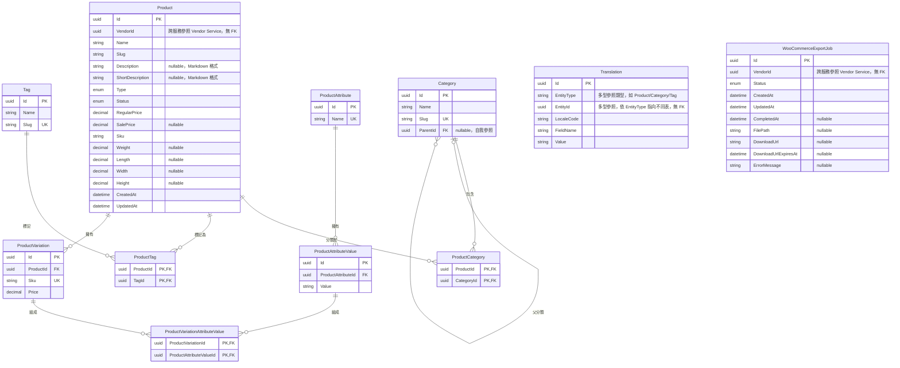

# 12 - Catalog Service

## 異動紀錄
| 版本 | 日期 | 作者 | 說明 |
|---|---|---|---|
| v0.1 | 2026-09-08 | ordinarycas | 從 [06-ecommerce-platform-architecture.md](06-ecommerce-platform-architecture.md)、[09-api-specification.md](09-api-specification.md) 拆分獨立，回應「微服務拆成多個規格」需求 |
| v0.2 | 2026-09-08 | ordinarycas | `Description`/`ShortDescription` 儲存格式改為 Markdown，回應「後台內容編輯使用 Markdown」需求；連帶修正 WooCommerce 匯出的轉換規則 |
| v0.3 | 2026-09-08 | ordinarycas | §2 補上 `Translation` 表；§6 的 Markdown/XSS 待決議改為引用 [29-shared-service-conventions.md](29-shared-service-conventions.md) 已定案的共用管線 |
| v0.4 | 2026-09-08 | ordinarycas | §5 明確定義商品讀取端點回傳 `DescriptionHtml`（已轉換安全 HTML）而非原始 Markdown，解決 [10-gap-analysis.md](10-gap-analysis.md) §10 已列「前端可能繞過共用消毒管線」的缺口 |
| v0.5 | 2026-09-09 | ordinarycas | §6 商品搜尋效能待決議項已解決：`ecommerce-services` 為 `Product.Name` 加上 `pg_trgm` GIN 索引（非原設想的 tsvector 全文檢索，理由見該條目），回應「將待決議事項列出來實作」需求 |
| v0.6 | 2026-09-10 | ordinarycas | §6 稅務欄位待決議項已解決：定案不新增，維持匯出固定值，回應「將待決議事項列出來實作」需求 |
| v0.7 | 2026-09-10 | ordinarycas | §2 新增 ER 圖（Mermaid erDiagram），涵蓋 11 個實體；交叉核對 `ecommerce-services` 實際程式碼後發現 `WooCommerceExportJob`（WooCommerce 匯出工作紀錄，§4/§5 已描述流程但 §2 資料模型表格從未列出）完全未記載，已補上一列；`ProductVariation` 一列補充其實際透過 `ProductVariationAttributeValue` 關聯表對應屬性值組合，原文字未點名此關聯表 |
| v0.8 | 2026-09-10 | ordinarycas | §5 新增內部端點 `POST /internal/v1/catalog/products/batch`（資安修正：稽核發現 Order Service 結帳 Saga 原本直接信任買家結帳請求本文的 Price 計算實際金額，任何人都能竄改該欄位送出任意單價；Promotions 的分類限定優惠券也因為 Order 從未查過商品分類、永遠傳空 categoryIds 而必然判定不符範圍——本端點批次回傳商品/變體當下的真實售價與所屬分類 ID，供結帳 Saga 取代這兩處信任/缺漏，詳見 [17-service-order.md](17-service-order.md) v0.13 §4 新增的步驟 1.5、[16-service-promotions.md](16-service-promotions.md) v0.9 §4.1） |

## 1. 職責

商品主檔、分類、標籤、變體、定價。**不擁有實際庫存數字**——庫存權責在 [13-service-wms.md](13-service-wms.md)，Catalog 只負責商品資訊與價格展示，顯示用的可售庫存透過呼叫 WMS Service 取得。

## 2. 資料模型

| 實體 | 說明 |
|---|---|
| Product | Id、VendorId、Name/Slug、**Description/ShortDescription（Markdown 格式儲存）**、Type（Simple/Variable/Grouped）、Status、RegularPrice/SalePrice、SKU、Weight/Length/Width/Height |
| Category / ProductCategory | 階層分類（多對多），支援 Parent/Child |
| Tag / ProductTag | 標籤（多對多），無階層 |
| ProductAttribute / ProductAttributeValue | 全域屬性（如顏色、尺寸）及其可選值 |
| ProductVariation | 商品變體，透過 `ProductVariationAttributeValue` 關聯表對應一組屬性值組合，各自 SKU/Price（不含庫存，庫存查 WMS） |
| Translation | EntityType（"Product"/"Category"/"Tag"）、EntityId、LocaleCode、FieldName（如 Name、Description）、Value——結構沿用 [28-i18n.md](28-i18n.md) §3 的共用模式 |
| WooCommerceExportJob | VendorId、Status（`Queued`/`Processing`/`Done`/`Failed`）、FilePath、DownloadUrl/DownloadUrlExpiresAt（時效性簽章下載連結）、ErrorMessage、CompletedAt——WooCommerce CSV 匯出工作紀錄，支撐 §4/§5 的非同步匯出流程 |

> `StockQuantity`/`StockStatus` 已從本服務移除，改由 WMS Service 擁有，見 [13-service-wms.md](13-service-wms.md)。

### 2.1 ER 圖

以下實體均屬本服務自己的 PostgreSQL schema，關聯線只畫本服務內部真實存在的外鍵（FK）；`Product.VendorId`/`WooCommerceExportJob.VendorId` 是對 Vendor Service 的跨服務參照，僅為慣例對應的裸 GUID，資料庫層級無 FK 約束。`Translation` 以 `EntityType`+`EntityId` 做多型參照（可能指向 Product/Category/Tag 任一張表），同樣不是資料庫外鍵，因此圖中不畫出這兩個實體的任何關聯線。

## 3. 爸芭樂案例

芭樂品種（珍珠芭樂/帝王芭樂/天拔芭樂）、規格（如 5 斤裝/10 斤裝）、售價。

## 4. WooCommerce 匯出功能

賣家後台「匯出 WooCommerce 商品 CSV」功能的欄位對照、變體展開規則、非同步作業流程，完整規格見 [08-vendor-admin-requirements.md](08-vendor-admin-requirements.md) §5。

**Markdown 轉換注意事項**：`Description`/`ShortDescription` 儲存為 Markdown，但 WooCommerce CSV 的 `Description`/`Short description` 欄位期待的是 **HTML**。匯出時（`POST /internal/v1/catalog/export/woocommerce-row`，見 §5）呼叫 [29-shared-service-conventions.md](29-shared-service-conventions.md) §2 的共用 Markdown 轉換函式庫，把 Markdown 轉成清理過的 HTML 再寫入 CSV，不能直接把 Markdown 原始文字塞進去，否則匯入 WooCommerce 後會顯示未轉譯的 Markdown 語法（如 `**` 符號）。匯出**只匯出繁體中文（預設語言）版本**，見 [28-i18n.md](28-i18n.md) §6。

## 5. API 大綱

| Method & Path | 說明 | 認證 |
|---|---|---|
| `GET /api/v1/products` | 商品清單（搜尋/篩選/排序，回傳 `ShortDescriptionHtml`，見下方說明） | 公開 |
| `GET /api/v1/products/{slug}` | 商品詳情（回傳 `DescriptionHtml`/`ShortDescriptionHtml`，見下方說明） | 公開 |
| `POST /api/v1/vendor/products` | 賣家新增商品 | 賣家 |
| `PUT /api/v1/vendor/products/{id}` | 賣家編輯商品 | 賣家 |
| `DELETE /api/v1/vendor/products/{id}` | 賣家刪除/封存商品（有訂單記錄者拒絕刪除，改上下架） | 賣家 |
| `POST /api/v1/vendor/products/export/woocommerce` | 建立 WooCommerce 匯出工作，立即回應 `202 Accepted` + `jobId` | 賣家 |
| `GET /api/v1/vendor/products/export/woocommerce/{jobId}` | 查詢匯出工作狀態，完成後回傳時效性下載連結 | 賣家 |
| `POST /internal/v1/catalog/export/woocommerce-row` | 背景 Worker 內部使用：組裝單一商品（含變體展開）對應的 CSV 列，內部呼叫 WMS（庫存/BackorderPolicy）與 Media（圖片排序） | 內部 |
| `POST /internal/v1/catalog/products/batch` | 結帳 Saga 內部呼叫（**v0.8 資安修正新增**）：批次查詢多個商品/變體**目前的真實售價**（已套用生效中的特價，無設定時回原價）與**所屬分類 ID**，取代 Order Service 原本直接信任買家結帳請求 Price 計算金額的缺口，並修正 Promotions 分類限定優惠券因 categoryIds 恆為空而必然判定不符範圍的相關缺口，見下方說明 | 內部（僅限 order-service） |

**`POST /internal/v1/catalog/products/batch` 的定價規則**：有效售價＝`SalePrice`（若有設定）否則 `RegularPrice`——與 `GET /api/v1/products`／`GET /api/v1/products/{slug}` 既有回應欄位的語意一致，沿用既有規則、未另外發明一套判斷。資料模型目前沒有特價生效期間欄位（`SalePriceStartAt`/`EndAt`，見 [08-vendor-admin-requirements.md](08-vendor-admin-requirements.md) §5.2 WooCommerce 匯出已記載的同一項缺口），故「生效中」單純代表「有設定值」，沒有時間窗判斷。變體（`ProductVariation`）沒有獨立的特價概念，直接回傳其 `Price` 欄位；`CategoryIds` 掛在商品本身，變體的 `CategoryIds` 取自所屬 `Product`。查無資料的 ID 不會出現在回應對應的清單中，語意比照 [13-service-wms.md](13-service-wms.md) §5 `POST /internal/v1/wms/inventory/batch` 既有的批次查詢慣例（含相同的單次請求筆數上限設計，見該端點文件）。

**讀取端點的回應格式（解決 Markdown 輸出格式未定義的問題）**：`Description`/`ShortDescription` 儲存為 Markdown（見 §2），但公開讀取端點（`GET /api/v1/products`、`GET /api/v1/products/{slug}`）**一律回傳已轉換的安全 HTML**（`DescriptionHtml`/`ShortDescriptionHtml`），由 Catalog Service 在組裝回應時呼叫 [29-shared-service-conventions.md](29-shared-service-conventions.md) §2 的共用 Markdown 轉換函式庫產生，前台（Next.js）**直接渲染**這個欄位，不自行對 Markdown 做二次轉換或消毒。這是唯一正確的架構——共用轉換函式庫是 .NET 函式庫，前台的 JavaScript 執行環境本來就無法呼叫它，若讓前端各自處理 Markdown 渲染，等於逼前端另外實作一套消毒邏輯，繞開 29 §2 好不容易統一的清理規則。原始 Markdown 只在賣家編輯情境（`POST`/`PUT /api/v1/vendor/products` 的請求/回應本體）雙向傳遞，供編輯器載入/儲存用，不會出現在上述公開讀取端點的回應裡。轉換時機可由實作階段決定（每次讀取即時轉換，或寫入時預先轉換快取），不影響本節定案的介面契約。

版本控管與文件格式沿用 [09-api-specification.md](09-api-specification.md) 的通用規範。

## 6. 待決議事項
- [x] ~~商品搜尋效能：關鍵字若以 `LIKE '%kw%'` 實作無法用索引，商品量成長後需改 PostgreSQL 全文檢索（tsvector + GIN 索引）~~——**已解決（採 pg_trgm 而非 tsvector）**：`ecommerce-services` 已在 `Product.Name` 加上 `pg_trgm` 三元組 GIN 索引（Migration `AddProductNameTrigramIndex`，已實測 `CREATE EXTENSION pg_trgm` + `CREATE INDEX ... USING gin ("Name" gin_trgm_ops)` 成功套用，查詢計畫確認 `ILIKE` 可命中該索引）。刻意選 pg_trgm 而非原本設想的 tsvector 全文檢索：(1) 維持現有「子字串比對」語意不變，tsvector 的斷詞/詞幹化會改變「符合」的定義，屬於更大幅的搜尋行為變更，不在本次範圍；(2) `ListProductsQueryHandler` 刻意用同步 LINQ 查詢以相容記憶體假 DbContext 測試替身，`EF.Functions.ToTsVector` 這類 PostgreSQL 專屬函式無法被假實作轉譯，會讓現有測試套件失效——pg_trgm 索引則完全不需要改動查詢程式碼本身（既有的 `Name.Contains(keyword)` 原樣保留），只是替它加速。43 個既有 Catalog 測試全數通過，無回歸
- [x] ~~稅務欄位（Tax status/class）是否要正式納入 Product 欄位，或維持匯出時固定值~~——**已解決：不新增欄位，維持匯出固定值**。理由：本平台鎖定 TWD 單一計價、不服務海外客群（見 [28-i18n.md](28-i18n.md) §7/§8），台灣零售價格慣例是稅內含（統一發票制度下標價即含稅），不像 WooCommerce 原生設計針對的美式「依商品類別/地區課不同稅率」情境——目前沒有任何文件描述「爸芭樂」或其他假設中的白牌客戶有跨稅率商品線（如免稅品、不同稅率的商品類別並存）的實際需求。新增欄位是為了一個沒有實例的假設情境預先設計，不符合本規格庫其餘決策一貫的「有實際需求才做」原則；[08-vendor-admin-requirements.md](08-vendor-admin-requirements.md) §6 對應待決議項同步標記已解決
- [x] ~~前台渲染 Markdown 為 HTML 時的 XSS 防護~~——已定案採共用管線，見 [29-shared-service-conventions.md](29-shared-service-conventions.md) §2
