# 13 - WMS Service（倉儲管理）

## 異動紀錄
| 版本 | 日期 | 作者 | 說明 |
|---|---|---|---|
| v0.1 | 2026-09-08 | ordinarycas | 從 [06-ecommerce-platform-architecture.md](06-ecommerce-platform-architecture.md)、[09-api-specification.md](09-api-specification.md) 拆分獨立，回應「微服務拆成多個規格」需求 |
| v0.2 | 2026-09-08 | ordinarycas | [10-gap-analysis.md](10-gap-analysis.md) 第七輪跨文件複查發現：[30-open-decisions-register.md](30-open-decisions-register.md) 一直假設本服務有「Saga 補償失敗」待決議項（§1 前 10 名、§6 重複項目都引用了 §6 的這個項目），但本文件實際上從未寫過，屬於遺漏；本次補上 |
| v0.3 | 2026-09-09 | ordinarycas | §6 Saga 補償失敗待決議項標記已解決，統一設計見 [17-service-order.md](17-service-order.md) §4.1 |
| v0.4 | 2026-09-10 | ordinarycas | §6 解決 3 項待決議：多倉現階段明確排除、效期商品新增每日自動處理排程、Catalog 呼叫失敗降級行為釐清為架構前提不成立（storefront 實際直接呼叫本服務，已有四態 UI），回應「將待決議事項列出來實作」需求 |
| v0.5 | 2026-09-10 | ordinarycas | §2 新增 ER 圖（Mermaid erDiagram），涵蓋 Inventory/StockBatch/StockReservation/StockLedger 四個實體；交叉核對 `ecommerce-services` 實際程式碼後發現 §2 表格文字未反映 v0.4 效期排程已解決項新增的 `StockBatch.IsNearExpiry`/`RemainingQuantity` 欄位與 `StockLedgerEntryType.Expired` 異動種類，已補上。四個實體彼此之間確認**沒有**資料庫層級外鍵關係（僅透過 `ProductId`/`VariationId` 慣例對應，且該欄位是對 Catalog Service 的跨服務參照），ER 圖因此不畫任何關聯線 |
| v0.6 | 2026-09-10 | ordinarycas | §5 新增 `POST /internal/v1/wms/inventory/batch` 批次庫存查詢端點，`ecommerce-services` 本輪修正 Catalog WooCommerce 匯出工作的 N+1 內部呼叫問題（見 [12-service-catalog.md](12-service-catalog.md) §5），取代原本規劃逐商品呼叫既有單筆端點的寫法 |

## 1. 職責

倉儲/庫存的唯一權責服務：實際庫存量、入庫/出庫紀錄、批次與有效期（生鮮商品用）、庫存原子扣減。取代原本掛在 Catalog 底下的 `StockQuantity` 欄位。

## 2. 資料模型

| 實體 | 說明 |
|---|---|
| Inventory | ProductId/VariationId、StockQuantity、`BackorderPolicy`（enum：`NotAllowed`/`Allowed`/`AllowedWithNotify`，供 WooCommerce 匯出的 `Backorders allowed?` 欄位使用；與 `StockStatus` 的當下狀態快照語意不同，不能借用） |
| StockBatch | 入庫批次，含 BatchNo、有效期（ExpiryDate）、入庫數量（Quantity）與剩餘數量（RemainingQuantity，生鮮商品先進先出用）、`IsNearExpiry`（效期 3 天內到期旗標，供前台/後台顯示「即期品」徽章，見 §6 效期排程已解決項） |
| StockReservation | 結帳 Saga 建立的庫存預留紀錄，含 `Released` 旗標避免重複釋放 |
| StockLedger | 庫存異動歷程（`EntryType`：入庫/出庫/預留/釋放/**效期已過**），供 `PlatformSupportStaff` 排查異常 |

### 2.1 ER 圖

本服務 4 個實體彼此之間**沒有**資料庫層級的外鍵關係——皆各自獨立的表，僅透過 `ProductId`/`VariationId` 依慣例對應同一商品/變體（該欄位是對 Catalog Service 的跨服務參照，資料庫層級無 FK 約束；`StockReservation.OrderId` 同理參照 Order Service）。`StockLedger.ReferenceId` 依 `EntryType` 可能指向同服務內 `StockReservation.Id` 或 `StockBatch.Id`，但這是應用層慣例，並非資料庫外鍵。因此下圖 4 個實體之間不畫任何關聯線。

```mermaid
erDiagram
    Inventory {
        uuid Id PK
        uuid ProductId "跨服務參照 Catalog Service Product，無 FK"
        uuid VariationId "nullable，跨服務參照 Catalog Service ProductVariation，無 FK"
        int StockQuantity
        enum BackorderPolicy
        datetime CreatedAt
        datetime UpdatedAt
    }
    StockBatch {
        uuid Id PK
        uuid ProductId "跨服務參照 Catalog Service Product，無 FK"
        uuid VariationId "nullable，跨服務參照 Catalog Service ProductVariation，無 FK"
        string BatchNo
        date ExpiryDate "nullable"
        int Quantity
        int RemainingQuantity
        bool IsNearExpiry
        datetime InboundAt
        datetime CreatedAt
    }
    StockReservation {
        uuid Id PK
        uuid ProductId "跨服務參照 Catalog Service Product，無 FK"
        uuid VariationId "nullable，跨服務參照 Catalog Service ProductVariation，無 FK"
        uuid OrderId "跨服務參照 Order Service，無 FK"
        int Quantity
        bool Released
        datetime CreatedAt
        datetime ReleasedAt "nullable"
    }
    StockLedger {
        uuid Id PK
        uuid ProductId "跨服務參照 Catalog Service Product，無 FK"
        uuid VariationId "nullable，跨服務參照 Catalog Service ProductVariation，無 FK"
        enum EntryType
        int QuantityDelta
        uuid ReferenceId "nullable，依 EntryType 指向 StockReservation.Id 或 StockBatch.Id，服務內亦無 DB 層 FK"
        string Note "nullable"
        datetime OccurredAt
    }
```

## 3. 爸芭樂案例

芭樂為生鮮商品，依採收批次記錄有效期；結帳扣庫存、退貨回補庫存都由此服務負責，未來若快到期需搭配促銷/下架邏輯（見 §6 待決議）。

## 4. 庫存扣減機制

採**原子條件更新**（`UPDATE ... WHERE StockQuantity >= N`），由資料庫對該列加鎖，影響列數為 0 即代表庫存不足，避免併發買超。

## 5. API 大綱

| Method & Path | 說明 | 認證 |
|---|---|---|
| `GET /api/v1/wms/products/{productId}/availability` | 查詢可售庫存（前台商品頁 CSR 呼叫，見 [07-storefront-requirements.md](07-storefront-requirements.md) §4） | 公開 |
| `POST /internal/v1/wms/reservations` | 結帳 Saga 呼叫：原子扣庫存並建立預留 | 內部（僅 Order Service 可呼叫） |
| `POST /internal/v1/wms/reservations/{id}/release` | Saga 補償：還原庫存 | 內部 |
| `POST /api/v1/wms/inbound` | 賣家登記入庫（含批次號、有效期） | 賣家 |
| `GET /api/v1/wms/batches?productId=...` | 查詢商品各批次庫存與有效期 | 賣家 |
| `PUT /api/v1/wms/products/{productId}/backorder-policy` | 設定 `BackorderPolicy` | 賣家 |
| `GET /internal/v1/wms/support/stock-ledger/{productId}` | 供 `PlatformSupportStaff` 唯讀查詢庫存異動歷程，用於排查庫存異常 | 內部 + PlatformSupportStaff |
| `POST /internal/v1/wms/inventory/batch` | 批次查詢多筆商品／規格的庫存狀態（`productIds`/`variationIds`，合計上限 500 筆）。供 Catalog Service 的 WooCommerce 匯出工作使用，取代原本逐商品各別呼叫一次的 N+1 寫法，見 [12-service-catalog.md](12-service-catalog.md) §5 | 內部 |

版本控管與文件格式沿用 [09-api-specification.md](09-api-specification.md) 的通用規範。

## 6. 待決議事項
- [x] ~~多倉支援：目前模型未區分「爸芭樂是否有多個實體倉庫」，若未來有多倉需求需加 `WarehouseId` 維度~~——**已解決：現階段明確排除多倉，單一倉庫**。理由：「爸芭樂」暫定單一賣家自營（[05-scope-and-open-items.md](05-scope-and-open-items.md) §2），沒有任何文件描述多倉的實際需求，`WarehouseId` 是為假設情境預留的維度，會讓 `Inventory`/`StockBatch`/`StockReservation` 三個實體與所有既有查詢多一個維度的複雜度。若未來某賣家真的有多倉，屆時再加欄位＋補 Migration，不影響既有資料（新增可為 nullable 的維度欄位是低成本的事後擴充，不需要現在預先設計）
- [x] ~~效期商品的自動下架/促銷：目前只記錄有效期，沒有自動化流程~~——**已解決**：新增背景排程（比照 [17-service-order.md](17-service-order.md) §4.1 補償重試已驗證過的背景 Worker 模式），每日執行：
  1. `StockBatch.有效期` 在 **3 天內**到期：標記該批次 `IsNearExpiry=true`，供前台/賣家後台顯示「即期品」徽章、Promotions Service 可選擇性套用即期折扣（賣家自行決定是否設定對應優惠券，本服務不強制折扣）。
  2. `StockBatch.有效期` **已過期**：該批次剩餘數量從可售庫存中扣除（不計入 `Inventory.StockQuantity` 的可售數字），寫入 `StockLedger` 記錄原因為「效期已過」，實體如何處理（下架銷毀等）是賣家自己的營運流程，不在本服務範圍內。
  
  刻意不做「自動下架整個商品」（`Product.Status` 屬 Catalog Service 範疇，WMS 不越權更動）——效期只影響「這批次還能不能賣」，不代表整個商品都要下架（可能還有其他未過期的批次）。
- [x] ~~Catalog 呼叫本服務失敗時，前台商品頁該顯示「查詢中」還是「暫時隱藏庫存」，降級行為未定義~~——**已解決（釐清：實際架構不存在這個耦合）**：`ecommerce-storefront` 的現貨顯示元件（`stock-badge.tsx`）**不是**透過 Catalog Service 間接取得庫存資料，而是前台直接呼叫本服務的 `GET /api/v1/wms/products/{productId}/availability`（見 [07-storefront-requirements.md](07-storefront-requirements.md) §4），與 Catalog 的呼叫完全獨立——所以「Catalog 呼叫本服務失敗」這個情境在實際架構裡不會發生，這個待決議項的前提本身就不成立。真正發生的是「前台直接呼叫本服務失敗」，這已經有明確定義的四態 UI（`loading`/`in-stock`/`out-of-stock`/`error`，`error` 是獨立於「已售完」的明確錯誤徽章，不是靜默隱藏也不是卡在「查詢中」不動），已實作並在 storefront E2E 驗證過
- [x] ~~Saga 補償失敗的最終處理與告警機制：`POST /internal/v1/wms/reservations/{id}/release`（結帳失敗時的補償呼叫）本身若失敗，`StockReservation.Released` 會卡在未釋放狀態，目前沒有重試/告警設計~~——**已解決**：統一設計見 [17-service-order.md](17-service-order.md) §4.1（`SagaCompensationFailure` 實體＋指數退避重試＋人工介入端點），`StockReservation.Released=false` 即為該設計所稱的「卡住狀態」，由 Order Service 端追蹤重試與升級，本服務不需另立一套
