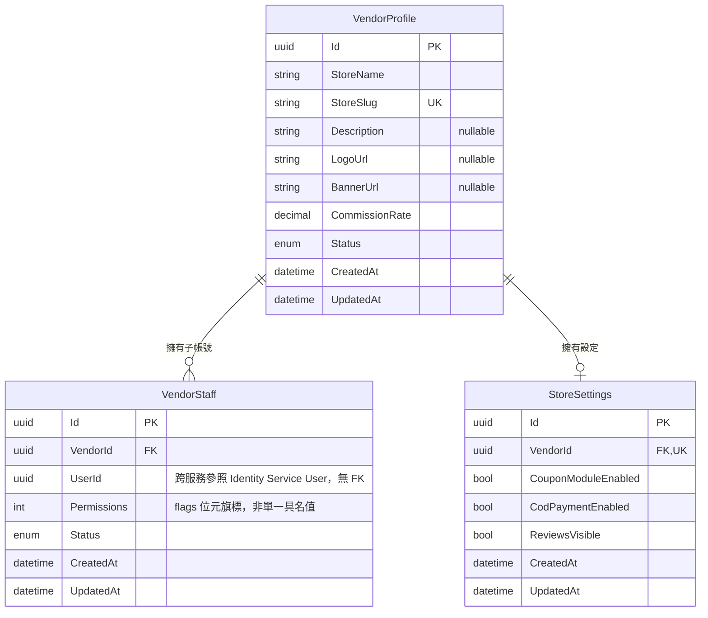

# 14 - Vendor Service

## 異動紀錄
| 版本 | 日期 | 作者 | 說明 |
|---|---|---|---|
| v0.1 | 2026-09-08 | ordinarycas | 從 [06-ecommerce-platform-architecture.md](06-ecommerce-platform-architecture.md) 拆分獨立，回應「微服務拆成多個規格」需求 |
| v0.2 | 2026-09-08 | ordinarycas | 補上本文件唯一缺少的「API 大綱」章節（新增 §4，原 §4 待決議事項改為 §5），回應 [10-gap-analysis.md](10-gap-analysis.md) §10 已列的最高優先缺口；同步移除 §2 `StoreSettings` 範例欄位裡的 `GuestCheckoutEnabled`——訪客結帳是平台鎖定的硬性需求（見 [07-storefront-requirements.md](07-storefront-requirements.md) §1），不應是賣家可關閉的功能開關，詳見 [08-vendor-admin-requirements.md](08-vendor-admin-requirements.md) §2 |
| v0.3 | 2026-09-08 | ordinarycas | §2 補充說明 `CodPaymentEnabled` 是 COD 是否開放的唯一權威來源（[18-service-payment.md](18-service-payment.md) 不重複管轄，見其 v0.2）；§4 新增結帳 Saga 查詢抽成費率的內部端點，解決 [10-gap-analysis.md](10-gap-analysis.md) §11「`SubOrder.CommissionAmount` 計算來源未定義」 |
| v0.4 | 2026-09-09 | ordinarycas | §2、§5 定案 `StoreSettings` 歸屬本服務（不歸 CMS Service），回應「將待決議事項列出來實作」需求，理由見 §5 |
| v0.5 | 2026-09-10 | ordinarycas | §5 多賣家平台管理員角色待決議項已解決：延後到多賣家入駐本身核准後再設計，回應「將待決議事項列出來實作」需求 |
| v0.6 | 2026-09-10 | ordinarycas | §2 新增 ER 圖（Mermaid erDiagram），涵蓋 VendorProfile/VendorStaff/StoreSettings 三個實體與其內部 FK 關係（VendorProfile 對 VendorStaff 一對多、對 StoreSettings 一對一）；交叉核對 `ecommerce-services` 實際程式碼後，VendorStaff 一列補上原文字未提及的 `Status`（Active/Disabled，對應 §4「停用/移除子帳號」）欄位，並註明 `UserId` 為對 Identity Service 的跨服務參照（無 FK） |
| v0.7 | 2026-09-12 | ordinarycas | §4 新增 `POST /internal/v1/vendor/commission-rates/batch` 批次抽成費率查詢端點（效能修正）：稽核 `ecommerce-services` 發現結帳 Saga 原本對購物車內每個不同賣家逐一呼叫既有單筆端點 `GET .../{vendorId}/commission-rate`（K 個不同賣家＝K 次序列化 await 的 HTTP 往返），且發生在 WMS 已原子性預留庫存**之後**——每多一次往返都拉長庫存被鎖住但訂單尚未確定成立的時間窗，購物車橫跨多個賣家（一張訂單拆多個 SubOrder）是本平台的常態情境，不是邊緣案例。比照 [12-service-catalog.md](12-service-catalog.md) `products/batch`、[13-service-wms.md](13-service-wms.md) `inventory/batch` 既有批次端點慣例（含相同的單次請求筆數上限 500、相同的「查無資料的 ID 不出現在回應清單中」語意），一次查完購物車橫跨的全部賣家，取代原本的 N+1 呼叫，詳見 [17-service-order.md](17-service-order.md) v0.18 §4 步驟 4 同步更新 |

## 1. 職責

賣家商店資料、子帳號、抽成設定。

## 2. 資料模型

| 實體 | 說明 |
|---|---|
| VendorProfile | StoreName/StoreSlug、Description、LogoUrl/BannerUrl、CommissionRate、Status |
| VendorStaff | 子帳號，關聯 User（`UserId` 為對 Identity Service 的跨服務參照，無 FK），Permissions（如僅出貨、僅看報表，flags 位元旗標）、Status（`Active`/`Disabled`，對應 §4「停用/移除子帳號」） |
| StoreSettings（**歸屬本服務，定案**，見 §5） | 賣家自己管理的功能開關（`CouponModuleEnabled`、`CodPaymentEnabled`、`ReviewsVisible` 等），與 ShyeCMS 的合約層級授權是兩回事，見 [08-vendor-admin-requirements.md](08-vendor-admin-requirements.md) §2。**不含**訪客結帳開關——訪客結帳是平台鎖定的硬性需求，不是賣家可關閉的功能，見 [07-storefront-requirements.md](07-storefront-requirements.md) §1。`CodPaymentEnabled` 是「結帳頁是否顯示 COD 選項」的**唯一權威來源**——[18-service-payment.md](18-service-payment.md) 的 `PaymentProviderSettings` 只管轄需要商店代號/金鑰的金流閘道商，不重複設定 COD，避免同一件事有兩處可設定 |

### 2.1 ER 圖

以下實體均屬本服務自己的 PostgreSQL schema，關聯線只畫本服務內部真實存在的外鍵（FK）；`VendorStaff.UserId` 是對 Identity Service 的跨服務參照，僅為慣例對應的裸 GUID，資料庫層級無 FK 約束。

## 3. 爸芭樂案例

爸芭樂店家自己的商店資料。**暫定為單一賣家自營**——多賣家審核/子帳號分權等場景在此案例下不適用，若平台本身即單一賣家自營，此服務仍保留供未來多賣家擴充，見 [05-scope-and-open-items.md](05-scope-and-open-items.md) §2。

## 4. API 大綱

| Method & Path | 說明 | 認證 |
|---|---|---|
| `GET /api/v1/vendor/profile` | 賣家查看自己的商店資料（含唯讀 `CommissionRate`） | 賣家 |
| `PUT /api/v1/vendor/profile` | 賣家編輯商店資料（`StoreName`/`Description`/`LogoUrl`/`BannerUrl`） | 賣家 |
| `GET /api/v1/vendors/{storeSlug}` | 前台顯示店家公開資訊（品牌故事、商店名稱等），對應 [07-storefront-requirements.md](07-storefront-requirements.md) 品牌形象首頁 | 公開 |
| `GET /api/v1/vendor/staff` | 列出子帳號 | 賣家 |
| `POST /api/v1/vendor/staff` | 新增子帳號並指派 `Permissions`（如僅出貨、僅看報表） | 賣家 |
| `PUT /api/v1/vendor/staff/{id}` | 調整子帳號權限 | 賣家 |
| `DELETE /api/v1/vendor/staff/{id}` | 停用/移除子帳號 | 賣家 |
| `GET /api/v1/vendor/settings` | 讀取 `StoreSettings`（功能開關，見 [08-vendor-admin-requirements.md](08-vendor-admin-requirements.md) §2） | 賣家 |
| `PUT /api/v1/vendor/settings` | 更新 `StoreSettings` | 賣家 |
| `GET /internal/v1/vendor/{vendorId}/commission-rate` | 結帳 Saga 建立 SubOrder 前查詢商店目前的 `CommissionRate`，用於計算 `SubOrder.CommissionAmount`（見 [17-service-order.md](17-service-order.md) §4） | 內部（服務身分 JWT: service=order-service） |
| `POST /internal/v1/vendor/commission-rates/batch` | **v0.7 效能修正新增**：批次查詢多個賣家目前的 `CommissionRate`，取代結帳 Saga 原本對購物車橫跨的每個不同賣家逐一呼叫上一列單筆端點的 N+1 序列化 HTTP 往返，見 [17-service-order.md](17-service-order.md) §4 步驟 4 | 內部（服務身分 JWT: service=order-service） |

`CommissionRate` 目前僅供唯讀展示：爸芭樂暫定為單一賣家自營，抽成費率於部署當下由拾夜科技直接寫入資料庫，本輪不提供賣家自行調整費率的端點；若未來開放多賣家入駐，需要另外設計平台管理員調整費率的 API（見 §5 待決議）。

**`POST /internal/v1/vendor/commission-rates/batch` 的批次語意**（v0.7 新增）：單次請求 `VendorIds` 合計上限 500 筆（比照 [12-service-catalog.md](12-service-catalog.md) `products/batch`、[13-service-wms.md](13-service-wms.md) `inventory/batch` 既有批次端點的相同上限設計），超過回 400 Problem Details；查無資料的 `VendorId` 不會出現在回應清單中，語意同上述兩個既有批次端點慣例，呼叫端（Order Service）需自行判斷缺漏項並視為 `vendor_not_found`。認證沿用與上一列單筆端點完全相同的 Policy，不是另外新開一個更寬鬆的認證路徑。

版本控管與文件格式沿用 [09-api-specification.md](09-api-specification.md) 的通用規範。

## 5. 待決議事項
- [x] ~~`StoreSettings` 是否應歸屬本服務而非 CMS Service~~——**已解決：定案歸屬 Vendor Service**。理由：(1) 三個欄位（優惠券模組開關、COD 開關、評價可見度）本質是**商業規則配置**，與本服務既有的抽成費率、賣家子帳號同屬「賣家如何營運自己商店」的範疇，跟 CMS Service 負責的「首頁/形象頁版型」（內容/呈現）是不同性質；(2) `ecommerce-services` 的 `SuxoShop.Vendor.Domain` 從骨架階段就已經把 `StoreSettings` 建在本服務底下、有真實的 `GET`/`PUT /api/v1/vendor/settings` 端點，CMS Service 從未實作過這個實體——與其為了理論上的職責劃分搬動已經在用的程式碼，不如承認現況。[20-service-cms.md](20-service-cms.md) §5 對應待決議項同步標記已解決
- [x] ~~若未來開放多賣家入駐，需要補上賣家審核流程與對應的平台管理員角色、以及調整 `CommissionRate` 的 API~~——**已解決：現階段不設計，延後到多賣家入駐真的核准時再做**。理由：「是否要開放多賣家入駐」本身還是未定案的商業模式問題（見 [05-scope-and-open-items.md](05-scope-and-open-items.md)、[10-gap-analysis.md](10-gap-analysis.md) §9），在還不確定要不要做多賣家之前先設計審核流程/管理員角色/費率調整 API，屬於為不確定會發生的情境超前設計；等「要開放多賣家」這個更上位的商業決策拍板後，再回頭一併設計
