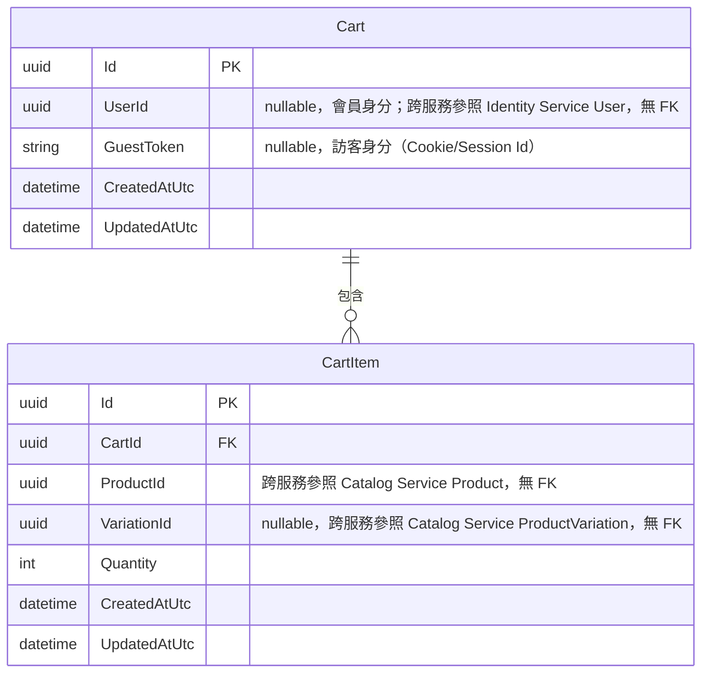

# 15 - Cart Service

## 異動紀錄
| 版本 | 日期 | 作者 | 說明 |
|---|---|---|---|
| v0.1 | 2026-09-08 | ordinarycas | 從 [06-ecommerce-platform-architecture.md](06-ecommerce-platform-architecture.md) 拆分獨立，回應「微服務拆成多個規格」需求 |
| v0.2 | 2026-09-09 | ordinarycas | §5 訪客購物車自動清理排程待決議項已解決：定案 30 天未更新視為過期、每日背景排程清理，回應「將待決議事項列出來實作」需求 |
| v0.3 | 2026-09-10 | ordinarycas | §2 新增 ER 圖（Mermaid erDiagram），涵蓋 Cart/CartItem 兩個實體（一對多）；已交叉核對 `ecommerce-services` 實際 EF Core 程式碼，§2 既有文字內容與程式碼一致，未發現需訂正之處 |

## 1. 職責

購物車，含會員與訪客兩種身分。

## 2. 資料模型

| 實體 | 說明 |
|---|---|
| Cart | 會員為 UserId，訪客為 Cookie/SessionId |
| CartItem | ProductId/VariationId、Quantity |

### 2.1 ER 圖

以下實體均屬本服務自己的 PostgreSQL schema，關聯線只畫本服務內部真實存在的外鍵（FK）；`Cart.UserId`、`CartItem.ProductId`/`VariationId` 分別是對 Identity Service、Catalog Service 的跨服務參照，僅為慣例對應的裸 GUID，資料庫層級無 FK 約束。

## 3. 爸芭樂案例

訪客免登入即可加入購物車，見 [07-storefront-requirements.md](07-storefront-requirements.md) §1。結帳時由 Order Service 呼叫本服務取得購物車內容（唯讀），見 [17-service-order.md](17-service-order.md) 的 Saga 流程。

## 4. API 大綱

| Method & Path | 說明 | 認證 |
|---|---|---|
| `GET /api/v1/cart` | 取得目前購物車（依 Cookie/JWT 識別） | 公開（含訪客） |
| `POST /api/v1/cart/items` | 加入商品 | 公開（含訪客） |
| `PUT /api/v1/cart/items/{id}` | 修改數量 | 公開（含訪客） |
| `DELETE /api/v1/cart/items/{id}` | 移除商品 | 公開（含訪客） |
| `GET /internal/v1/cart/{cartId}` | 結帳 Saga 內部呼叫：取得購物車內容 | 內部（僅 Order Service） |

版本控管與文件格式沿用 [09-api-specification.md](09-api-specification.md) 的通用規範。

## 5. 待決議事項
- [x] ~~訪客購物車的自動清理排程（多久未更新視為過期）~~——**已解決：30 天未更新視為過期，背景排程每日清理一次**。理由：Cart Service 加入購物車時**不**向 WMS 預留庫存（預留只發生在結帳當下，見 [17-service-order.md](17-service-order.md) §4），所以閒置購物車唯一的成本是資料庫儲存空間，沒有鎖住庫存的急迫性，可以給比較寬鬆的期限；30 天貼近一般電商「棄單挽回」的常見窗口（太短會刪掉使用者隔幾天回來想繼續結帳的購物車，太長則無意義地累積資料）。背景排程比照 [08-vendor-admin-requirements.md](08-vendor-admin-requirements.md) §5.5 WooCommerce 匯出、[17-service-order.md](17-service-order.md) §4.1 補償重試已驗證過的背景 Worker 模式，不需要新的技術選型
