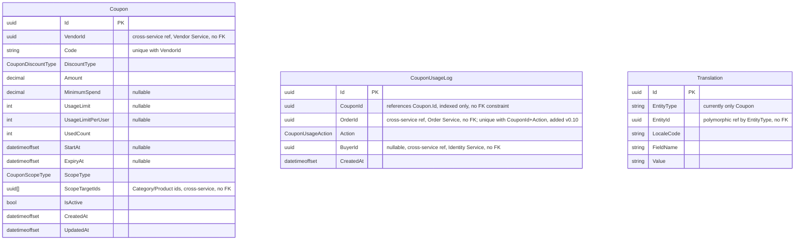

# 16 - Promotions Service

## 異動紀錄
| 版本 | 日期 | 作者 | 說明 |
|---|---|---|---|
| v0.1 | 2026-09-08 | ordinarycas | 從 [06-ecommerce-platform-architecture.md](06-ecommerce-platform-architecture.md) 拆分獨立，回應「微服務拆成多個規格」需求 |
| v0.2 | 2026-09-08 | ordinarycas | §2 補上 `Translation` 表，落實 [28-i18n.md](28-i18n.md) §3 列出但本文件尚未實作的多語系需求 |
| v0.3 | 2026-09-08 | ordinarycas | 新增 §5 待決議事項——本文件先前是唯一沒有此章節的服務規格，屬於既有疏漏 |
| v0.4 | 2026-09-08 | ordinarycas | 新增 §4 併發保護機制，套用 [13-service-wms.md](13-service-wms.md) §4 已定案的原子條件更新模式，解決 [10-gap-analysis.md](10-gap-analysis.md) §11 已列的優惠券使用次數併發缺口；§5（原 §4）API 大綱補上編輯/刪除優惠券端點，回應賣家後台優惠券管理需求（見 [08-vendor-admin-requirements.md](08-vendor-admin-requirements.md) §1） |
| v0.5 | 2026-09-09 | ordinarycas | §6 Saga 補償失敗待決議項標記已解決，統一設計見 [17-service-order.md](17-service-order.md) §4.1 |
| v0.6 | 2026-09-09 | ordinarycas | §2 補上 Coupon.VendorId 欄位；§6 解決 2 項待決議：優惠券不可疊加使用、Code 唯一性範圍為賣家範圍內唯一（皆核對 `ecommerce-services` 既有實作後定案），回應「將待決議事項列出來實作」需求 |
| v0.7 | 2026-09-10 | ordinarycas | §2 新增 CouponUsageLog 實體、§5 新增對應的 PlatformSupportStaff 診斷端點——回應 [08-vendor-admin-requirements.md](08-vendor-admin-requirements.md) §6「診斷端點逐服務盤點」發現本服務原本遺漏這塊 |
| v0.8 | 2026-09-10 | ordinarycas | §2 新增 2.1 ERD（Mermaid），並核對 `ecommerce-services` 現行 Domain/Infrastructure 程式碼後補上表格原先遺漏的欄位——`Coupon.UsedCount`/`IsActive`、`CouponUsageLog.BuyerId`；確認 `Coupon` 與 `CouponUsageLog`/`Translation` 之間目前皆未在 EF 設定檔建立資料庫層級外鍵（僅建索引），ERD 依此如實不畫關聯線 |
| v0.9 | 2026-09-10 | ordinarycas | 新增 §4.1「優惠券適用範圍檢查」——本服務原本完全沒有文件描述 `ScopeType`/`ScopeTargetIds` 這組欄位實際怎麼判斷「是否在範圍內」，稽核 [17-service-order.md](17-service-order.md) 資安修正時一併核對程式碼補上。同時記錄該輪稽核發現的一個相關缺口：本服務端的範圍檢查邏輯（含 `SpecificCategories`）本身沒有問題、已有獨立測試涵蓋兩個方向，缺口其實在 Order Service 那一側——結帳 Saga 過去從未查過商品分類，永遠傳空 `categoryIds` 過來，導致任何 `SpecificCategories` 範圍的優惠券無論購物車內容為何都會判定 `scope_not_met`；本服務的 `/internal/v1/promotions/validate` 契約其實早就有 `CategoryIds` 這個可選欄位，缺口不在本服務，已於 [17-service-order.md](17-service-order.md) v0.13 §4 步驟 1.5 修正，本文件不需要修改程式碼 |
| v0.10 | 2026-09-10 | ordinarycas | 配合 [17-service-order.md](17-service-order.md) v0.14 結帳冪等性修正：§2/§2.1 `CouponUsageLog` 新增 `(CouponId, OrderId, Action)` 唯一約束；§4 補充使用次數的原子遞增現在對同一個 OrderId 是安全可重複呼叫的行為說明，同時修正 `RevertAsync`（Saga 補償還原）先前並非真正冪等的既有缺口。完整設計理由見 [17-service-order.md](17-service-order.md) §4.2 |

## 1. 職責

優惠券的建立、驗證與套用。

## 2. 資料模型

| 實體 | 說明 |
|---|---|
| Coupon | VendorId（優惠券歸屬某個賣家）、Code（**VendorId + Code 唯一**，見 §6）、DiscountType（FixedAmount/Percentage）、Amount、MinimumSpend、UsageLimit/UsageLimitPerUser、UsedCount（目前已使用次數，§4 原子遞增的對象）、StartAt/ExpiryAt、適用範圍（ScopeType + ScopeTargetIds，分類/商品限定）、IsActive（停用旗標，見 §5 DELETE 端點，採軟刪除） |
| CouponUsageLog | 優惠券使用/還原歷程（`CouponId`、`OrderId`、`Action`：`Used`/`Reverted`、`BuyerId`：使用者 ID，訪客結帳為 null、供 `UsageLimitPerUser` 每人上限查詢、`CreatedAt`），供 `PlatformSupportStaff` 排查併發或補償異常——比照 [13-service-wms.md](13-service-wms.md) §2 `StockLedger` 的既有模式，本服務先前遺漏這張表，只靠 `Coupon.UsedCount` 這個計數器沒有歷史軌跡可查；`(CouponId, OrderId, Action)` 唯一約束（新增於 v0.10）防止同一個 OrderId 的使用/還原被重複套用，見 [17-service-order.md](17-service-order.md) §4.2 |
| Translation | EntityType（"Coupon"）、EntityId、LocaleCode、FieldName（如優惠券顯示文案）、Value——結構沿用 [28-i18n.md](28-i18n.md) §3 的共用模式 |

### 2.1 ERD



> 本圖未畫出任何關聯線：已對照 `CouponUsageLogConfiguration`／`TranslationConfiguration` 確認，`CouponUsageLog.CouponId` 與 `Translation.EntityId` 都只建了索引，沒有 `HasOne`/`HasForeignKey`，資料庫層級不存在外鍵約束（`CouponId` 邏輯上仍對應 `Coupon.Id`；`Translation.EntityId` 依 `EntityType` 指向不同實體，是 [28-i18n.md](28-i18n.md) §3 共用多語系表既有的多型設計，目前僅有 `"Coupon"` 一種）。`Coupon.VendorId`、`Coupon.ScopeTargetIds`、`CouponUsageLog.OrderId`/`BuyerId` 則是本服務一貫的跨服務參照慣例（只存 ID、不建 FK），分屬 Vendor／Catalog／Order／Identity 服務。

## 3. 爸芭樂案例

如「產季優惠」「滿千免運」等折扣券。

## 4. 併發保護機制

優惠券使用次數（`Coupon.UsedCount`）比照 [13-service-wms.md](13-service-wms.md) §4 已定案的**原子條件更新**模式，避免併發結帳導致超用：

```sql
UPDATE Coupons SET UsedCount = UsedCount + 1 WHERE Id = @CouponId AND UsedCount < UsageLimit
```

影響列數為 0 即代表已達使用上限，`/internal/v1/promotions/validate` 應回傳結帳失敗（優惠券已達使用上限），觸發 Saga 走「優惠券失敗」分支（見 [06-ecommerce-platform-architecture.md](06-ecommerce-platform-architecture.md) §7）。`UsageLimitPerUser` 的每人限制需額外查詢該使用者的歷史使用次數，屬於原子更新之外的追加檢查，仍應在同一個資料庫交易內完成，避免 TOCTOU 競態。

**冪等性（v0.10 新增，見 [17-service-order.md](17-service-order.md) §4.2）**：`/internal/v1/promotions/validate` 對同一個 OrderId 現在是安全可重複呼叫的——呼叫前先查該 (CouponId, OrderId) 是否已有 `Used` 歷程列，有則直接回報成功（折扣金額以目前券設定重算，不重複遞增 `UsedCount`）；沒有才進入上述原子遞增流程，寫入時若與另一個真正同時送達、帶著同一個 OrderId 的請求競爭 `(CouponId, OrderId, Action)` 唯一約束，輸的一方回滾自己造成的遞增、回報清楚的失敗（`reason=duplicate_usage`），不假裝成功——理由與取捨比照 [13-service-wms.md](13-service-wms.md) §4 的同款修正。`/internal/v1/promotions/{code}/revert`（Saga 補償）同步修正：先前並非真正冪等（同一張券若還有其他訂單的合法使用量，重複呼叫 `Revert` 同一個 OrderId 會把別張訂單的合法用量也跟著多扣一次），現在同樣先查該 (CouponId, OrderId) 是否已有 `Reverted` 歷程列，有則直接回報「已還原」，不重複遞減。

### 4.1 優惠券適用範圍檢查（v0.9 新增，補齊原本完全沒有文件描述的既有邏輯）

`Coupon.ScopeType` + `ScopeTargetIds`（§2）決定優惠券是否適用於某次結帳，`/internal/v1/promotions/validate` 依 `ScopeType` 判斷：

| ScopeType | 判斷規則 |
|---|---|
| `AllProducts` | 一律通過，不檢查品項/分類 |
| `SpecificProducts` | 結帳品項的 `ProductIds` 與 `Coupon.ScopeTargetIds` 至少有一個交集才通過，否則回傳 `scope_not_met` |
| `SpecificCategories` | 結帳品項所屬的 `CategoryIds` 與 `Coupon.ScopeTargetIds` 至少有一個交集才通過，否則回傳 `scope_not_met` |

折扣金額仍以**整張訂單小計**計算（§2 `DiscountType` 既有語意），本服務只做到「範圍內完全沒有符合品項就整張拒絕套用」，未做到「只對範圍內品項折抵」的行項級折扣——這是骨架階段的既知簡化，不在本輪範圍。

**`ProductIds`/`CategoryIds` 由呼叫端（Order Service 結帳 Saga）提供，本服務不自行查詢商品資料**（本服務的資料模型完全不含商品/分類資訊）——這正是稽核 [17-service-order.md](17-service-order.md) 資安修正時發現的一個相關缺口：`CategoryIds` 這個參數本身在契約裡早就存在（`/internal/v1/promotions/validate` 請求本體），本服務端的範圍檢查邏輯也早就正確處理它（含 `SpecificCategories` 兩個方向皆有獨立測試覆蓋），但呼叫端（Order）過去從未實際查過商品分類，永遠傳一個空清單過來——空清單與任何非空的 `ScopeTargetIds` 交集必然是空集合，等同「任何 `SpecificCategories` 範圍的優惠券無論購物車內容為何都判定不符範圍」。缺口完全在 Order 那一側沒把資料準備好，本服務的邏輯或契約都不需要修改，已於 [17-service-order.md](17-service-order.md) v0.13 §4 新增的步驟 1.5 修正（Order 改為呼叫 Catalog Service 批次查詢商品真實分類後再傳進來）。`SpecificProducts`（`ProductIds`）不受影響——Order 的結帳品項快照本來就含 `ProductId`，這個參數一直是正確填入的。

## 5. API 大綱

| Method & Path | 說明 | 認證 |
|---|---|---|
| `GET /api/v1/vendor/coupons` | 賣家查看/管理優惠券 | 賣家 |
| `POST /api/v1/vendor/coupons` | 建立優惠券 | 賣家 |
| `PUT /api/v1/vendor/coupons/{id}` | 編輯優惠券（折扣內容、期限、適用範圍） | 賣家 |
| `DELETE /api/v1/vendor/coupons/{id}` | 刪除/停用優惠券 | 賣家 |
| `POST /internal/v1/promotions/validate` | 結帳 Saga 內部呼叫：驗證優惠券並計算折扣、使用次數 +1（原子更新，見 §4；適用範圍檢查見 §4.1） | 內部（僅 Order Service） |
| `POST /internal/v1/promotions/{code}/revert` | Saga 補償：還原優惠券使用次數 | 內部 |
| `GET /internal/v1/promotions/support/{code}/usage-log` | 供 `PlatformSupportStaff` 唯讀查詢優惠券使用/還原歷程，用於排查併發或補償異常（比照 [13-service-wms.md](13-service-wms.md) §4 `StockLedger` 診斷端點的既有模式，本服務先前遺漏對應端點） | 內部 + PlatformSupportStaff |

版本控管與文件格式沿用 [09-api-specification.md](09-api-specification.md) 的通用規範。

## 6. 待決議事項
- [x] ~~優惠券是否可疊加使用（一張訂單同時套用多張優惠券），目前資料模型未定義互斥/疊加規則~~——**已解決：不可疊加**。`ecommerce-services` 的結帳 Saga 契約（`CheckoutOrderCommand.CouponCode`）本來就是單一字串欄位，不是清單，一張訂單只能套用一組優惠券——與其回頭改資料模型與 Saga 契約去支援疊加，不如承認現況即為定案。日後若要開放疊加，屬於新功能而非本項待決議的範圍
- [x] ~~Saga 補償失敗時（`/internal/v1/promotions/{code}/revert` 本身失敗，如還原使用次數時資料庫異常）的處理方式~~——**已解決**：統一設計見 [17-service-order.md](17-service-order.md) §4.1（`SagaCompensationFailure` 實體＋指數退避重試＋人工介入端點），`Coupon.UsedCount` 未還原即為該設計所稱的「卡住狀態」，由 Order Service 端追蹤重試與升級，本服務不需另立一套
- [x] ~~`Coupon.Code` 的唯一性範圍：全站唯一，還是允許不同賣家各自使用相同代碼~~——**已解決：VendorId + Code 唯一（賣家範圍內唯一，非全站唯一）**。`ecommerce-services` 已這樣實作（`Coupon` 實體的唯一索引），理由：多賣家入駐後（[05-scope-and-open-items.md](05-scope-and-open-items.md) §2）每個賣家應能獨立管理自己的行銷代碼，不需要跟platform上其他不相干的賣家協調避免代碼撞名（例如兩個賣家都想用 `WELCOME10` 當歡迎折扣碼）；優惠券驗證/使用本來就是在特定賣家的商品範圍內進行（見 §4、[17-service-order.md](17-service-order.md) §4 結帳 Saga 依 SubOrder 拆分賣家），不存在「同一個代碼、不知道歸哪個賣家」的歧義。若日後改採全站唯一，只需調整索引，程式碼已預留彈性
