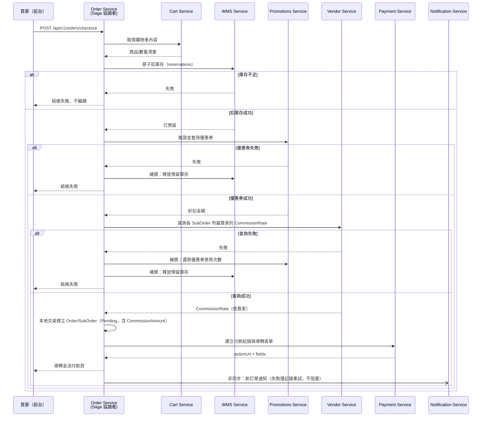

# 17 - Order Service

## 異動紀錄
| 版本 | 日期 | 作者 | 說明 |
|---|---|---|---|
| v0.1 | 2026-09-08 | ordinarycas | 從 [06-ecommerce-platform-architecture.md](06-ecommerce-platform-architecture.md)、[09-api-specification.md](09-api-specification.md) 拆分獨立，回應「微服務拆成多個規格」需求 |
| v0.2 | 2026-09-08 | ordinarycas | §4 Saga 新增查詢 Vendor Service 抽成費率的步驟，解決 `SubOrder.CommissionAmount` 計算來源未定義的問題（見 [10-gap-analysis.md](10-gap-analysis.md) §11、[14-service-vendor.md](14-service-vendor.md) §4 新增的內部端點）；[06-ecommerce-platform-architecture.md](06-ecommerce-platform-architecture.md) §7 同步更新 |
| v0.3 | 2026-09-08 | ordinarycas | §6 Correlation ID 待決議項已過時——機制已由 [29-shared-service-conventions.md](29-shared-service-conventions.md) §1.1 定案，改為標記已解決並確認本服務的落實方式 |
| v0.4 | 2026-09-09 | ordinarycas | 新增 §4.1：Saga 補償失敗的統一處理設計（`SagaCompensationFailure` 實體＋指數退避重試＋人工介入端點 `GET /internal/v1/orders/support/compensation-failures`），[13-service-wms.md](13-service-wms.md)、[16-service-promotions.md](16-service-promotions.md) 同步回頭引用而不各自另立；§6 對應待決議項標記已解決 |

## 1. 職責

訂單、子訂單、狀態機，並擔任**結帳流程的 Saga 協調者**——這是全平台唯一的跨服務交易協調點。

## 2. 資料模型

| 實體 | 說明 |
|---|---|
| Order | BuyerId（訪客可為 null，改用訪客識別）、Status、Subtotal/ShippingFee/TaxTotal/DiscountTotal/GrandTotal、PaymentStatus |
| SubOrder | 依賣家拆分的子訂單，Status（Pending/Confirmed/Shipped/Completed/Cancelled/ReturnRequested/Refunded）、CommissionAmount（= 該 SubOrder 小計 × 結帳當下向 Vendor Service 查得的 `CommissionRate`，見 §4） |
| OrderItem | ProductNameSnapshot/SKUSnapshot（下單當下快照，避免商品後續變更影響歷史訂單）、Price/Quantity |

## 3. 爸芭樂案例

買家同時購買珍珠芭樂+帝王芭樂時，結帳建立一張 Order，若平台為單一賣家自營則只會產生一張 SubOrder。

## 4. 結帳 Saga（本平台唯一的跨服務交易協調流程）

爸芭樂買家結帳需跨 Cart、WMS、Promotions、Order、Payment、Notification 六個服務，由 Order Service 擔任 Saga 協調者：

1. 呼叫 Cart Service 取得購物車內容
2. 呼叫 WMS Service 原子扣庫存（成功視為已預留，失敗則整筆結帳失敗）
3. 呼叫 Promotions Service 驗證並套用優惠券
4. 呼叫 Vendor Service 查詢各 SubOrder 所屬賣家目前的 `CommissionRate`（`GET /internal/v1/vendor/{vendorId}/commission-rate`，見 [14-service-vendor.md](14-service-vendor.md) §4），用於計算 `SubOrder.CommissionAmount`；查詢失敗視同整筆結帳失敗，觸發與優惠券/庫存相同的補償鏈
5. 建立 Order/SubOrder（Order Service 自己的資料庫，本地原子交易，`CommissionAmount` 已由上一步算出）
6. 呼叫 Payment Service 建立付款紀錄
7. 任一步驟失敗 → 觸發補償（還原庫存、還原優惠券使用次數、標記訂單失敗），補償動作需冪等可重試
8. 訂單建立後，**非同步**通知 Notification Service 推播新訂單訊息，失敗僅記錄重試，不影響訂單本身（容錯隔離原則）

通訊方式：同步 REST 呼叫鏈（Notification 除外，走非同步），不引入訊息佇列——單一客戶部署流量規模不大，非同步事件驅動換不到對應的複雜度代價。

### 4.1 補償失敗的統一處理（WMS/Promotions/Order 共通設計）

結帳 Saga 任一步驟失敗時觸發的補償動作（[13-service-wms.md](13-service-wms.md) 的釋放預留庫存、[16-service-promotions.md](16-service-promotions.md) 的還原優惠券使用次數）本身也可能失敗——這是全新的失敗模式（補償的補償），WMS/Promotions/Order 三個服務都會遇到。本節提供**唯一一套**設計，13、16 不各自另立，只回頭引用本節（見兩份文件各自的 §6）。

**設計原則**：補償失敗後，受影響的資料**保持卡住狀態**（`StockReservation.Released=false`、`Coupon.UsedCount` 未還原），**不自動嘗試修正資料**——庫存/優惠券使用次數涉及財務與庫存正確性，自動修正的風險高於暫時卡住，改由下方機制引導人工介入。

**重試策略**：比照 [23-service-notification.md](23-service-notification.md) §4 已定案的參數，統一採**指數退避、最多 4 次重試**，由 Order Service 內建的背景 Worker（比照 [08-vendor-admin-requirements.md](08-vendor-admin-requirements.md) §5.5 WooCommerce 匯出已驗證的背景工作模式）非同步執行——結帳當下已回應買家「結帳失敗」，補償重試不能阻塞任何使用者請求。

**新增實體 `SagaCompensationFailure`（Order Service 自己的資料庫）**：

| 欄位 | 說明 |
|---|---|
| Id | |
| OrderId | 關聯的訂單 |
| FailedStep | 補償失敗的服務，`WMS` / `Promotions` |
| FailedAction | 呼叫的端點，如 `/internal/v1/wms/reservations/{id}/release` |
| RetryCount | 目前已重試次數 |
| LastError | 最後一次失敗的錯誤訊息 |
| Status | `Open`（重試中或待人工介入）/ `Resolved`（人工確認已處理） |
| CreatedAt / ResolvedAt / ResolvedByStaffId | |

**升級為人工介入**：重試 4 次仍失敗後，`Status` 維持 `Open`，不再自動重試，透過 `GET /internal/v1/orders/support/compensation-failures`（見 §5）供 `PlatformSupportStaff` 查詢待處理清單，人工確認並處理（如手動重試該端點，或視情況直接修正庫存/優惠券資料）後標記 `Status=Resolved`。

**即時告警的殘留缺口（誠實記錄）**：本節解決了「補償失敗不會被默默遺失」（保證寫入 `SagaCompensationFailure` ＋ ERROR 等級結構化 log，見 [29-shared-service-conventions.md](29-shared-service-conventions.md) §1.3），但**即時推播告警**（Email/Slack/簡訊通知維運人員）仍依賴 [29-shared-service-conventions.md](29-shared-service-conventions.md) §5「結構化 log 集中收集方案」這項既有待決議——該方案定案前，`PlatformSupportStaff` 只能靠**主動查詢**上述端點得知待處理項目，不會有主動推播。這是已知殘留缺口，不是遺漏。

## 5. API 大綱

| Method & Path | 說明 | 認證 |
|---|---|---|
| `POST /api/v1/orders/checkout` | 建立訂單（Saga 協調者入口） | 公開（含訪客） |
| `GET /api/v1/orders/{id}` | 查詢訂單詳情 | 需登入（本人） |
| `POST /api/v1/orders/lookup` | 訪客查單（訂單編號 + Email） | 公開，需速率限制 |
| `GET /api/v1/vendor/orders` | 賣家查看自己商店的訂單 | 賣家 |
| `POST /api/v1/vendor/orders/{id}/ship` | 賣家標記出貨 | 賣家 |
| `GET /internal/v1/orders/support/{id}/trace` | 供 `PlatformSupportStaff` 查看某筆訂單完整 Saga 執行軌跡（哪一步失敗、補償是否成功），用於排查卡單問題 | 內部 + PlatformSupportStaff |
| `GET /internal/v1/orders/support/compensation-failures` | 供 `PlatformSupportStaff` 查詢待人工介入的補償失敗清單（§4.1） | 內部 + PlatformSupportStaff |

版本控管與文件格式沿用 [09-api-specification.md](09-api-specification.md) 的通用規範。

## 6. 待決議事項
- [x] ~~Saga 補償失敗時（例如還原庫存本身也失敗）的最終處理與告警機制——這是全新的失敗模式，需要對應設計~~——**已解決**：見 §4.1 統一設計（`SagaCompensationFailure` 實體＋指數退避重試＋人工介入端點），[13-service-wms.md](13-service-wms.md) §6、[16-service-promotions.md](16-service-promotions.md) §6 同步標記已解決並回頭引用本節。即時推播告警仍是殘留缺口，見 §4.1 說明
- [x] ~~Correlation ID 貫穿追蹤：Saga 橫跨 6 個服務，`/internal/v1/orders/support/{id}/trace` 依賴此機制存在，但機制本身尚未設計~~——**已解決**：[29-shared-service-conventions.md](29-shared-service-conventions.md) §1.1 已定案傳遞規則（Gateway 產生/沿用 `X-Correlation-Id`，逐服務強制轉發）；`/internal/v1/orders/support/{id}/trace` 的實作需確保 Saga 每一步（呼叫 Cart/WMS/Promotions/Vendor/Payment）都帶上同一組 Correlation ID 並寫入自己的結構化 log，才能依此 ID 查出跨服務的完整執行軌跡
- [ ] 逾時未付款自動取消、訂單編號產生策略需另訂
