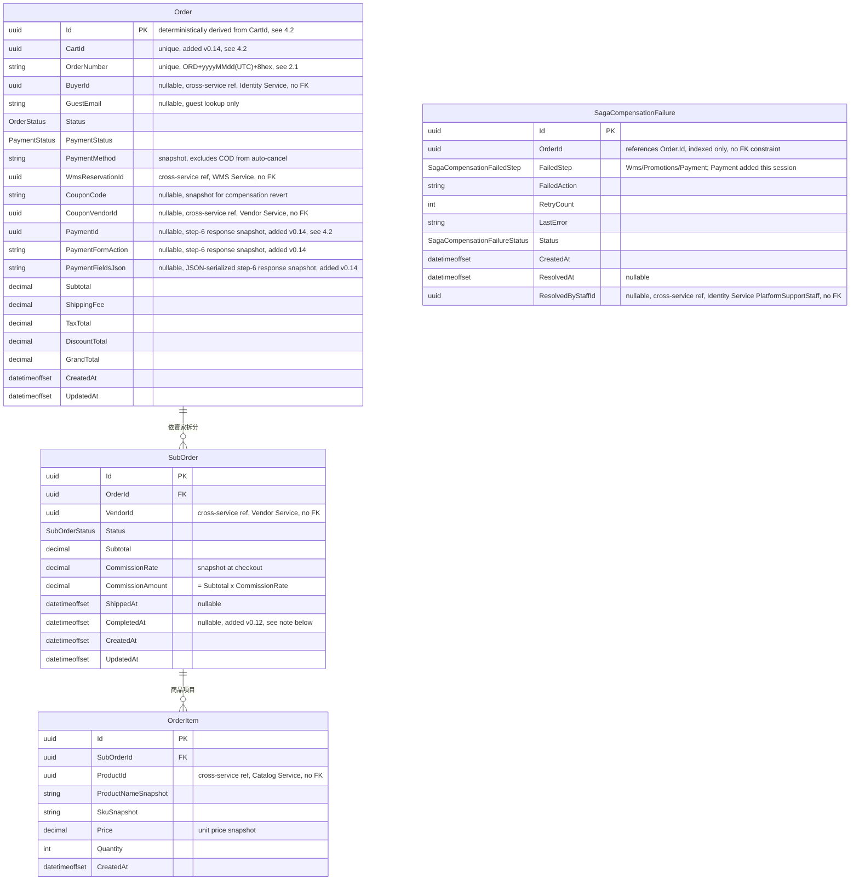
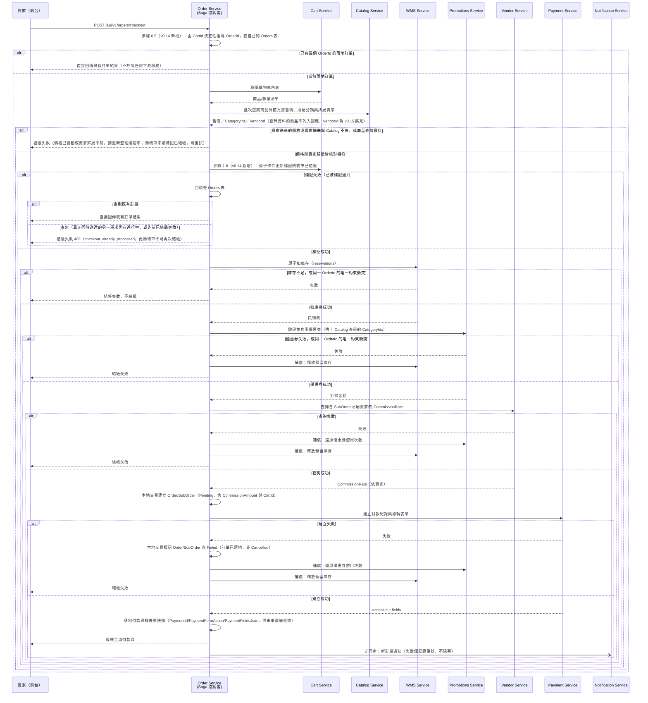

# 17 - Order Service

## 異動紀錄
| 版本 | 日期 | 作者 | 說明 |
|---|---|---|---|
| v0.1 | 2026-09-08 | ordinarycas | 從 [06-ecommerce-platform-architecture.md](06-ecommerce-platform-architecture.md)、[09-api-specification.md](09-api-specification.md) 拆分獨立，回應「微服務拆成多個規格」需求 |
| v0.2 | 2026-09-08 | ordinarycas | §4 Saga 新增查詢 Vendor Service 抽成費率的步驟，解決 `SubOrder.CommissionAmount` 計算來源未定義的問題（見 [10-gap-analysis.md](10-gap-analysis.md) §11、[14-service-vendor.md](14-service-vendor.md) §4 新增的內部端點）；[06-ecommerce-platform-architecture.md](06-ecommerce-platform-architecture.md) §7 同步更新 |
| v0.3 | 2026-09-08 | ordinarycas | §6 Correlation ID 待決議項已過時——機制已由 [29-shared-service-conventions.md](29-shared-service-conventions.md) §1.1 定案，改為標記已解決並確認本服務的落實方式 |
| v0.4 | 2026-09-09 | ordinarycas | 新增 §4.1：Saga 補償失敗的統一處理設計（`SagaCompensationFailure` 實體＋指數退避重試＋人工介入端點 `GET /internal/v1/orders/support/compensation-failures`），[13-service-wms.md](13-service-wms.md)、[16-service-promotions.md](16-service-promotions.md) 同步回頭引用而不各自另立；§6 對應待決議項標記已解決 |
| v0.5 | 2026-09-09 | ordinarycas | [10-gap-analysis.md](10-gap-analysis.md) §14 第九輪複查發現：§6 新增待決議項——Saga 循序圖遺漏 Payment 建立失敗的補償分支 |
| v0.6 | 2026-09-09 | ordinarycas | §2 補上 Order.OrderNumber 欄位、新增 §2.1 記錄 `ecommerce-services` 已實作的訂單編號產生規則（原本只活在程式碼的 TODO 註解裡）；§6 拆分原本混在一起的待決議項，訂單編號部分改為「現況已補上文件，正式定案與否仍待決議」，逾時未付款自動取消獨立成一項，回應「把已經做出來但規格沒寫的東西補回文件」需求 |
| v0.7 | 2026-09-09 | ordinarycas | §2 補上 Order.Status 列舉值（原本只有欄位名、沒有值，與 SubOrder 那列不一致）；§4 循序圖補上「Payment 建立失敗」分支，核對 `ecommerce-services` 的 `CheckoutOrderCommandHandler` 確認實際行為（`OrderStatus.Failed`、補償順序優惠券→庫存）後寫入；§6 對應待決議項標記已解決，回應「將待決議事項列出來實作」需求 |
| v0.8 | 2026-09-10 | ordinarycas | §6 逾時未付款自動取消待決議項已解決：定案 30 分鐘門檻（僅線上付款適用）、背景排程每 5 分鐘掃描、取消時觸發既有補償鏈，回應「將待決議事項列出來實作」需求 |
| v0.9 | 2026-09-10 | ordinarycas | §2.1 訂單編號產生規則從「暫定方案」正式定案為永久設計（理由：序號式編號會洩漏營業量、需要額外的集中計數基礎設施，划不來），追加防碰撞重試機制（最多 3 次）；§6 對應待決議項標記完全解決，回應「繼續補完 9 項未解決」需求 |
| v0.10 | 2026-09-10 | ordinarycas | §4.1 新增 `SagaCompensationFailedStep.Payment`（稽核發現的分散式正確性缺口）：結帳 Saga 步驟 6 呼叫 Payment 若逾時/連線中斷，Order 無法區分「請求未送達」與「Payment 已處理但回應遺失」，原補償鏈只還原優惠券、釋放庫存，遺漏收斂 Payment 端可能留下的孤兒付款紀錄——比照對帳（只比對 `Status=Success`）與逾時未付款自動取消（只挑 `Order.Status=Pending`）都不會再碰到這批訂單，屬於原設計的死角；Payment 新增 `POST /internal/v1/payments/orders/{orderId}/cancel` 配合收斂，見 [18-service-payment.md](18-service-payment.md) 同步更新 |
| v0.11 | 2026-09-10 | ordinarycas | §2 新增 2.2 ERD（Mermaid），並核對 `ecommerce-services` 現行 Domain/Infrastructure 程式碼後補上表格原先遺漏的欄位——`Order.GuestEmail`/`PaymentMethod`/`WmsReservationId`/`CouponCode`/`CouponVendorId`（皆為骨架階段依自動取消/補償鏈需求新增、規格表格原未列出）、`SubOrder.VendorId`/`CommissionRate`/`ShippedAt`、`OrderItem.ProductId`；確認 `Order → SubOrder → OrderItem` 為資料庫層級強制外鍵（級聯刪除），`SagaCompensationFailure.OrderId` 未建 FK（僅索引），ERD 依此如實不畫該關聯線 |
| v0.12 | 2026-09-10 | ordinarycas | 修正 Analytics Service 批次拉取已完成子訂單的核心缺口（稽核發現：`ecommerce-services` 的 `HttpOrderDataSource` 呼叫的端點原本不存在，每小時批次拉取永遠 404，見 [22-service-analytics.md](22-service-analytics.md) 同步更新）：§2 新增 `SubOrder.CompletedAt` 欄位並同步更新 §2.2 ERD；§5 新增 `GET internal/v1/orders/support/completed` 內部端點；§6 新增一項待決議——目前沒有任何程式碼路徑會把 `SubOrder.Status` 轉為 `Completed`（賣家後台只有「標記出貨」，[08-vendor-admin-requirements.md](08-vendor-admin-requirements.md) 列出的「標記已完成」規格尚未落地），這是核對程式碼時意外發現的獨立缺口，不在本輪修復範圍內 |
| v0.13 | 2026-09-10 | ordinarycas | **資安修正（money-critical）**：稽核發現結帳 Saga 原本在步驟 3 直接執行 `request.Items.Sum(i => i.Price * i.Quantity)`——`Price` 是買家結帳請求本文帶入的單價快照，Cart Service 不儲存價格、Order 也從未呼叫 Catalog 查真實現價，任何人都能竄改該欄位送出任意單價，直接決定 GrandTotal、Payment 導轉付款金額與 WMS 扣庫存依據的小計。§4 新增步驟 1.5：呼叫 [12-service-catalog.md](12-service-catalog.md) v0.8 新增的 `POST /internal/v1/catalog/products/batch` 取得每個 ProductId 當下的權威售價與所屬分類 ID；買家送來的 Price 只用於比對是否與權威售價一致（不相符即整筆拒絕，409 Problem Details，`step=Catalog`/`reason=price_mismatch`，提示買家重新整理購物車），不再是金額計算來源。同時修正一個相關但獨立的缺口：優惠券分類範圍檢查（`ScopeType.SpecificCategories`）先前因為 Order 從未查過商品分類、永遠傳空 categoryIds 給 Promotions，導致這類優惠券無論購物車內容為何必然判定 `scope_not_met`（Promotions 端的檢查邏輯本身沒問題，缺口完全在 Order 這一側沒把資料準備好，見 [16-service-promotions.md](16-service-promotions.md) v0.9 §4.1）；步驟編號沿用既有慣例以「1.5」插入、不整段重編，避免連帶修改 13/14/16/18/23 等文件既有的步驟數字引用 |
| v0.14 | 2026-09-10 | ordinarycas | **正確性修正（inventory/payment-critical）**：稽核發現 `POST /api/v1/orders/checkout` 完全沒有冪等保護——`OrderId` 每次呼叫都重新隨機產生、Cart 從未被標記為已結帳、WMS/Promotions 皆不以 OrderId 去重，買家端逾時重試或雙重點擊會各自獨立成功、建立兩筆訂單、庫存與優惠券使用次數各被多算一次，COD 訂單的重複扣庫存更是永久性的（§6 逾時未付款自動取消排除 COD，不會自我修復）。新增 §4.2「結帳冪等性與重複請求防護」：OrderId 改由 CartId 決定性推導＋Order orchestration 層級的冪等短路（新增步驟 0.5／1.6）＋WMS/Promotions 資料庫唯一約束三層防護；§2/§2.2 新增 `Order.CartId`（唯一索引）與付款導轉表單快照三欄位（`PaymentId`/`PaymentFormAction`/`PaymentFieldsJson`，供冪等重放使用，不必重新呼叫 Payment）；§4 循序圖與步驟清單同步更新。[13-service-wms.md](13-service-wms.md)、[16-service-promotions.md](16-service-promotions.md)、[15-service-cart.md](15-service-cart.md) 同步更新（新增各自的唯一約束／購物車已結帳標記機制） |
| v0.15 | 2026-09-11 | ordinarycas | **資安修正（money-critical，v0.13 已知相鄰風險的延續收斂）**：v0.13 修正買家可竄改 Price 的缺口時，本文件與 `ecommerce-services` 程式碼註解皆記載 VendorId（品項所屬賣家，供拆 SubOrder／算佣金）「本輪未一併改為伺服器權威來源，仍是已知的相鄰風險」——稽核／核對現況後本輪收斂：步驟 4 查詢 Vendor 抽成費率、步驟 5 拆分 SubOrder，原本都直接信任買家結帳請求本文的 VendorId，任何人都能竄改該欄位，把訂單導向錯誤賣家的 SubOrder，影響佣金歸屬。修法與 Price 完全對稱：§4 步驟 1.5 呼叫的 `POST /internal/v1/catalog/products/batch`（[12-service-catalog.md](12-service-catalog.md) v0.9 擴充回應）同一次批次查詢一併取得每個 ProductId 的權威 VendorId，不需第二次 Catalog 往返；買家送來的 VendorId 只用於比對，不相符即整筆拒絕，回傳 409 Problem Details（`step=Catalog`，`reason=vendor_mismatch`），比照既有 `price_mismatch` 機制。§2 `SubOrder.VendorId` 欄位說明同步更新；§4 步驟 1.5 說明與循序圖同步更新 |
| v0.16 | 2026-09-11 | ordinarycas | §6「沒有任何機制會把 `SubOrder.Status` 轉為 `Completed`」待決議項定案並解決：採方案 (c) 出貨後 N 天自動完成（N=5 天，背景排程每小時掃描一次），`ecommerce-services` 新增 `SubOrderAutoCompletePass`／`SubOrderAutoCompleteWorker`，結構比照既有的 `UnpaidOrderAutoCancelPass`／`Worker`。實作過程中另發現並一併修正一個獨立但相關的缺口：[24-service-reviews.md](24-service-reviews.md) 的評價資格檢查一直呼叫 `GET internal/v1/orders/sub-orders/{subOrderId}`，但本服務從未實作過這個端點（每次呼叫皆 404），即使 `SubOrder.Status` 正確轉為 `Completed`，評價功能實際上仍然無法使用——已於 §5 補上此端點；兩者一併修正後，已用真實 Docker Compose 環境（真實買家帳號、真實子訂單資料、真實服務間 HTTP 呼叫）驗證評價送出功能確實恢復正常 |
| v0.17 | 2026-09-11 | ordinarycas | §5 新增 `GET internal/v1/orders/{orderId}/vendor-ids` 內部端點：供 Payment Service 查詢訂單所屬賣家清單（依 `SubOrder.VendorId` 去重）。緣由：稽核 Payment Service 發現其 `mark-cod-received`／退款兩個賣家端點原本完全未驗證操作者是否為訂單實際歸屬賣家（任一已驗證賣家皆可操作平台上任意其他賣家的訂單），修正這個授權缺口需要 Payment Service 即時查詢本服務——因為 `Payment` 實體本身不持有 `VendorId`，且訂單可能依 §4 步驟 5 拆成多筆不同賣家的 `SubOrder`，無法只靠 Payment 自己的資料回答「這筆訂單屬於哪個賣家」。詳見 [18-service-payment.md](18-service-payment.md) v0.8。 |

## 1. 職責

訂單、子訂單、狀態機，並擔任**結帳流程的 Saga 協調者**——這是全平台唯一的跨服務交易協調點。

## 2. 資料模型

| 實體 | 說明 |
|---|---|
| Order | CartId（發起本次結帳的購物車，**唯一索引**，新增於 v0.14 結帳冪等性修正——`Order.Id` 本身也由此欄位決定性推導，見 §4.2）、OrderNumber（對外查單/顯示用編號，產生規則見 §2.1）、BuyerId（訪客可為 null，改用訪客識別）、GuestEmail（訪客查單用 Email，僅訪客訂單填值）、Status（`Pending`/`Processing`/`Completed`/`Cancelled`/`Failed`——`Failed` 是結帳 Saga 於 Order/SubOrder 已落地後才失敗時的專用狀態，見 §4 Payment 失敗分支，與買家主動取消的 `Cancelled` 區分）、PaymentStatus、PaymentMethod（付款方式快照，供 §6 逾時未付款自動取消排除 COD）、WmsReservationId（結帳當下的庫存預留 ID，供補償鏈/自動取消釋放庫存使用）、CouponCode/CouponVendorId（結帳當下套用的優惠券代碼與所屬賣家，供補償鏈/自動取消還原優惠券使用次數；兩者一律同時有值或同時為 null）、PaymentId/PaymentFormAction/PaymentFieldsJson（步驟 6 付款導轉表單的完整快照，新增於 v0.14——供冪等重放直接組出與第一次結帳一模一樣的回應，不必重新呼叫 Payment Service，見 §4.2；COD 訂單或尚未走到步驟 6 即失敗的訂單三者皆為 null）、Subtotal/ShippingFee/TaxTotal/DiscountTotal/GrandTotal |
| SubOrder | 依賣家拆分的子訂單，VendorId（所屬賣家，**v0.15 起為伺服器權威值**——由 §4 步驟 1.5 向 Catalog Service 批次查得，買家結帳請求裡的 VendorId 僅供比對用，不是這裡落地的資料來源，機制比照 OrderItem.Price）、Status（Pending/Confirmed/Shipped/Completed/Cancelled/ReturnRequested/Refunded）、Subtotal（該子訂單商品小計）、CommissionRate（結帳當下向 Vendor Service 查得的抽成費率快照，v0.15 起查詢用的 VendorId 同樣改用伺服器權威值）、CommissionAmount（= Subtotal × CommissionRate，結帳當下計算並落地）、ShippedAt（賣家標記出貨時間戳記，nullable）、CompletedAt（進入 Completed 狀態的時間戳記，nullable，新增於 v0.12——供 Analytics Service §5 `GET internal/v1/orders/support/completed` 當增量拉取游標，刻意獨立於 UpdatedAt，理由見下方 2.2 ERD 備註） |
| OrderItem | ProductId（參照 Catalog Service 的商品）、ProductNameSnapshot/SKUSnapshot（下單當下快照，避免商品後續變更影響歷史訂單）、Price（下單當下的**伺服器權威單價**，v0.13 起由 §4 步驟 1.5 向 Catalog Service 查得，買家請求裡的單價僅供比對用，不是這裡落地的資料來源）、Quantity |

### 2.1 訂單編號（OrderNumber）產生規則（正式定案）

```
ORD{yyyyMMdd}{8 位大寫十六進位亂數}
範例：ORD202609099F3A1C7B
```

**已定案為永久設計，不改成序號式/可讀式編號**。理由：序號式編號（如 `ORD-2026-000123`）唯一的好處是好看、看得出當日第幾筆，代價卻不小——(1) 會直接暴露營業量給任何拿到訂單號碼的人（買家、競爭對手都能從連號反推每日訂單數，這是零售業常見的忌諱）；(2) 需要一個跨服務安全遞增的計數器，要嘛引入資料庫序號（在 Saga 的分散式建立流程裡要另外處理併發鎖定）、要嘛引入 Redis 之類的集中計數服務——後者正是本平台從架構層級就刻意排除的額外基礎設施（見 [06-ecommerce-platform-architecture.md](06-ecommerce-platform-architecture.md)「不引入訊息佇列/分散式快取」的一貫立場）。現有的亂數式編號兩個代價都沒有，換來的只是編號比較不好看，這筆交易划算。

- **日期部分**：UTC 日期（不是台北時區），八位數字（`yyyyMMdd`）。因為是 UTC，午夜前後下單可能與台北當地日期相差一天，目前沒有特別處理——**定案維持現狀**：這只影響編號裡的日期數字好不好對應到台北在地認知，不影響編號本身的唯一性或功能，改成台北時區需要多一次時區轉換運算，換來的只是可讀性，不值得為此增加程式碼路徑。
- **亂數部分**：一組新產生 GUID 的前 8 個十六進位字元，轉大寫；不是遞增序號，看不出「今天第幾筆訂單」——這是刻意的，見上方定案理由。
- **唯一性與防碰撞（本輪補上重試機制）**：`OrderNumber` 欄位維持資料庫層級的唯一索引（`varchar(50)`）。**新增**：`CheckoutOrderCommandHandler` 建立 Order 那一步改為捕捉唯一約束違反的例外，重新產生一組編號後重試，最多重試 3 次（3 次都撞號則視為異常，讓結帳失敗並記錄 ERROR log，交由 `PlatformSupportStaff` 排查——這種情況在數學上幾乎不可能發生，重試 3 次還撞號更可能代表程式邏輯出了其他問題，而非單純運氣不好）。這個改動很小（8 位十六進位＝32 bits 的亂數空間，以這個規模的單一賣家部署，先前的零重試設計其實已經夠安全），但退回訂單建立失敗這種結帳最後一步的行為就算機率再低也值得用幾行程式碼堵起來，這是本輪追加的健全性強化，不是重新設計。
- **用途**：買家/客服對外溝通與訪客查單（`POST /api/v1/orders/lookup`，見 §5）、LINE 通知訊息（[23-service-notification.md](23-service-notification.md)）皆用這組編號，不是內部 `Order.Id`（GUID 主鍵）。

### 2.2 ERD



> `Order`—`SubOrder`（`OrderConfiguration.HasMany(o => o.SubOrders).WithOne(...).HasForeignKey(s => s.OrderId).OnDelete(Cascade)`）與 `SubOrder`—`OrderItem`（`SubOrderConfiguration` 同樣模式）皆已對照 Infrastructure 層 `Configurations/*.cs` 確認為資料庫層級強制外鍵，刪除時串聯刪除。`SagaCompensationFailure`（§4.1 新增實體）的 `OrderId` 未在 `SagaCompensationFailureConfiguration` 設定 `HasForeignKey`，只建了索引，本圖故不畫關聯線（邏輯上仍對應同一筆 `Order`，見 §4.1）。`Order.BuyerId`/`WmsReservationId`/`CouponVendorId`、`SubOrder.VendorId`、`OrderItem.ProductId`、`SagaCompensationFailure.ResolvedByStaffId` 皆為跨服務參照（依序為 Identity／WMS／Vendor／Vendor／Catalog／Identity 的 `PlatformSupportStaff` 帳號），依本平台既有慣例只存 ID、不建 FK。
>
> **`SubOrder.CompletedAt`（v0.12 新增）為何獨立於 `UpdatedAt`**：`UpdatedAt` 任何欄位異動都會前進（如標記出貨、補償重試更新其他欄位），若拿來當 Analytics Service 增量拉取已完成子訂單的游標欄位，會讓 Analytics 漏抓「完成時間早、但之後又因無關原因被更新」的子訂單，或抓不到正確的增量邊界——這正是修正 Analytics 批次拉取核心缺口時（見本文件 v0.12 異動紀錄）需要一併解決的問題，故新增獨立欄位，只在 `Status` 轉為 `Completed` 那一刻設定，之後不再變動。

## 3. 爸芭樂案例

買家同時購買珍珠芭樂+帝王芭樂時，結帳建立一張 Order，若平台為單一賣家自營則只會產生一張 SubOrder。

## 4. 結帳 Saga（本平台唯一的跨服務交易協調流程）

爸芭樂買家結帳需跨 Cart、Catalog、WMS、Promotions、Order、Payment、Notification 七個服務（**Catalog 為 v0.13 資安修正新增**，見下方步驟 1.5 與變更紀錄），由 Order Service 擔任 Saga 協調者。**v0.14 起結帳請求本身具備冪等性**（步驟 0.5／1.6，見 §4.2）——以下先看步驟清單，冪等性機制的完整設計理由見 §4.2，這裡的循序圖已將其畫入：



1. 呼叫 Cart Service 取得購物車內容，逐項核對品項組成與數量是否與請求一致
   - **步驟 1.5（v0.13 資安修正新增，v0.15 擴充 VendorId，非獨立編號，緊接在步驟 1 之後、步驟 2 之前執行）**：呼叫 Catalog Service 新增的 `POST /internal/v1/catalog/products/batch`（[12-service-catalog.md](12-service-catalog.md) §5）批次查詢每個 ProductId 當下的權威售價（已套用生效中特價）、所屬分類 ID 與**所屬賣家 VendorId（v0.15 擴充）**。買家結帳請求裡的單價/VendorId **只用於跟這裡查得的權威值比對**，不相符（或該 ProductId 查無資料）即整筆拒絕，回傳 409 Problem Details（`step=Catalog`，`reason=price_mismatch`、`vendor_mismatch`（v0.15 新增）或 `product_not_found`）——這一步發生在任何庫存預留/金流呼叫之前，不需要觸發下方 §4.1 的補償鏈。此步驟之前，Handler 直接信任請求本文的 Price 計算 GrandTotal 等實際金額，任何人都能竄改該欄位，是 v0.13 修正的核心缺口；VendorId 是同一類但當時未一併處理的已知相鄰風險（見 v0.13 變更紀錄「已知的相鄰風險」用語），直接信任請求本文會讓買家有機會竄改品項所屬賣家、影響下方步驟 4 抽成費率查詢與步驟 5 SubOrder 拆分的佣金歸屬，v0.15 收斂。查得的 CategoryIds 同時供下方步驟 3 使用，修正優惠券分類範圍檢查原本恆收到空清單的相關缺口。（編號刻意標「1.5」而非重編後續步驟：13/14/16/18/23 等文件與 `ecommerce-services` 程式碼註解已大量引用「步驟 2」＝WMS、「步驟 6」＝Payment 等既有編號，整段重編會讓那些既有引用全部跟著錯誤，代價大於編號好看）
   - **步驟 1.6（v0.14 結帳冪等性修正新增，緊接在步驟 1.5 之後、步驟 2 之前執行）**：原子性標記購物車為已結帳，完整機制與設計理由見 §4.2。
2. 呼叫 WMS Service 原子扣庫存（成功視為已預留，失敗則整筆結帳失敗；v0.14 起同一 OrderId 重複呼叫是安全的，見 §4.2）
3. 呼叫 Promotions Service 驗證並套用優惠券，**帶上步驟 1.5 查得的 CategoryIds**（供 `ScopeType.SpecificCategories` 範圍檢查，見 [16-service-promotions.md](16-service-promotions.md) §4.1；v0.14 起同一 OrderId 重複呼叫是安全的，見 §4.2）
4. 呼叫 Vendor Service 查詢各 SubOrder 所屬賣家目前的 `CommissionRate`（`GET /internal/v1/vendor/{vendorId}/commission-rate`，見 [14-service-vendor.md](14-service-vendor.md) §4），用於計算 `SubOrder.CommissionAmount`；查詢失敗視同整筆結帳失敗，觸發與優惠券/庫存相同的補償鏈
5. 建立 Order/SubOrder（Order Service 自己的資料庫，本地原子交易，`CommissionAmount` 已由上一步算出，`CartId` 同時落地）
6. 呼叫 Payment Service 建立付款紀錄；**這步失敗時，Order/SubOrder 在上一步已經落地**，所以補償多一個動作：標記該筆訂單 `Status = Failed`（§2 `OrderStatus` 列舉的獨立狀態，與買家主動取消的 `Cancelled` 區分，保留供事後追蹤，見 `ecommerce-services` 實作），再依序還原優惠券、釋放庫存；前三個失敗分支（庫存/優惠券/Vendor 查詢）發生在 Order/SubOrder 建立**之前**，不需要這個標記動作。建立成功時把完整回應（`PaymentId`/`FormAction`/`Fields`）落地到 `Order`（v0.14 新增，見 §4.2），供未來冪等重放使用
7. 任一步驟失敗 → 觸發補償（還原庫存、還原優惠券使用次數，Payment 步驟失敗時另外標記訂單 `Failed`），補償動作需冪等可重試
8. 訂單建立後，**非同步**通知 Notification Service 推播新訂單訊息，失敗僅記錄重試，不影響訂單本身（容錯隔離原則）

通訊方式：同步 REST 呼叫鏈（Notification 除外，走非同步），不引入訊息佇列——單一客戶部署流量規模不大，非同步事件驅動換不到對應的複雜度代價。

### 4.1 補償失敗的統一處理（WMS/Promotions/Payment/Order 共通設計）

結帳 Saga 任一步驟失敗時觸發的補償動作（[13-service-wms.md](13-service-wms.md) 的釋放預留庫存、[16-service-promotions.md](16-service-promotions.md) 的還原優惠券使用次數、[18-service-payment.md](18-service-payment.md) 的取消/收斂付款紀錄）本身也可能失敗——這是全新的失敗模式（補償的補償），WMS/Promotions/Payment/Order 四個服務都會遇到。本節提供**唯一一套**設計，13、16 不各自另立，只回頭引用本節（見兩份文件各自的 §6）；18 是本輪才加入的第三個補償目標，其取消端點（見該文件 §7）同樣依循本節的重試與人工介入設計。

**設計原則**：補償失敗後，受影響的資料**保持卡住狀態**（`StockReservation.Released=false`、`Coupon.UsedCount` 未還原），**不自動嘗試修正資料**——庫存/優惠券使用次數涉及財務與庫存正確性，自動修正的風險高於暫時卡住，改由下方機制引導人工介入。

**重試策略**：比照 [23-service-notification.md](23-service-notification.md) §4 已定案的參數，統一採**指數退避、最多 4 次重試**，由 Order Service 內建的背景 Worker（比照 [08-vendor-admin-requirements.md](08-vendor-admin-requirements.md) §5.5 WooCommerce 匯出已驗證的背景工作模式）非同步執行——結帳當下已回應買家「結帳失敗」，補償重試不能阻塞任何使用者請求。

**新增實體 `SagaCompensationFailure`（Order Service 自己的資料庫）**：

| 欄位 | 說明 |
|---|---|
| Id | |
| OrderId | 關聯的訂單 |
| FailedStep | 補償失敗的服務，`WMS` / `Promotions` / `Payment`（本輪新增，見下方說明） |
| FailedAction | 呼叫的端點，如 `/internal/v1/wms/reservations/{id}/release` |
| RetryCount | 目前已重試次數 |
| LastError | 最後一次失敗的錯誤訊息 |
| Status | `Open`（重試中或待人工介入）/ `Resolved`（人工確認已處理） |
| CreatedAt / ResolvedAt / ResolvedByStaffId | |

**`Payment` 補償（本輪新增，稽核發現的分散式正確性缺口）**：結帳 Saga 步驟 6 呼叫 Payment 建立付款導轉表單時，若 HTTP 呼叫本身逾時/連線中斷（不是 Payment 明確回應業務性失敗），Order 無法區分「請求根本沒送達 Payment」與「Payment 已經處理、只是回應在傳輸過程中遺失」——後者會在 Payment 端留下一筆孤兒的 `Pending` 付款紀錄，且原設計沒有任何機制會再去收斂它：對帳排程（[18-service-payment.md](18-service-payment.md) §8）只比對 `Status=Success` 的紀錄，逾時未付款自動取消（§6）只挑 `Order.Status=Pending` 的訂單，兩者都不會碰到「Order 已標記 `Failed`」的這批訂單，這批紀錄原本會永久卡住。修法比照 WMS/Promotions 既有模式：Payment 新增 `POST /internal/v1/payments/orders/{orderId}/cancel`（見 [18-service-payment.md](18-service-payment.md) §7），Order 的補償鏈在**確實執行過步驟 6**（非 COD 且流程真的走到那一步）時才呼叫它，冪等收斂該訂單在 Payment 端的紀錄。若收斂時發現該訂單其實已有 `Status=Success` 的付款（金流商真的收到款了，只是回應遺失），端點回 409，Order 端**刻意不視為補償成功**——比照本節其餘失敗一樣寫入 `SagaCompensationFailure`（`Open`），重試 4 次後仍會命中同一個 409、永遠不會自動解決，只能靠 §5 的人工介入端點核對。這是刻意的設計，不是殘留缺口：不可能讓系統自動判定「這筆可能已經收到的款項沒事了」。

**升級為人工介入**：重試 4 次仍失敗後，`Status` 維持 `Open`，不再自動重試，透過 `GET /internal/v1/orders/support/compensation-failures`（見 §5）供 `PlatformSupportStaff` 查詢待處理清單，人工確認並處理（如手動重試該端點，或視情況直接修正庫存/優惠券資料）後標記 `Status=Resolved`。

**即時告警的殘留缺口（誠實記錄）**：本節解決了「補償失敗不會被默默遺失」（保證寫入 `SagaCompensationFailure` ＋ ERROR 等級結構化 log，見 [29-shared-service-conventions.md](29-shared-service-conventions.md) §1.3），但**即時推播告警**（Email/Slack/簡訊通知維運人員）仍依賴 [29-shared-service-conventions.md](29-shared-service-conventions.md) §5「結構化 log 集中收集方案」這項既有待決議——該方案定案前，`PlatformSupportStaff` 只能靠**主動查詢**上述端點得知待處理項目，不會有主動推播。這是已知殘留缺口，不是遺漏。

### 4.2 結帳冪等性與重複請求防護（v0.14 新增）

**問題背景**：`POST /api/v1/orders/checkout` 原本完全沒有冪等保護——`OrderId` 每次呼叫都重新隨機產生，Cart 從未被標記為「已結帳」，WMS 的扣庫存與 Promotions 的套用優惠券都無條件執行、不以 OrderId 去重。買家端逾時重試（結帳當下網路壅塞很常見，尤其促銷檔期）、雙重點擊、或任何真正同時送達的重複結帳請求，會各自獨立跑完整條 Saga、各自成功：兩筆 Order/SubOrder、庫存被扣兩次、優惠券使用次數被算兩次、非 COD 訂單還會產生兩筆 Payment 導轉紀錄。**COD 訂單的重複扣庫存是永久性的**：§6 逾時未付款自動取消機制只處理非 COD 訂單（COD 下單當下即視同付款方式已確認，見該節），不會自我修復。這在促銷檔期（有限量商品、有使用上限的優惠券）最容易發生，也代價最高——正是重試/雙重點擊最常發生的流量條件。

**修法（三層防護，由快到慢、由粗到細）**：

1. **OrderId 決定性推導**：不再用 `Guid.NewGuid()` 隨機產生，改由 `CartId` 以 SHA-256 決定性推導（固定命名空間鹽值 + CartId 位元組取前 128 bits）——同一張購物車的每一次結帳嘗試（不論是使用者重試、還是真正同時送達的重複請求）都算出同一個 OrderId。這是下面兩層防護能夠成立的前提：沒有這個，WMS/Promotions 根本無法用「同一個 OrderId」去重。
2. **Order orchestration 層級的冪等短路（最重要的一層）**：
   - **步驟 0.5**（Handler 一開始）：先查自己的 Orders 資料表，若這個 CartId 推導出的 OrderId 已經有落地的訂單，直接回傳既有訂單的結果（含步驟 6 落地的付款導轉表單快照，見下方），完全不呼叫任何下游服務。這是讓「重試」真正表現成「冪等」（買家拿回同一個訂單結果，而不是一個莫名其妙的錯誤）的關鍵。
   - **步驟 1.6**（步驟 1.5 通過後、步驟 2 之前）：呼叫 Cart Service 新增的內部端點 `POST /internal/v1/cart/{cartId}/checkout-claim`（見 [15-service-cart.md](15-service-cart.md) §4），以資料庫層的原子條件更新（`UPDATE carts SET CheckedOutOrderId=@orderId WHERE Id=@cartId AND CheckedOutOrderId IS NULL`）把購物車標記為已結帳——比照 WMS 原子扣庫存／Promotions 原子遞增使用次數的既有模式，由資料庫的列鎖保證「兩個真正同時送達的請求，只有一個能標記成功」，不是「先查再判斷」這種應用層有競態窗口的寫法。標記失敗的請求回頭查 Orders 表：找得到既有訂單就回傳；找不到（真正同時送達的另一請求仍在進行中，或該次嘗試已終局失敗）就回報業務性拒絕 `checkout_already_processed`（409）。
   - **已知取捨（刻意簡化）**：購物車一旦被步驟 1.6 標記為已結帳，就**永久**不能再被結帳——即使這次結帳最終在更後面的步驟（WMS 庫存不足、優惠券被拒、Payment 失敗）整個失敗，也不會「解除標記」讓買家用同一張購物車重新嘗試；買家需要以新購物車（重新加入商品）才能再次結帳。真正支援「失敗後可安全重試同一張購物車」需要處理 WMS/Promotions 對「同一個 OrderId 先前已被釋放/還原、現在要重新申請」的情境，會讓下方第 3 層的唯一約束語意複雜很多，本輪判斷不值得為此增加的正確性風險。相對地，步驟 1（Cart 核對）與步驟 1.5（Catalog 核價）這兩種發生在標記**之前**、且不消耗任何下游資源的業務性拒絕（購物車不一致、價格已變動），重新整理購物車後仍可正常重試，不受影響——這是刻意選在「通過核價之後、開始消耗共享資源之前」標記的理由。這是產品層級待確認的 UX 取捨，記錄於 §6。
3. **WMS／Promotions 資料庫層級的唯一約束**：即使上面兩層因為競態或未來的呼叫端變動被繞過，[13-service-wms.md](13-service-wms.md) 的 `StockReservation` 唯一約束與 [16-service-promotions.md](16-service-promotions.md) 的 `CouponUsageLog` 唯一約束仍然保證同一個 OrderId 不會被重複扣庫存／重複算使用次數——這是「檢查後才動作」模式在真正同時送達的請求下唯一靠得住的防線，兩服務各自的文件已記錄唯一鍵設計與併發下的處理方式（輸掉競賽的一方回報清楚的失敗，而不是假裝成功，避免後續補償鏈誤動到贏家真正持有的資源）。

**冪等重放的完整性**：`Order` 新增 `PaymentId`/`PaymentFormAction`/`PaymentFieldsJson` 三個欄位（見 §2），在步驟 6 成功後落地——沒有這三個欄位，步驟 0.5／1.6 命中既有訂單時，沒有資料可以組出與第一次結帳一模一樣的付款導轉表單，重放只能回傳訂單基本資訊、無法真正做到「回傳與第一次相同的結果」。

**為什麼不用買家端自帶的冪等鍵（如 `Idempotency-Key` Header）**：一張購物車（`Cart.Id`）在目前的設計裡本來就是「一次結帳嘗試」的天然範圍——購物車沒有版本化或每次結帳產生新副本的機制（見 [15-service-cart.md](15-service-cart.md) §2），一旦加上 v0.14 的已結帳標記，`CartId` 本身就具備冪等鍵需要的性質（同一個值代表同一次結帳意圖），不需要再讓前端多帶一個自產生的鍵值、Order 再額外儲存映射關係。

## 5. API 大綱

| Method & Path | 說明 | 認證 |
|---|---|---|
| `POST /api/v1/orders/checkout` | 建立訂單（Saga 協調者入口） | 公開（含訪客） |
| `GET /api/v1/orders/{id}` | 查詢訂單詳情 | 需登入（本人） |
| `POST /api/v1/orders/lookup` | 訪客查單（訂單編號 + Email） | 公開，需速率限制 |
| `GET /api/v1/vendor/orders` | 賣家查看自己商店的訂單 | 賣家 |
| `POST /api/v1/vendor/orders/{id}/ship` | 賣家標記出貨 | 賣家 |
| `GET /internal/v1/orders/support/{id}/trace` | 供 `PlatformSupportStaff` 查看某筆訂單完整 Saga 執行軌跡（哪一步失敗、補償是否成功），用於排查卡單問題 | 內部 + PlatformSupportStaff |
| `GET /internal/v1/orders/support/compensation-failures` | 供 `PlatformSupportStaff` 查詢待人工介入的補償失敗清單（§4.1） | 內部 + PlatformSupportStaff |
| `GET /internal/v1/orders/support/completed` | 供 Analytics Service 定期批次拉取已完成子訂單，建置 GMV/熱銷商品排行/付款方式分布投影（[22-service-analytics.md](22-service-analytics.md) §1）。Query：`since`（ISO 8601，選填，未帶視同全量拉取）、`page`/`pageSize`（分頁 envelope 沿用 [09-api-specification.md](09-api-specification.md) §3）。過濾 `SubOrder.Status == Completed` 且 `CompletedAt` 嚴格晚於 `since`，依 `CompletedAt` 由舊到新排序；`paymentMethod` 由查詢端 join 回父層 `Order.PaymentMethod` 取得。v0.12 新增，修正 Analytics 端原本呼叫不存在端點導致批次拉取永遠失敗的缺口 | 內部（服務身分 JWT，任一內部服務） |
| `GET /internal/v1/orders/sub-orders/{subOrderId}` | 供 Reviews Service 的評價資格檢查（[24-service-reviews.md](24-service-reviews.md) §1「僅限已完成訂單的買家可評價」）查詢單一子訂單摘要：`subOrderId`/`buyerId`（訪客訂單為 null）/`vendorId`/`status`（字串）/`productIds`。子訂單不存在回傳 404。v0.16 新增——Reviews Service 端一直在呼叫這個路徑，但本服務先前從未實作過，導致即使 `SubOrder.Status` 正確轉為 `Completed`，評價資格檢查依然一律因 404 判定失敗；與同版新增的出貨後自動完成機制一併修正，見 §6 | 內部（服務身分 JWT，任一內部服務） |
| `GET /internal/v1/orders/{orderId}/vendor-ids` | 供 Payment Service 查詢訂單所屬賣家清單：回傳該訂單底下所有 `SubOrder.VendorId`（去重）；訂單不存在或無子訂單時回傳空陣列，不視為錯誤。v0.17 新增——修正 Payment Service `mark-cod-received`／退款兩個賣家端點原本未驗證操作者是否為訂單實際歸屬賣家的授權缺口，詳見 [18-service-payment.md](18-service-payment.md) §7 | 內部（服務身分 JWT，任一內部服務） |

版本控管與文件格式沿用 [09-api-specification.md](09-api-specification.md) 的通用規範。

## 6. 待決議事項
- [x] ~~Saga 補償失敗時（例如還原庫存本身也失敗）的最終處理與告警機制——這是全新的失敗模式，需要對應設計~~——**已解決**：見 §4.1 統一設計（`SagaCompensationFailure` 實體＋指數退避重試＋人工介入端點），[13-service-wms.md](13-service-wms.md) §6、[16-service-promotions.md](16-service-promotions.md) §6 同步標記已解決並回頭引用本節。即時推播告警仍是殘留缺口，見 §4.1 說明
- [x] ~~Correlation ID 貫穿追蹤：Saga 橫跨 6 個服務，`/internal/v1/orders/support/{id}/trace` 依賴此機制存在，但機制本身尚未設計~~——**已解決**：[29-shared-service-conventions.md](29-shared-service-conventions.md) §1.1 已定案傳遞規則（Gateway 產生/沿用 `X-Correlation-Id`，逐服務強制轉發）；`/internal/v1/orders/support/{id}/trace` 的實作需確保 Saga 每一步（呼叫 Cart/WMS/Promotions/Vendor/Payment）都帶上同一組 Correlation ID 並寫入自己的結構化 log，才能依此 ID 查出跨服務的完整執行軌跡
- [x] ~~逾時未付款自動取消機制需另訂（多久算逾時、由誰觸發取消、是否需要背景排程服務）~~——**已解決**：
  1. **適用範圍**：僅信用卡（ECPay）等**線上付款**方式——結帳當下已導轉金流頁但買家未完成付款；COD **不適用**（COD 本來就沒有「導轉付款」這個等待步驟，見 [18-service-payment.md](18-service-payment.md) §2，下單當下即視同付款方式已確認，只是收款發生在出貨後）。
  2. **逾時門檻：30 分鐘**。多數金流導轉頁（信用卡刷卡頁）本身也有類似的作業時限，30 分鐘足夠買家完成輸入卡號等操作，又不會讓庫存預留卡住太久（下方第 4 點）。
  3. **由背景排程服務觸發**（比照本文件 §4.1 補償重試、[13-service-wms.md](13-service-wms.md) §6 效期商品排程已驗證過的背景 Worker 模式）：每 5 分鐘掃描一次 `PaymentStatus=Pending` 且 `CreatedAt` 超過 30 分鐘的訂單。
  4. **取消動作**：`Order.Status` 轉為 `Cancelled`（買家自己逾時未付款，不是系統/服務端錯誤，用 `Cancelled` 而非 §2 新增的 `Failed`——`Failed` 專指 Saga 本身於服務呼叫失敗，見 §2 說明），並觸發與 §4 相同的補償鏈（釋放 WMS 預留庫存、還原優惠券使用次數）。
  
  此機制與 §4.1 的 Saga 補償失敗重試是不同層級：§4.1 處理「補償動作本身失敗」，這裡處理「買家單純沒有在時限內完成付款」，觸發的補償鏈相同，但觸發原因與時機不同（一個是被動偵測付款失敗後立刻補償，一個是主動排程偵測逾時後才觸發補償）
- [x] ~~訂單編號產生策略需另訂~~——**已解決（正式定案）**：`ORD{日期}{8 碼亂數}` 定案為永久設計（不改成序號式編號）並補上防碰撞重試，理由與細節見 §2.1
- [x] ~~§4、[06-ecommerce-platform-architecture.md](06-ecommerce-platform-architecture.md) §7 的 Saga 循序圖未畫出「Payment 建立失敗」分支~~——**已解決**：兩份文件的循序圖皆已補上第四個 `alt` 分支；已核對 `ecommerce-services` 的 `CheckoutOrderCommandHandler` 實際行為（`OrderStatus.Failed`、補償順序為優惠券→庫存），文件與程式碼一致，見 [10-gap-analysis.md](10-gap-analysis.md) §14
- [x] ~~**沒有任何機制會把 `SubOrder.Status` 轉為 `Completed`**（v0.12 核對程式碼時意外發現，獨立於同輪修正的 Analytics 批次拉取缺口）：§2 列出的 `SubOrder.Status` 列舉值包含 `Completed`，`ecommerce-services` 現有的賣家後台也確實只做到「標記出貨」（`POST /api/v1/vendor/orders/{id}/ship` → `Shipped`），[08-vendor-admin-requirements.md](08-vendor-admin-requirements.md) 列出的「訂單處理（確認、出貨、**標記已完成**）」規格中「標記已完成」這部分從未落地為端點，本文件 §5 API 大綱也只列出 `ship`，沒有對應的 complete 端點。這代表即使 §5 新增的 `GET internal/v1/orders/support/completed` 端點本身正確，實務上目前也永遠查不到任何資料。**待決議**：由誰觸發完成？(a) 賣家在後台主動標記已完成（比照「標記出貨」的既有模式，最小改動）；(b) 買家確認收貨；(c) 出貨後 N 天自動完成（背景排程，比照 §6 逾時未付款自動取消/[13-service-wms.md](13-service-wms.md) 效期排程的既有模式，需另訂天數門檻）；(d) (a)(c) 併存（賣家可提前標記，逾時未標記則自動完成，電商平台常見設計）。四種方案對 SubOrder 狀態機、通知時機、評價開放時機（[24-service-reviews.md](24-service-reviews.md) 的「子訂單完成資格」判斷依賴此狀態）皆有不同影響，需要獨立討論，不是單純的實作缺口~~——**已解決（v0.16）**：定案採方案 **(c) 出貨後 N 天自動完成**，**N = 5 天**。理由：本平台案例「爸芭樂」是生鮮商品，[13-service-wms.md](13-service-wms.md) §6 本身已把「即期品」門檻定在效期前 **3 天**（`StockBatch.IsNearExpiry`），可見本平台對生鮮商品時間敏感度的既有基準就是以「天」計；5 天扣掉國內配送約 1-2 天的物流時間，仍留給買家 3-4 天可驗貨、發現碰傷/腐壞等品質問題並反映，比一般耐久財電商常見的 30 天預設合理縮短，落在最初評估的 5-7 天區間下緣（生鮮爭議通常比耐久財更早浮現）。機制比照本節上方「逾時未付款自動取消」的既有模式：背景排程服務（`SubOrderAutoCompletePass`／`SubOrderAutoCompleteWorker`，`ecommerce-services` 已落地）每小時掃描一次（比 5 分鐘寬鬆——完成門檻以天為單位，小時級延遲可忽略，不需要同等頻率），挑出 `Status=Shipped` 且 `ShippedAt` 超過 5 天的子訂單轉為 `Completed` 並填入 `CompletedAt`；不觸發任何補償鏈（出貨→完成純粹是狀態機前進一步，沒有東西需要復原，與逾時未付款取消的關鍵差異）。方案 (a)（賣家主動標記已完成）與 (b)（買家確認收貨）本輪不採用，暫不視為缺口——(c) 已能讓子訂單自然走到 `Completed`，日後若有需要仍可疊加 (a) 成為方案 (d)，屬於獨立的未來增強，不影響本項解決。**實作過程中另外發現並一併修正一個獨立但直接相關的缺口**：[24-service-reviews.md](24-service-reviews.md) 的評價資格檢查（`IOrderServiceClient`/`HttpOrderServiceClient`）一直呼叫 `GET internal/v1/orders/sub-orders/{subOrderId}`，但本服務先前從未實作過這個端點——即使 `SubOrder.Status` 正確轉為 `Completed`，該呼叫仍一律得到 404、評價資格檢查一律判定「子訂單不存在」，評價功能實質上完全無法使用。已於 §5 補上此端點（見該節新增列），兩者缺一不可，必須一併修正評價功能才會真正可用。已用真實 Docker Compose 環境端到端驗證：真實註冊/登入一個買家帳號、直接寫入一筆 `Status=Shipped`、`ShippedAt` 為 6 天前的子訂單、重啟 Order 服務觸發背景排程立即掃描一次（確認子訂單真的轉為 `Completed`），再以該買家真實 JWT 呼叫 Reviews Service 的 `POST /api/v1/orders/{subOrderId}/review`，確認回傳 201 且評價真的寫入 Reviews 資料庫、並出現在商品評價公開列表；另以一筆僅出貨 1 天的子訂單作負向對照，確認同樣的呼叫正確回傳 409（子訂單尚未完成），證明修正後的資格檢查是真的在判斷完成狀態，不是恆真
- [ ] **購物車被標記已結帳後即永久不可再結帳，即使該次結帳最終失敗**（v0.14 結帳冪等性修正的刻意簡化，見 §4.2「已知取捨」段落）：目前唯一的復原方式是買家以新購物車重新加入商品——這是為了避免支援「失敗後重試同一張購物車」需要讓 WMS/Promotions 的唯一約束處理「同一個 OrderId 先前已被釋放/還原、現在要重新申請」的情境，帶來的正確性風險評估後不值得。**待決議**：這個 UX 取捨是否可接受？若不可接受，需要重新設計 WMS/Promotions 唯一約束的範圍（如改用排除已釋放列的部分索引），讓「標記已結帳但該次嘗試終局失敗」的購物車能夠安全地重新走一次 Saga
