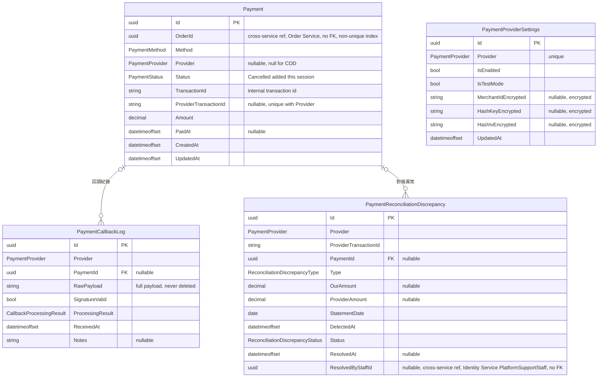

# 18 - Payment Service

## 異動紀錄
| 版本 | 日期 | 作者 | 說明 |
|---|---|---|---|
| v0.1 | 2026-09-08 | ordinarycas | 從 [06-ecommerce-platform-architecture.md](06-ecommerce-platform-architecture.md) 拆分獨立，回應「微服務拆成多個規格」需求 |
| v0.2 | 2026-09-08 | ordinarycas | `Payment` 補上 `ProviderTransactionId` 欄位與 `(Provider, ProviderTransactionId)` 唯一索引，把 §4「重複識別」從文字承諾落實成資料層保證；§2 補充說明 COD 不屬於本表的金流廠商，啟用與否唯一歸屬 [14-service-vendor.md](14-service-vendor.md) 的 `StoreSettings.CodPaymentEnabled`（見 [10-gap-analysis.md](10-gap-analysis.md) §10、§11） |
| v0.3 | 2026-09-10 | ordinarycas | §8 處理 3 項待決議：沙箱實測標記為需要外部資源（金流商測試環境憑證），退款串接與對帳排程補上完整設計（實際 API 串接仍待沙箱環境），回應「將待決議事項列出來實作」需求 |
| v0.4 | 2026-09-10 | ordinarycas | §8 沙箱實測項目補上取得憑證後的執行清單（4 個步驟），縮短拿到廠商測試環境後的等待時間，回應「繼續補完 9 項未解決」需求 |
| v0.5 | 2026-09-10 | ordinarycas | §3 `Payment.Status` 新增 `Cancelled`；§7 新增 `POST /internal/v1/payments/orders/{orderId}/cancel`——結帳 Saga 步驟 6 呼叫本服務若逾時/連線中斷，Order 無法區分「請求未送達」與「本服務已處理但回應遺失」，新端點供 Order 的補償鏈冪等收斂可能留下的孤兒付款紀錄；發現有 `Status=Success` 的紀錄時拒絕取消（409），需人工介入，詳見 [17-service-order.md](17-service-order.md) §4.1（稽核發現的分散式正確性缺口） |
| v0.6 | 2026-09-10 | ordinarycas | §3 新增 3.1 ERD（Mermaid），並核對 `ecommerce-services` 現行 Domain/Infrastructure 程式碼後補上 `PaymentReconciliationDiscrepancy` 實體——§8「對帳排程」設計早已定案且程式碼已建表，但 §3 資料模型表格先前漏列這張表，本輪補上；`PaymentProviderSettings`/`PaymentCallbackLog` 兩列補上完整欄位名稱。確認 `PaymentCallbackLog.PaymentId`／`PaymentReconciliationDiscrepancy.PaymentId` 皆為資料庫層級的選擇性外鍵（`OnDelete(Restrict)`） |
| v0.7 | 2026-09-10 | ordinarycas | §8 補充說明：核對 `ecommerce-services` 現行程式碼後發現「呼叫尚未串接沙箱環境的操作」（四家廠商的退款、LINE Pay 的建立導轉表單/回調驗章）先前會讓 `NotImplementedException` 原樣洩漏成未處理的 HTTP 500，賣家/呼叫端無法區分「操作真的失敗」與「系統故障」；已於程式碼修正為統一的乾淨 503 Problem Details（回應內容明確告知該操作尚未串接、須人工處理），回應「修這個 ungraceful crash」需求。此為錯誤處理層面的修正，不影響本節既有「實際串接仍待沙箱環境」的待決議狀態 |
| v0.8 | 2026-09-11 | ordinarycas | §7 修正嚴重授權缺口：核對 `ecommerce-services` 現行程式碼後發現 `mark-cod-received` 與退款端點（後者先前未列入本表，一併補上該列）的「認證」欄位雖寫「賣家」，程式碼卻只驗證呼叫者「是某個已驗證賣家」，從未驗證「是否為該筆訂單實際歸屬賣家」——任一已驗證賣家皆可對平台上任意其他賣家的訂單標記 COD 已收款或發起退款，影響真實收款狀態與金流。已於程式碼修正（VendorPaymentsController 比照 12-service-catalog.md §5 賣家商品端點既有的歸屬驗證模式：不符合時回應與「訂單不存在」相同的 404，不區分兩者以避免洩漏其他賣家的訂單存在與否）；因本服務 `Payment` 實體不持有 VendorId（見 §3），且一張訂單可能依商品所屬賣家拆成多筆 SubOrder（[17-service-order.md](17-service-order.md) §4 結帳 Saga），驗證需即時向 Order Service 查詢該訂單的 SubOrder 賣家清單（新增 `GET /internal/v1/orders/{orderId}/vendor-ids` 內部端點），查詢失敗時 fail closed 回應 503，不可誤放行 |

## 1. 職責

金流串接、回調處理、驗章、金流稽核紀錄。

## 2. 支援廠商

| 廠商 | 代碼 | 驗章方式 |
|---|---|---|
| 綠界科技 ECPay | `ECPay` | 欄位字典序 + HashKey/IV → URL encode → SHA256 (CheckMacValue) |
| 紅陽科技 SunPay | `SunPay` | 固定欄位順序串接 + HashKey → SHA256 (Checksum) |
| 藍新金流 NewebPay | `NewebPay` | AES-256-CBC 加密 TradeInfo + SHA256 驗章 (TradeSha) |
| LINE Pay | `LinePay` | REST 兩階段（Reserve/Confirm） |

每家廠商**各自獨立開關**：賣家後台逐家設定「啟用/測試模式/商店代號/HashKey/HashIV」，未啟用或設定不完整的廠商不會出現在前台結帳頁。

> **COD（貨到付款）不算本表的「廠商」**：COD 不需要商店代號/HashKey，也沒有 server-to-server 回調要驗章，性質上是純粹的營運/物流選擇，不是金流閘道整合。COD 是否開放給買家選擇，唯一歸屬 [14-service-vendor.md](14-service-vendor.md) 的 `StoreSettings.CodPaymentEnabled`，本服務**不**另外提供 COD 專屬的啟用開關，避免同一件事有兩個地方可以設定、卻沒有明訂誰優先。買家選擇 COD 結帳時，本服務僅建立 `Method=COD`、`Status=Pending` 的 `Payment` 紀錄（不產生導轉表單、不等待回調），實際收款由賣家出貨後透過 §7 新增的端點手動標記（見 `PUT /api/v1/vendor/payments/{orderId}/mark-cod-received`）。

## 3. 資料模型

| 實體 | 說明 |
|---|---|
| Payment | OrderId、Method（CreditCard/LinePay/ATM/CVS/COD）、Provider、Status（Pending/Success/Failed/Refunded/**Cancelled**——新增值，結帳 Saga 補償鏈透過 §7 新增的取消端點收斂孤兒付款紀錄時使用，語意是「我方在不確定金流商是否收到請求的情況下主動關閉」，與金流商明確回報失敗的 `Failed` 區分，見 [17-service-order.md](17-service-order.md) §4.1）、TransactionId、`ProviderTransactionId`（廠商端交易序號，如 ECPay 的 `TradeNo`；COD 無廠商回調，此欄位為 null）、Amount/PaidAt。`(Provider, ProviderTransactionId)` 唯一索引（`ProviderTransactionId` 非 null 時），作為回調去重的資料層保證。OrderId 僅一般索引、非唯一鍵——理論上一筆訂單可能有不只一筆 `Payment` |
| PaymentProviderSettings | 逐廠商的啟用狀態（IsEnabled/IsTestMode）與加密後的商店代號/金鑰（MerchantIdEncrypted/HashKeyEncrypted/HashIvEncrypted，見 §5）；`Provider` 唯一，每家廠商一筆設定 |
| PaymentCallbackLog | 所有回調（含驗章失敗者）都寫入，**永不刪除**，是對帳爭議的唯一證據；欄位含 PaymentId（比對不出對應訂單時為 null）、RawPayload（原始回調內容，不拆解儲存）、SignatureValid、ProcessingResult（見 §4 三道防線，含 §8 退款設計新增的 RefundAccepted/RefundFailed）、ReceivedAt、Notes |
| PaymentReconciliationDiscrepancy | §8「對帳排程」比對 `PaymentCallbackLog` 與金流商對帳明細後標記出的每筆落差：Provider、ProviderTransactionId、PaymentId（金流商有收款但本服務查無記錄時為 null）、Type（`ProviderHasPaymentWeDoNot`/`WeHavePaymentProviderDoesNot`）、OurAmount/ProviderAmount、StatementDate、Status（Open/Resolved）——比照 [17-service-order.md](17-service-order.md) §4.1 `SagaCompensationFailure` 的人工介入模式，不自動修正金流資料。本服務先前只在 §8 待決議文字內描述此表設計，程式碼已建表，§3 表格原漏列，本輪補上 |

### 3.1 ERD

> `PaymentCallbackLog.PaymentId`／`PaymentReconciliationDiscrepancy.PaymentId` 皆已對照 `PaymentCallbackLogConfiguration`／`PaymentReconciliationDiscrepancyConfiguration` 確認為資料庫層級外鍵（`HasOne<Payment>().WithMany().HasForeignKey(...).OnDelete(Restrict)`），且皆為可為 null 的選擇性關聯（驗章失敗或對帳時比對不出對應 `Payment` 皆可能發生），故以 `|o` 表示零或一。`PaymentProviderSettings` 與其餘三個實體之間沒有任何外鍵——逐廠商設定是獨立表，`Provider` 只是共同的列舉值，不是關聯鍵。`Payment.OrderId` 是跨服務參照 Order Service 的 `Order.Id`，只建一般索引、非唯一鍵（同一訂單理論上可能有不只一筆 `Payment`，如失敗重試），不建 FK。`PaymentReconciliationDiscrepancy.ResolvedByStaffId` 比照 [17-service-order.md](17-service-order.md) `SagaCompensationFailure.ResolvedByStaffId` 的既有模式，參照 Identity Service 的 `PlatformSupportStaff` 帳號，同樣不建 FK。

## 4. 回調安全機制（三道防線）

| 防線 | 說明 |
|---|---|
| 驗章 | 各廠商演算法驗證簽章，失敗一律不更新訂單 |
| 金額比對 | 回調金額與原訂單差距超過 1 元即拒絕，防止竄改 |
| 重複識別 | 依 `(Provider, ProviderTransactionId)` 唯一索引識別：寫入 `Payment.ProviderTransactionId` 前先查詢是否已存在相同組合且 `Status=Success`，是則直接回應成功、不重複記帳；唯一索引本身作為併發下的最後一道資料層防線（見 §3） |

## 5. 金鑰保管

HashKey/HashIV 以 Data Protection 加密後存入資料庫，後台不回傳明文；儲存時金鑰欄位留空 = 沿用既有金鑰，避免誤清空。**Data Protection 金鑰須持久化**（掛載磁碟區），容器重建若金鑰未持久化會導致既有密文無法解密。

## 6. 爸芭樂案例

生鮮商品建議優先開啟信用卡與 LINE Pay（縮短付款到出貨的等待時間，降低生鮮腐損風險），COD（貨到付款）需評估退貨/拒收造成的生鮮報廢成本。

## 7. API 大綱

| Method & Path | 說明 | 認證 |
|---|---|---|
| `POST /internal/v1/payments/orders/{id}/redirect` | 結帳 Saga 內部呼叫：產生含驗章的表單欄位 | 內部（僅 Order Service） |
| `POST /internal/v1/payments/orders/{orderId}/cancel` | 結帳 Saga 補償鏈呼叫（[17-service-order.md](17-service-order.md) §4.1）：Order 若無法確認上一列端點的請求是否送達，呼叫本端點冪等收斂——找不到付款紀錄則無動作，`Pending` 紀錄轉 `Cancelled`（§3），已是其他終態則視為已處理；若已有 `Status=Success` 則回 409（金流商其實已收款，不可取消，需人工介入） | 內部（僅 Order Service） |
| `POST /api/v1/payments/callback/{provider}` | 金流商 server-to-server 回調 | 對外開放（簽章驗證） |
| `GET /api/v1/vendor/payment-settings` | 賣家查看/設定逐廠商啟用狀態 | 賣家 |
| `PUT /api/v1/vendor/payments/{orderId}/mark-cod-received` | 賣家標記 COD 訂單已當面收款（`Payment.Status` → `Success`） | 賣家，**僅限該訂單實際歸屬賣家**（見下方說明） |
| `POST /api/v1/vendor/payments/{orderId}/refund` | 賣家在後台對某筆訂單發起退款（§8 定案流程；v0.8 補上此前遺漏的路由列） | 賣家，**僅限該訂單實際歸屬賣家**（見下方說明） |
| `GET /internal/v1/payments/support/{orderId}/callback-log` | 供 `PlatformSupportStaff` 查看回調紀錄，排查金流異常 | 內部 + PlatformSupportStaff |

> **賣家歸屬驗證（v0.8 新增，2026-09-11 資安修正）**：上面兩個賣家端點的「賣家」認證，指的不只是「呼叫者是某個已驗證賣家」，還必須是「該筆訂單實際歸屬的賣家」——修正前程式碼只驗證前者，任一已驗證賣家皆可對平台上任意其他賣家的訂單標記 COD 已收款或發起退款。本服務的 `Payment` 實體本身不持有 `VendorId`（見 §3），且一張訂單可能依商品所屬賣家拆成多筆 `SubOrder`（[17-service-order.md](17-service-order.md) §4 結帳 Saga 步驟 5），因此歸屬驗證無法只靠本服務自己的資料回答，須即時呼叫 Order Service 新增的 `GET /internal/v1/orders/{orderId}/vendor-ids` 內部端點查詢該訂單的 SubOrder 賣家清單。不符合時回應與「訂單不存在」相同的 404（不區分兩者，避免洩漏其他賣家的訂單是否存在，比照 [12-service-catalog.md](12-service-catalog.md) §5 賣家商品端點既有的歸屬驗證模式）；查詢 Order Service 失敗時 fail closed 回應 503，不可誤放行。

版本控管與文件格式沿用 [09-api-specification.md](09-api-specification.md) 的通用規範。

## 8. 待決議事項
- [ ] **無法由本規格庫解決（需要外部資源）**：三家廠商的沙箱實測（驗章邏輯需單元測試涵蓋，但未對接真實測試環境）——需要向綠界/藍新等金流商申請商店測試環境憑證（MerchantID、HashKey/HashIV 等），這是要向廠商申請的帳號資源，不是規格或程式碼能單方面解決的事，維持開放。**申請到憑證後的執行清單（先備妥，縮短拿到憑證後的等待時間）**：
  1. 向綠界/藍新的商店後台申請測試環境（沙箱）帳號，取得 MerchantID/HashKey/HashIV。
  2. 憑證以環境變數注入（比照本平台既有的「機密不進版控」慣例，見 [26-project-structure.md](26-project-structure.md) §3.4），不寫進任何設定檔或程式碼。
  3. 依序驗證：建立付款導轉表單 → 完成一筆測試付款 → 驗證回調簽章正確解析 → 驗證 `PaymentCallbackLog` 正確記錄 → 驗證 `Payment.ProviderTransactionId` 唯一索引正確擋下重複回調 （既有設計，見上方 v0.2）→ 若廠商測試環境支援，驗證退款 API（見 §8 上一項已補齊的退款設計）。
  4. 三家廠商（若最終選定不只一家）需要各自重複上述流程，且需要記錄下**每家廠商實際的簽章演算法/編碼細節差異**（過去常見的坑：MD5 vs SHA256、URL encode 時機、參數排序規則），這些細節目前規格只寫了「驗章」這個抽象需求，沒有寫死任何一家的具體演算法，屆時應該回頭補進 §4 或新增子章節。
- [x] ~~退款金流串接：目前狀態機有 Refunded，但沒有實際呼叫金流商退款 API~~——**部分解決（設計已補齊，實作仍待沙箱環境）**：流程定案為「賣家在後台對某筆訂單發起退款 → Payment Service 檢查 `PaymentStatus=Paid` 才允許 → 呼叫金流商的退款 API（ECPay `AllPay.ECPayAPI` 的信用卡負向交易，或藍新對應端點）→ 成功則 `PaymentStatus` 轉 `Refunded`、寫入 `PaymentCallbackLog`，失敗則維持原狀態並回報賣家重試」。**仍待實作**：實際串接退款 API 需要真實的金流商串接文件與沙箱環境（見上一項待決議），本項設計本身不受此阻擋，先記錄下來避免又是一個只活在程式碼 TODO 裡的缺口。**2026-09-10 補充（錯誤處理層面，不等於「實際串接完成」）**：核對 `ecommerce-services` 現行程式碼發現，四家廠商的 `RefundAsync` 骨架階段皆以 `NotImplementedException` 明確標示「尚未串接」（不假裝呼叫成功），但賣家後台若真的對一筆已付款訂單按下退款，先前這個例外會原樣洩漏成未處理的 HTTP 500（無 Problem Details），賣家只會看到不明錯誤、無法判斷退款到底有沒有發生。已修正：`RefundPaymentHandler`／`CreatePaymentRedirectHandler`／`HandlePaymentCallbackHandler` 三處呼叫點統一攔截並轉譯為 `PaymentProviderOperationNotSupportedException`，賣家端點（`POST /api/v1/vendor/payments/{orderId}/refund`）與結帳 Saga 內部端點（`POST /internal/v1/payments/orders/{id}/redirect`）對應回應乾淨的 503 Problem Details（明確告知「退款/建立導轉表單功能尚未串接 {廠商} 正式 API，請洽系統管理員手動處理」），回調端點（`POST /api/v1/payments/callback/{provider}`）維持既有「一律回應 200」設計、內部分類為 `CallbackProcessingResult.Error` 並留痕於 `PaymentCallbackLog`；另加一層僅限本服務、僅攔 `NotImplementedException` 的全域防護網作最後防線。同一情境也涵蓋 LINE Pay 的 `CreateRedirectForm`/`VerifyCallback`（見 §2，LINE Pay 三個方法骨架階段皆為 `NotImplementedException`）。**仍待實作的部分不變**：本次修正只解決「呼叫時的錯誤處理」，不是「實際串接沙箱環境」，四家廠商的退款與 LINE Pay 的建立導轉表單/回調驗章實際 API 串接仍待上一項待決議的外部資源到位
- [x] ~~對帳排程：回調成功即標記 Paid，若當下資料庫寫入失敗，金流商已收款而系統未記錄，需補「對帳排程」主動向金流商查詢核對~~——**部分解決（設計已補齊，實作仍待沙箱環境）**：新增每日對帳背景排程（比照本規格庫已驗證過的背景 Worker 模式，見 [17-service-order.md](17-service-order.md) §4.1）：向各金流商查詢**前一天**的實際收款明細，逐筆比對 `PaymentCallbackLog`——(1) 金流商有收款但本服務無對應 `Paid` 記錄：標記為對帳異常，通知 `PlatformSupportStaff` 人工核對（比照 [17-service-order.md](17-service-order.md) §4.1 的人工介入模式，不自動修正金流資料）；(2) 本服務標記 `Paid` 但金流商查無此筆：同樣標記異常。**仍待實作**：金流商查詢 API 的實際串接同樣需要沙箱環境（見第一項待決議），設計本身已可作為之後實作的依據
