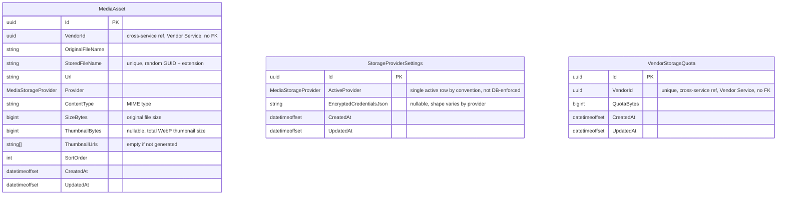

# 19 - Media Service

## 異動紀錄
| 版本 | 日期 | 作者 | 說明 |
|---|---|---|---|
| v0.1 | 2026-09-08 | ordinarycas | 從 [06-ecommerce-platform-architecture.md](06-ecommerce-platform-architecture.md) 拆分獨立，回應「微服務拆成多個規格」需求 |
| v0.2 | 2026-09-08 | ordinarycas | `MediaAsset` 補上 `VendorId` 欄位——先前沒有歸屬欄位，無法對照 `VendorStorageQuota` 算出「這個賣家用了多少配額」（見 [10-gap-analysis.md](10-gap-analysis.md) §10） |
| v0.3 | 2026-09-10 | ordinarycas | §7 解決 2 項待決議：影片縮圖補上 ffmpeg 技術設計（尚未實作）、CDN 加速定案現階段不需要，回應「將待決議事項列出來實作」需求 |
| v0.4 | 2026-09-10 | ordinarycas | §3 新增 3.1 ERD（Mermaid），並核對 `ecommerce-services` 現行 Domain/Infrastructure 程式碼後補上表格原先遺漏的欄位——`MediaAsset.OriginalFileName`/`StoredFileName`/`ContentType`/`SizeBytes`/`ThumbnailUrls`（`ThumbnailUrls` 為骨架階段依 §4 縮圖需求新增，規格表格原未列出）；確認 `MediaAsset`/`StorageProviderSettings`/`VendorStorageQuota` 三者之間沒有任何資料庫層級外鍵，ERD 依此如實不畫關聯線 |
| v0.5 | 2026-09-10 | ordinarycas | §6 新增 `POST /internal/v1/media/images/batch` 批次圖片查詢端點，`ecommerce-services` 本輪修正 Catalog WooCommerce 匯出工作的 N+1 內部呼叫問題（見 [12-service-catalog.md](12-service-catalog.md) §5）時發現並記錄：`MediaAsset` 目前沒有任何關聯到 Product 的欄位，WooCommerce 匯出的圖片網址欄位因此從骨架階段至今實際上從未真正輸出過資料，這是與本次批次化修正無關、更早就存在的獨立缺口，見 [10-gap-analysis.md](10-gap-analysis.md) 新增項目 |

## 1. 職責

檔案上傳、儲存後端切換、縮圖產生、賣家上傳配額。

## 2. 支援的儲存後端

| 方式 | 適用情境 | 影片 | 注意事項 |
|---|---|---|---|
| 本機磁碟 | 單機部署（符合本平台單一 VPS 拓樸） | ✓ | 多副本部署時各副本磁碟不共用，本平台單一 VPS 拓樸下無此疑慮 |
| FTP / FTPS | 客戶已有虛擬主機或自架伺服器 | ✓ | 需另有 Web 伺服器對應到上傳目錄 |
| S3 相容物件儲存 | 正式營運建議方案，相容 AWS S3 / MinIO / R2 / B2 | ✓ | 需搭配 Data Protection 金鑰持久化，避免容器重建後憑證失效 |
| Imgur | 客戶沒有儲存空間、想最快上線 | ✗ | 只支援圖片；免費額度有限；檔案存第三方，Imgur 有權移除內容，不建議正式營運長期依賴 |

**一次只啟用一種**，切換儲存方式不會自動搬移既有檔案，需個別執行搬移工具。

## 3. 資料模型

| 實體 | 說明 |
|---|---|
| MediaAsset | `VendorId`（歸屬賣家，用於配額計算）、OriginalFileName/StoredFileName（原始檔名／實際隨機檔名，見 §4）、Url、Provider、ContentType（MIME type，供 §4 格式白名單比對）、SizeBytes（原始檔案大小，配額用量加總來源）、ThumbnailBytes、ThumbnailUrls（各尺寸縮圖網址，縮圖產生失敗時為空清單）、SortOrder |
| StorageProviderSettings | 目前啟用的儲存後端（ActiveProvider）與其憑證（EncryptedCredentialsJson，加密存放）——骨架階段以單一設定列建模（整個部署僅一列生效中設定），非逐 Provider 各存一列 |
| VendorStorageQuota | 逐賣家可覆寫的上傳配額（VendorId 唯一、QuotaBytes），全站有預設值（未落於本表，以應用層常數承載）；目前用量＝依 `VendorId` 加總該賣家所有 `MediaAsset` 的檔案大小 |

### 3.1 ERD

> 三個實體彼此之間沒有任何外鍵，已對照 `MediaAssetConfiguration`／`StorageProviderSettingsConfiguration`／`VendorStorageQuotaConfiguration` 確認——皆只設定自己的欄位與索引，沒有互相 `HasOne`/`HasForeignKey`。`MediaAsset.VendorId` 與 `VendorStorageQuota.VendorId` 只是在 Application 層依同一個 `VendorId` 做**查詢時加總**（配額用量計算，見上表），資料庫層級不存在關聯；兩者的 `VendorId` 皆是跨服務參照 Vendor Service 的商店 ID，不建 FK。`StorageProviderSettings` 是全站單列設定，與另外兩個實體完全無關聯。

## 4. 安全處理

| 項目 | 做法 |
|---|---|
| 檔名 | 一律改為隨機 GUID + 副檔名，避免路徑穿越與覆蓋既有檔案 |
| 格式白名單 | 圖片 JPEG/PNG/WebP/GIF/AVIF；影片 MP4/WebM/MOV |
| 大小上限 | 圖片 10MB、影片 200MB |
| 縮圖 | 產生多尺寸 WebP，降低列表頁頻寬 |

## 5. 爸芭樂案例

商品照片、產地照，芭樂新鮮度展示建議搭配多角度縮圖。

## 6. API 大綱

| Method & Path | 說明 | 認證 |
|---|---|---|
| `POST /api/v1/vendor/media` | 上傳檔案 | 賣家 |
| `DELETE /api/v1/vendor/media/{id}` | 刪除檔案（回收配額） | 賣家 |
| `GET /api/v1/vendor/media/quota` | 查詢目前配額用量 | 賣家 |
| `POST /internal/v1/media/thumbnail-jobs` | 縮圖背景 Worker 內部佇列 | 內部 |
| `POST /internal/v1/media/images/batch` | 批次查詢多筆商品的圖片網址（`productIds`，上限 500 筆），供 Catalog Service 的 WooCommerce 匯出工作使用，取代原本逐商品各別呼叫一次的 N+1 寫法，見 [12-service-catalog.md](12-service-catalog.md) §5。**已知缺口**：`MediaAsset`（見 §3/§3.1 ERD）目前沒有任何關聯到 Product 的欄位，本端點契約完整、已通過批次化，但在該欄位補齊前一律回傳「查無圖片」，與批次化之前的既有行為相同，不是本次新增的退步 | 內部 |

版本控管與文件格式沿用 [09-api-specification.md](09-api-specification.md) 的通用規範。

## 7. 待決議事項
- [x] ~~影片縮圖（需 ffmpeg，會增加映像檔體積與 CPU 需求）~~——**部分解決（設計已補齊，尚未實作）**：上傳影片時，於 Infrastructure 層呼叫系統安裝的 `ffmpeg`（`ffmpeg -i input.mp4 -ss 00:00:01 -vframes 1 thumbnail.jpg`，擷取第 1 秒畫面），產生的縮圖依既有圖片儲存流程處理（含 §4 的安全檢查）；Dockerfile 需在 runtime image 額外 `apt-get install ffmpeg`（目前 15 服務共用的 `mcr.microsoft.com/dotnet/aspnet:10.0` base image 不含 ffmpeg）。**仍待實作**：`ecommerce-services` 目前對任何檔案類型皆走同一套上傳流程（`VendorMediaController` 未區分圖片/影片），這是本規格庫目前唯一尚未動手實作的部分，記錄設計避免又成為只活在腦中的缺口
- [x] ~~CDN 加速是否需要~~——**已解決：現階段不需要**。理由：本平台鎖定單一 VPS、每客戶獨立部署、非高流量（見 [06-ecommerce-platform-architecture.md](06-ecommerce-platform-architecture.md)），CDN 主要解決的是「地理distributed 使用者」與「大流量」兩個問題，與現況（單一客戶、單一地區的台灣買家）不符；先以應用伺服器直接回應媒體檔案，待客戶流量或地理分布真的需要時再評估導入
