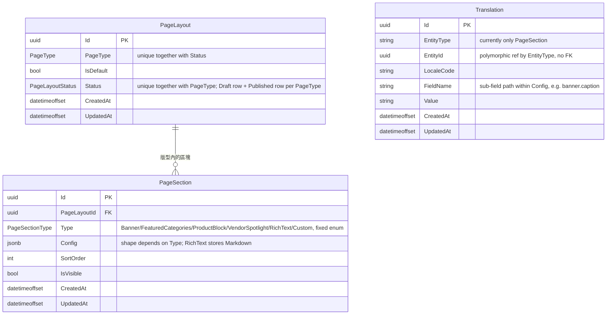

# 20 - CMS Service

## 異動紀錄
| 版本 | 日期 | 作者 | 說明 |
|---|---|---|---|
| v0.1 | 2026-09-08 | ordinarycas | 從 [06-ecommerce-platform-architecture.md](06-ecommerce-platform-architecture.md)、[09-api-specification.md](09-api-specification.md) 拆分獨立，回應「微服務拆成多個規格」需求 |
| v0.2 | 2026-09-08 | ordinarycas | `RichText` 區塊內容改為 Markdown 儲存，回應「後台內容編輯使用 Markdown」需求 |
| v0.3 | 2026-09-08 | ordinarycas | §2 補上 `Translation` 表，落實 [28-i18n.md](28-i18n.md) §3 列出但本文件尚未實作的多語系需求 |
| v0.4 | 2026-09-08 | ordinarycas | §4 新增賣家後台讀取目前草稿內容的 `GET` 端點——先前只有公開的「取得已發佈版型」，賣家編輯器無法載入尚未發佈的變更內容（見 [10-gap-analysis.md](10-gap-analysis.md) §10） |
| v0.5 | 2026-09-09 | ordinarycas | §5 標記 `StoreSettings` 歸屬待決議項已解決：定案歸屬 Vendor Service，回應「將待決議事項列出來實作」需求 |
| v0.6 | 2026-09-10 | ordinarycas | §5 Page Builder 實作方式待決議項已解決：定案簡化版（既有 PageSection.Type 固定列舉設計即為答案），回應「將待決議事項列出來實作」需求 |
| v0.7 | 2026-09-10 | ordinarycas | §2 新增 2.1 ERD（Mermaid），並核對 `ecommerce-services` 現行 Domain/Infrastructure 程式碼後補上 PageLayout 的 `(PageType, Status)` 唯一索引說明——每個 PageType 各有一列草稿＋一列已發佈，先前表格未提及這個「草稿/已發佈分列儲存」設計；確認 `PageLayout`—`PageSection` 為資料庫層級強制外鍵（級聯刪除），`Translation.EntityId` 為既有多型設計、未建 FK |
| v0.8 | 2026-09-10 | ordinarycas | §1、§4 補上「系統預設版型」fallback 的實際實作方式——`ecommerce-services` 稽核發現公開端點先前對從未發佈過內容的 `PageType` 一律回 404，違反本文件 §1 原有的「未自訂時套用系統預設版型」，已修正：改為程式碼內建常數（`SystemDefaultPageLayouts`），不是 seed 一列資料庫資料，理由與內容組成見 §4 新增說明 |

## 1. 職責

首頁/形象頁版型管理。每個客戶站台首頁由多個可插拔區塊組成，賣家可調整區塊順序、內容與顯示/隱藏；未自訂時套用系統預設版型（實作方式見 §4 說明——全新客戶部署上線第一天、賣家尚未發佈任何內容時，公開端點仍會回傳合理的預設內容，不會 404）。

## 2. 資料模型

| 實體 | 說明 |
|---|---|
| PageLayout | PageType（Home/AboutUs/Custom）、IsDefault、Status（Draft/Published）——`(PageType, Status)` 唯一，每個 PageType 各有一列草稿＋一列已發佈（兩筆各自獨立的資料列），供 §4 的公開／賣家草稿兩個讀取端點同時存在、互不影響 |
| PageSection | Type（Banner/FeaturedCategories/ProductBlock/VendorSpotlight/RichText/Custom）、Config（jsonb）、SortOrder、IsVisible |
| Translation | EntityType（"PageSection"）、EntityId、LocaleCode、FieldName（`Config` 內需要翻譯的子欄位路徑，如 Banner 文案、RichText 內容）、Value——結構沿用 [28-i18n.md](28-i18n.md) §3 的共用模式 |

> `Type = RichText` 的區塊，`Config` 內的內容欄位以 **Markdown** 格式儲存（賣家後台用 Markdown 編輯器輸入），前台渲染時轉成 HTML 顯示（沿用 [29-shared-service-conventions.md](29-shared-service-conventions.md) §2 的共用 Markdown 處理管線，不自行實作）。
>
> `Config` 是半結構化 jsonb，並非每個子欄位都需要翻譯——只有文字內容（Banner 文案、RichText 本文）透過 `Translation` 查詢，結構性欄位（圖片 URL、排序數字、顯示分類 Id）不分語言、所有語言共用同一份。

### 2.1 ERD

> `PageLayout`—`PageSection`（`PageLayoutConfiguration.HasMany(x => x.Sections).WithOne(x => x.PageLayout).HasForeignKey(x => x.PageLayoutId).OnDelete(Cascade)`）是本服務唯一的資料庫層級外鍵。`Translation.EntityId` 未對任何實體建立 `HasForeignKey`（`TranslationConfiguration` 只建 `(EntityType, EntityId, LocaleCode, FieldName)` 唯一索引），是 [28-i18n.md](28-i18n.md) §3 共用多語系表模式既有的多型設計（`EntityType` 決定 `EntityId` 指向哪個實體，目前只有 `"PageSection"` 一種），本圖故不畫關聯線。`PageSectionType` 的固定列舉值即為 §5 已定案的「簡化版 Page Builder」設計本身（不是自建拖拉式編輯器，見該節）。

## 3. 爸芭樂案例

品牌故事、產地介紹等形象內容區塊；首頁主打當季芭樂品種的 Banner 輪播。

## 4. API 大綱

| Method & Path | 說明 | 認證 |
|---|---|---|
| `GET /api/v1/cms/page-layouts/{pageType}` | 取得已發佈的頁面版型（前台 SSG 建置時呼叫） | 公開 |
| `GET /api/v1/vendor/cms/page-layouts/{pageType}` | 賣家後台讀取目前草稿內容（含尚未發佈的變更），供編輯器載入目前設定 | 賣家 |
| `PUT /api/v1/cms/page-layouts/{pageType}` | 更新版型內容（區塊順序、顯示/隱藏、Config） | 賣家 |
| `POST /api/v1/cms/page-layouts/{pageType}/publish` | 將草稿版型發佈 | 賣家 |
| `POST /internal/v1/cms/revalidate-webhook` | 版型變更時通知前台 Next.js 觸發 ISR 重新產生 | 內部（Gateway 或 CMS 自己觸發） |

> **系統預設版型 fallback（§1 呼應）**：`GET /api/v1/cms/page-layouts/{pageType}` 對任何合法 `PageType`（`Home`/`AboutUs`/`Custom`）皆不回 404。資料庫沒有對應 `Published` 列時（全新客戶部署、賣家尚未發佈過任何內容），改回傳**程式碼內建**的系統預設內容，`IsDefault` 誠實回報 `true`；404 僅保留給 `pageType` 路徑參數本身不是合法列舉值的情況。一旦賣家透過 `PUT` + `POST .../publish` 真的發佈過內容，對應 `PageType` 就會有真正的 `Published` 列，這個 fallback 便不再介入（`IsDefault` 回報 `false`）。
>
> 刻意選擇「程式碼常數」而非「seed 一列 `IsDefault = true` 的 `Published` 資料庫資料」：這個 404 是**正式環境**的缺口（全新部署上線第一天就會遇到，不是開發方便性缺口），需要在任何環境（含正式環境）都保證可用，不能依賴 Migration data seed 或種子資料列是否存在/完整——seed 列可能被刪除、資料庫損毀，或種子步驟尚未執行就已經有真實流量進來，這些都會讓 fallback 本身失效。程式碼常數不依賴資料庫狀態，任何時候都保證能回傳內容。
>
> 預設內容只使用本文件 §2 既有的固定 `PageSectionType`（不新增任何區塊型別）：`Home` 為 Banner（品牌／商店名稱佔位文案，CMS 服務本身不知道賣家實際店名）+ ProductBlock（無客製時以「最新上架」為排序依據）+ RichText（店家資訊佔位文字）；`AboutUs` 為 Banner + RichText；`Custom`（規格未進一步定義其用途）僅給一段最小可用的 RichText 說明文字。RichText 內容一樣流過 [29-shared-service-conventions.md](29-shared-service-conventions.md) §2 的共用 Markdown 消毒管線，不特例繞過。

版本控管與文件格式沿用 [09-api-specification.md](09-api-specification.md) 的通用規範。

## 5. 待決議事項
- [x] ~~Page Builder 實作方式：自建拖拉式編輯器，還是先做「後台表單設定區塊參數」的簡化版~~——**已解決：簡化版，非自建拖拉式編輯器**。這其實已經是本文件 §2 資料模型的既有設計所隱含的答案，只是先前沒有把這個開放問題明確關閉：`PageSection.Type` 是**固定列舉**（`Banner`/`FeaturedCategories`/`ProductBlock`/`VendorSpotlight`/`RichText`/`Custom`），賣家後台是從這些預先定義好的區塊「類型」挑選、排序、填寫各自的 `Config` 參數（比照多數輕量電商後台如 Shopify 佈景主題編輯器的模式），不是自由拖拉排版的畫布式編輯器——若要做到真正拖拉式，`PageSection` 的資料模型需要整個重新設計（版面座標、巢狀元件樹等），遠超過目前規模需要的複雜度
- [x] ~~`StoreSettings`（賣家自家功能開關）是否應歸屬本服務而非 Vendor Service~~——**已解決：定案歸屬 Vendor Service，不歸本服務**，理由與現況見 [14-service-vendor.md](14-service-vendor.md) §5
