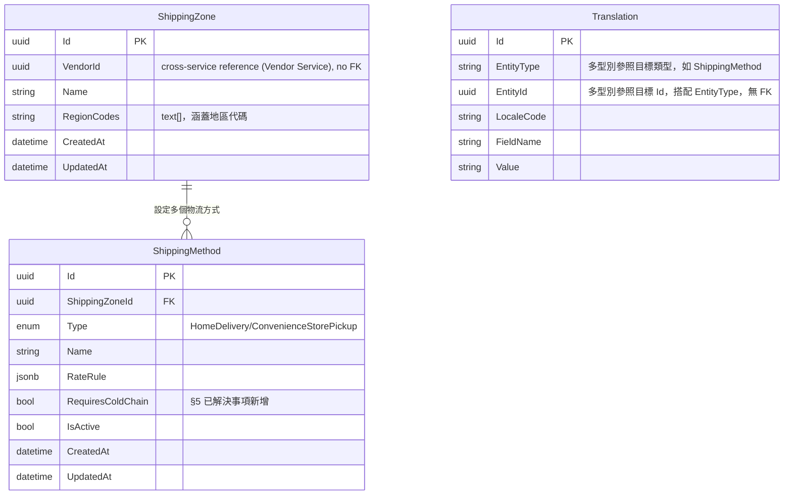

# 21 - Shipping Service

## 異動紀錄
| 版本 | 日期 | 作者 | 說明 |
|---|---|---|---|
| v0.1 | 2026-09-08 | ordinarycas | 從 [06-ecommerce-platform-architecture.md](06-ecommerce-platform-architecture.md) 拆分獨立，回應「微服務拆成多個規格」需求 |
| v0.2 | 2026-09-08 | ordinarycas | §2 補上 `Translation` 表，落實 [28-i18n.md](28-i18n.md) §3 列出但本文件尚未實作的多語系需求 |
| v0.3 | 2026-09-08 | ordinarycas | §4 API 大綱補齊運費區域/物流方式的查詢/編輯/刪除端點（原本只有建立），回應賣家後台運費規則管理需求（見 [08-vendor-admin-requirements.md](08-vendor-admin-requirements.md) §1、[10-gap-analysis.md](10-gap-analysis.md) §10） |
| v0.4 | 2026-09-10 | ordinarycas | §5 解決 2 項待決議：溫控物流視為一般宅配子選項（新增 RequiresColdChain 欄位）、超商取貨門市選擇標記為需要外部資源（電子地圖 API 官方合作），回應「將待決議事項列出來實作」需求 |
| v0.5 | 2026-09-10 | ordinarycas | §5 超商取貨門市選擇項目補上取得官方合作資格後的執行清單（4 個步驟，含資料模型擴充提醒），回應「繼續補完 9 項未解決」需求 |
| v0.6 | 2026-09-10 | ordinarycas | §2 新增 2.1 ER 圖（Mermaid erDiagram），並依 `ecommerce-services/services/shipping` 實作程式碼修正資料模型表格：`ShippingZone` 補上 `VendorId`／`RegionCodes`、`ShippingMethod` 補上 §5 已解決事項新增但先前未同步列出的 `RequiresColdChain` 與 `IsActive` 欄位 |
| v0.7 | 2026-09-12 | ordinarycas | §4 新增內部端點 `GET /internal/v1/shipping/methods/{id}/quote`（資安修正：Order Service 結帳 Saga 原本直接信任買家結帳請求本文的 `ShippingFee`，任何人都能竄改該欄位送出任意運費，本端點依 `ShippingMethodId` 回傳權威運費供核對；本服務第一個 `internal/v1/*` 端點，掛 `InternalOrderOnly` Policy），見 [17-service-order.md](17-service-order.md) v0.20 §4 新增的步驟 1.55 |

## 1. 職責

物流方式與運費試算。

## 2. 資料模型

| 實體 | 說明 |
|---|---|
| ShippingZone | VendorId（所屬賣家，跨服務參照 Vendor Service 的 Vendor.Id，無 DB 外鍵）、地區（如本島/離島）、RegionCodes（涵蓋地區代碼清單） |
| ShippingMethod | 宅配 / 超商取貨，RateRule（jsonb，如滿額免運、每件加價）、RequiresColdChain（布林，冷藏配送標記，§5 已解決事項新增的欄位，本表格先前未同步列出）、IsActive（是否啟用） |
| Translation | EntityType（"ShippingMethod"）、EntityId、LocaleCode、FieldName（顯示名稱）、Value——結構沿用 [28-i18n.md](28-i18n.md) §3 的共用模式 |

### 2.1 ER 圖

> 已對照 `ecommerce-services/services/shipping` 的 `Domain/Entities/*.cs` 與 `Infrastructure/Persistence/Configurations/*.cs` 實作逐欄核對，並修正上方表格兩處落後於程式碼的欄位：(1) `ShippingZone.VendorId`——程式碼註解明載「規格文件的 §2 資料模型表格沒有逐欄列出，是依 §4 API 大綱反推的必要欄位」；(2) `ShippingMethod.RequiresColdChain`——§5 已解決事項描述了這個欄位的新增，但 §2 表格先前未同步補上。`Translation` 與 `ShippingMethod` 之間是 EntityType+EntityId 的多型別鬆散參照（沿用 [28-i18n.md](28-i18n.md) §3 的共用模式），非資料庫層級外鍵，ER 圖故意不畫關聯線。

## 3. 爸芭樂案例

常溫/冷藏宅配——生鮮水果通常需要溫控物流選項，一般超商取貨（常溫）可能不適用於容易碰傷的芭樂。

## 4. API 大綱

| Method & Path | 說明 | 認證 |
|---|---|---|
| `GET /api/v1/shipping/methods` | 結帳頁查詢可用物流方式與運費 | 公開 |
| `GET /api/v1/vendor/shipping/zones` | 賣家列出自己設定的運費區域與各區域下的物流方式 | 賣家 |
| `POST /api/v1/vendor/shipping/zones` | 賣家新增運費區域 | 賣家 |
| `PUT /api/v1/vendor/shipping/zones/{id}` | 編輯運費區域 | 賣家 |
| `DELETE /api/v1/vendor/shipping/zones/{id}` | 刪除運費區域（含底下的物流方式） | 賣家 |
| `POST /api/v1/vendor/shipping/zones/{zoneId}/methods` | 於指定區域新增物流方式（宅配/超商取貨）與 `RateRule` | 賣家 |
| `PUT /api/v1/vendor/shipping/methods/{id}` | 編輯物流方式的運費規則 | 賣家 |
| `DELETE /api/v1/vendor/shipping/methods/{id}` | 刪除物流方式 | 賣家 |
| `GET /internal/v1/shipping/methods/{id}/quote` | 依 `ShippingMethodId` + `orderAmount`（伺服器權威小計）+ `itemCount` 用既有 `RateRuleCalculator` 算出權威運費，供 Order Service 結帳 Saga 核對買家送來的 `ShippingFee`（v0.7 新增，見下方說明） | 內部（僅限 order-service） |

**`GET /internal/v1/shipping/methods/{id}/quote` 的設計理由（v0.7 資安修正新增）**：Order Service 結帳 Saga 原本直接信任買家結帳請求本文的 `ShippingFee`，完全沒有伺服器端驗證，任何人都能竄改該欄位送出任意（含 0 或負值）運費——與 [12-service-catalog.md](12-service-catalog.md) 的 `products/batch`（核對 Price/VendorId）同一類缺口。既有的 `GET /api/v1/shipping/methods` 是公開端點（未受服務身分 JWT 保護），與本平台「Order 呼叫其他服務一律走 `internal/v1/*` + 服務身分 JWT」的既有慣例（Catalog `products/batch`、Vendor `commission-rates/batch`）不符，故新增這個內部端點而非直接呼叫既有公開端點——本服務先前完全沒有任何 `internal/v1/*` 端點，這是第一個，掛 `InternalOrderOnly` Policy（僅信任 Order Service 的服務身分 JWT）。查無此 `ShippingMethodId`，或該物流方式已被賣家停用（`IsActive=false`），回 404，由 Order Service 轉譯為 `reason=shipping_method_not_found`；運費計算完全沿用既有 `RateRuleCalculator`，不另立一套規則。完整的呼叫時機、比對邏輯與拒絕條件見 [17-service-order.md](17-service-order.md) §4 步驟 1.55。**已知相鄰缺口**：本端點不驗證這個 `ShippingMethodId` 是否歸屬結帳品項所屬的賣家（Order 沒有地址/地區欄位可供反推），見該文件 §6 對應待決議項。

版本控管與文件格式沿用 [09-api-specification.md](09-api-specification.md) 的通用規範。

## 5. 待決議事項
- [x] ~~生鮮水果是否需要溫控物流的特殊處理邏輯，或視為一般宅配的子選項即可~~——**已解決：視為一般宅配的子選項，不建立獨立的溫控處理邏輯**。做法：`ShippingMethod` 新增 `RequiresColdChain`（布林）欄位，賣家設定運費方式時可標記某個宅配選項為「冷藏配送」，`RateRule`（既有的 jsonb 欄位）自行納入冷藏加價；前台顯示上以一般宅配選項呈現（如「黑貓宅急便－冷藏」），買家選擇時如同選一般宅配方式。不做的原因：溫控物流的「特殊處理邏輯」（如出貨時效限制、特殊包材追蹤）屬於賣家與物流商之間的實際履約細節，這個服務只負責收費規則與方式呈現，不涉入賣家怎麼真的把貨品保冷送達——這件事本來就是子選項的價格/名稱差異，不需要在資料模型或程式碼裡開一條特殊分支
- [ ] **無法由本規格庫解決（需要外部資源）**：超商取貨門市選擇（需串接電子地圖 API）——需要向 7-11／全家等超商申請官方物流 API 合作資格（通常需要正式簽約與串接文件，非公開自助申請），目前僅支援超商代碼付款（買家自行到店輸入代碼，不需要地圖選店），這是取代「地圖選店」的可行替代方案，維持現狀直到取得官方 API 合作資格。**取得合作資格後的執行清單**：
  1. 依超商官方文件申請 API 存取憑證（通常是特店代號 + API Key，各家超商格式不同）。
  2. 新增 `ShippingMethod` 的子選項（門市選擇），前台結帳頁改用地圖/門市搜尋元件取代目前的「輸入超商代碼」文字欄位。
  3. 選定門市後的門市代號需要傳遞給後續的出貨流程（賣家後台看得到買家選的門市），這牽涉`Order`/`SubOrder` 是否要新增門市代號欄位，屆時需要回頭確認 [17-service-order.md](17-service-order.md) §2 的資料模型是否要擴充。
  4. 7-11（ibon/超商交貨便）與全家（FamiPort）的門市查詢 API 格式不同，若兩家都要支援，前端的門市選擇元件需要能依賣家設定的物流商切換串接對象，不是單一介面打單一 API。
