# 22 - Analytics Service

## 異動紀錄
| 版本 | 日期 | 作者 | 說明 |
|---|---|---|---|
| v0.1 | 2026-09-08 | ordinarycas | 從 [06-ecommerce-platform-architecture.md](06-ecommerce-platform-architecture.md) 拆分獨立，回應「微服務拆成多個規格」需求 |
| v0.2 | 2026-09-08 | ordinarycas | 新增 §4：圖表函式庫確定用 TradingView Lightweight Charts，回應「圖表使用 tradingview lightweight-charts」需求 |
| v0.3 | 2026-09-08 | ordinarycas | §1 修正「訂閱事件」措辭——與 [06-ecommerce-platform-architecture.md](06-ecommerce-platform-architecture.md) §2「不引入訊息佇列」的決策矛盾，改為明確的定期輪詢/批次拉取，解決 [10-gap-analysis.md](10-gap-analysis.md) §11 已列的缺口 |
| v0.4 | 2026-09-09 | ordinarycas | §4 補上熱銷排行/付款分布的圖表函式庫選型：Chart.js（`react-chartjs-2`），與 Lightweight Charts 職責互補；§6 對應待決議項標記已解決 |
| v0.5 | 2026-09-10 | ordinarycas | §6 解決 2 項待決議：報表查詢效能定案即時彙總已投影資料即可、報表匯出補上 CSV 端點設計（尚未實作），回應「將待決議事項列出來實作」需求 |
| v0.6 | 2026-09-10 | ordinarycas | §2 新增 2.1 服務內部資料表與 ER 圖（Mermaid erDiagram）：依 `ecommerce-services/services/analytics` 實作程式碼補上原本完全未列出的 5 張投影/狀態表（`SalesDailySummary`/`PaymentMethodDistribution`/`TopProductRanking`/`DataSourceSyncState`/`AnalyticsExportJob`）——§2 原表格只列資料來源服務，未列本服務自己實際落地的資料表 |

## 1. 職責

報表/數據分析，唯讀服務。無自有寫入表，定期輪詢/批次拉取其他服務的 REST API 建置投影——本平台不引入訊息佇列（見 [06-ecommerce-platform-architecture.md](06-ecommerce-platform-architecture.md) §2），本服務不例外，不走事件訂閱/pub-sub 機制。

## 2. 資料來源

| 來源服務 | 用途 |
|---|---|
| Order Service | 銷售趨勢、GMV |
| Catalog Service | 熱銷商品排行 |
| Payment Service | 付款方式分布 |

### 2.1 服務內部資料表（投影）

上方表格描述的是資料「來源」（本服務從哪個服務拉資料），並非本服務自己 schema 內實際落地的資料表——本節補上後者，原文件版本並未列出：

| 實體 | 說明 |
|---|---|
| SalesDailySummary | 賣家 × 日彙總：GMV、訂單數、幣別、最近一次來源同步時間；供銷售趨勢/GMV 走勢使用（§4 TradingView Lightweight Charts，§5 `GET .../sales`） |
| PaymentMethodDistribution | 賣家 × 統計區間 × 付款方式彙總：交易筆數、總金額；供付款方式分布圖使用（§4 Chart.js）——骨架階段尚未串接對應 API 端點與 Controller |
| TopProductRanking | 賣家 × 統計區間 × 商品彙總：商品名稱快照、銷售數量、金額、名次；供熱銷商品排行使用（§4 Chart.js，§5 `GET .../top-products`） |
| DataSourceSyncState | 依來源服務（Order/Catalog/Payment）各一筆，記錄批次拉取游標與最近執行狀態，供增量拉取使用；非業務實體，是落實 §1「定期輪詢/批次拉取」架構所需的基礎設施狀態表，規格文件未明確定義過這張表 |
| AnalyticsExportJob | §6 已解決事項新增：CSV 報表匯出的背景工作紀錄（區間、格式、狀態機、簽章下載連結）；設計已補齊但尚未實作對應 API 端點（見 §6） |

#### 2.1.1 ER 圖

```mermaid
erDiagram
    SalesDailySummary {
        uuid Id PK
        uuid VendorId "cross-service reference (Vendor Service), no FK"
        date SummaryDate
        decimal GrossMerchandiseValue
        int OrderCount
        string Currency "預設 TWD"
        datetime SourceSyncedAt
        datetime CreatedAt
        datetime UpdatedAt
    }
    PaymentMethodDistribution {
        uuid Id PK
        uuid VendorId "cross-service reference (Vendor Service), no FK"
        date PeriodStart
        date PeriodEnd
        string PaymentMethod
        int TransactionCount
        decimal TotalAmount
        string Currency "預設 TWD"
        datetime SourceSyncedAt
        datetime CreatedAt
        datetime UpdatedAt
    }
    TopProductRanking {
        uuid Id PK
        uuid VendorId "cross-service reference (Vendor Service), no FK"
        uuid ProductId "cross-service reference (Catalog Service), no FK"
        string ProductName "反正規化快照"
        date PeriodStart
        date PeriodEnd
        int QuantitySold
        decimal RevenueAmount
        string Currency "預設 TWD"
        int Rank
        datetime SourceSyncedAt
        datetime CreatedAt
        datetime UpdatedAt
    }
    DataSourceSyncState {
        uuid Id PK
        enum SourceService "Order/Catalog/Payment"
        datetime LastSuccessfulSyncAt "nullable"
        string LastCursor "nullable"
        string LastRunStatus
        string LastErrorMessage "nullable"
        datetime CreatedAt
        datetime UpdatedAt
    }
    AnalyticsExportJob {
        uuid Id PK
        uuid VendorId "cross-service reference (Vendor Service), no FK"
        date FromDate
        date ToDate
        string Format "現階段固定 csv"
        enum Status "Queued/Processing/Done/Failed"
        datetime CreatedAt
        datetime UpdatedAt
        datetime CompletedAt "nullable"
        string FilePath "nullable"
        string DownloadUrl "nullable，簽章下載連結"
        datetime DownloadUrlExpiresAt "nullable"
        string ErrorMessage "nullable"
    }
```

> 已對照 `ecommerce-services/services/analytics` 的 `Domain/Entities/*.cs` 與 `Infrastructure/Persistence/Configurations/*.cs` 實作逐欄核對。5 張表彼此之間沒有資料庫層級外鍵（皆為獨立的批次拉取投影/狀態表，各自僅有唯一索引與查詢索引），故 ER 圖不畫任何關聯線。§1「無自有寫入表」一詞依程式碼註解澄清：指本服務不對外提供任何寫入 API、不接受其他服務或前端直接寫入業務資料，並非真的沒有資料庫寫入——上述 5 張表是本服務自己的批次工作寫入的內部投影快取，與「唯讀服務」的定位並不矛盾，§1 文字保留原樣不修改。

## 3. 爸芭樂案例

銷售趨勢、熱銷品種排行（如珍珠芭樂 vs 帝王芭樂銷量比較）。

用量統計（GMV、商品數等）留在本服務內供賣家自己檢視，**不會、也沒有機制回傳給拾夜科技**——這是 ShyeCMS 決策 D 的直接落實，見 [01-architecture.md](01-architecture.md)。

## 4. 前端圖表函式庫

時間序列類報表（銷售趨勢、GMV 走勢）採 **[TradingView Lightweight Charts](https://github.com/tradingview/lightweight-charts)**（Apache-2.0 授權，可商用）：體積小（約 45KB gzip）、效能佳，原生支援 Line/Area/Candlestick/Histogram 等時間序列圖表類型，直接對應銷售趨勢圖的需求。

**適用範圍的限制**：Lightweight Charts 是**時間序列/金融圖表**專用函式庫，**不適合**用來畫熱銷商品排行（類別型長條圖）或付款方式分布（圓餅圖）這類非時間軸資料，需另選一套通用圖表方案。

**熱銷排行/付款分布採 [Chart.js](https://www.chartjs.org/)（透過 [react-chartjs-2](https://react-chartjs-2.js.org/) 包裝）**：MIT 授權、生態成熟、原生支援 Bar/Pie/Doughnut 等類別型圖表，體積輕量（核心約 60KB gzip，可依實際用到的圖表類型 tree-shaking），與 Lightweight Charts 職責互補（一個管時間序列，一個管類別/比例型資料），不強求兩種圖表類型共用同一套函式庫。這兩種報表都只出現在**賣家後台**（Vite SPA，[08-vendor-admin-requirements.md](08-vendor-admin-requirements.md) §1「銷售數據」），純 CSR 情境不需考慮 SSR 相容性，`react-chartjs-2` 的 React 元件封裝可直接套用。

| 報表 | 圖表類型 | 函式庫 |
|---|---|---|
| 銷售趨勢、GMV 走勢 | Line/Area（時間序列） | TradingView Lightweight Charts |
| 熱銷商品排行 | 長條圖（類別排名） | Chart.js（`react-chartjs-2`） |
| 付款方式分布 | 圓餅/環圖 | Chart.js（`react-chartjs-2`） |

## 5. API 大綱

| Method & Path | 說明 | 認證 |
|---|---|---|
| `GET /api/v1/vendor/analytics/sales` | 銷售摘要/趨勢（時間序列，供 Lightweight Charts 使用） | 賣家 |
| `GET /api/v1/vendor/analytics/top-products` | 熱銷商品排行 | 賣家 |

版本控管與文件格式沿用 [09-api-specification.md](09-api-specification.md) 的通用規範。

## 6. 待決議事項
- [x] ~~報表查詢效能：直接對交易表即時彙總，資料量成長後需評估預先彙總表或物化檢視~~——**已解決：現階段對已拉取的投影資料即時彙總即可，不另建物化檢視**。理由：本服務的資料來源本來就是「定期輪詢/批次拉取其他服務資料、建置自己的投影」（見 §1），不是對 Order/Payment 等服務的原始交易表直接下即時查詢——投影資料本身規模已受限於拉取頻率與單一客戶的實際訂單量（非高流量部署，見 [06-ecommerce-platform-architecture.md](06-ecommerce-platform-architecture.md)），對這個已經縮小過的投影資料做即時彙總，效能疑慮不大。若未來特定報表查詢真的量測到效能問題，再針對那個查詢加物化檢視，不需要現在對全部報表預先假設都需要
- [x] ~~報表匯出（CSV/Excel）供會計對帳~~——**部分解決（設計已補齊，尚未實作）**：新增 `GET /api/v1/vendor/analytics/export?format=csv&from=...&to=...` 端點，沿用本平台既有的 CSV 匯出模式（比照 [08-vendor-admin-requirements.md](08-vendor-admin-requirements.md) §5.5 WooCommerce 匯出的背景 Worker + 下載連結模式，非同步產生大檔案、避免請求逾時），欄位涵蓋日期/GMV/訂單數/付款方式分布，供會計比對；Excel（`.xlsx`）格式優先度低於 CSV（CSV 已可被 Excel 開啟，多數會計對帳流程用 CSV 即足夠），暫不特別實作 `.xlsx` 格式。**仍待實作**：`ecommerce-services` 目前 Analytics Service 僅有唯讀查詢端點，尚未加上匯出端點，記錄設計避免又成為只活在腦中的缺口
- [x] ~~熱銷排行/付款分布的圖表函式庫選型（見 §4，Lightweight Charts 不適用）~~——**已解決**：採 Chart.js（`react-chartjs-2`），見 §4
