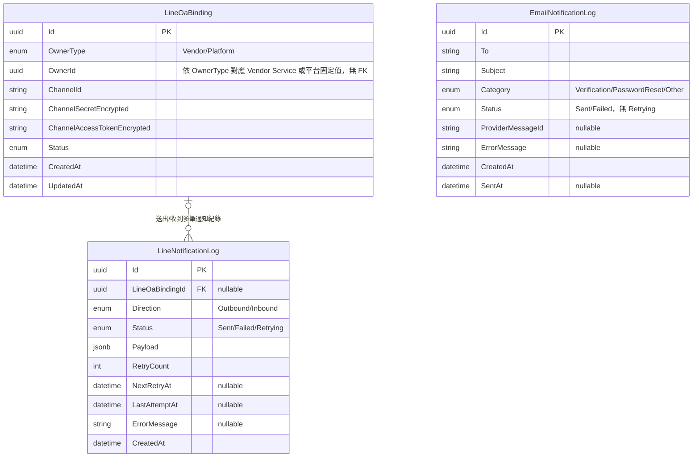

# 23 - Notification Service

## 異動紀錄
| 版本 | 日期 | 作者 | 說明 |
|---|---|---|---|
| v0.1 | 2026-09-08 | ordinarycas | 從 [06-ecommerce-platform-architecture.md](06-ecommerce-platform-architecture.md) 拆分獨立，回應「微服務拆成多個規格」需求 |
| v0.2 | 2026-09-08 | ordinarycas | §4 補上具體重試參數（先前只寫「僅記錄並重試」），解決 [10-gap-analysis.md](10-gap-analysis.md) §12 已列的缺口 |
| v0.3 | 2026-09-10 | ordinarycas | §7 解決 3 項待決議：LINE OA 定案站台統一一組、LINE API 費用查證官方公開資訊完成量級評估、Email 併入本服務(簡訊現階段不做)並解除 Identity 驗證信的既有卡點，回應「將待決議事項列出來實作」需求 |
| v0.4 | 2026-09-10 | ordinarycas | §6 修正 LINE OA 綁定端點描述以呼應 v0.3 的站台統一定案（原文字仍是賣家各自綁定的舊語意，未同步更新）；新增 PlatformSupportStaff 失敗推播診斷端點，回應 [08-vendor-admin-requirements.md](08-vendor-admin-requirements.md) §6「診斷端點逐服務盤點」發現本服務原本遺漏這塊 |
| v0.5 | 2026-09-10 | ordinarycas | §3 新增 `EmailNotificationLog` 實體列（§7 已解決事項「Email 併入本服務」的資料模型落地，原表格漏列）與 3.1 ER 圖（Mermaid erDiagram），依 `ecommerce-services/services/notification` 實作程式碼核對三個實體目前的實際欄位 |

## 1. 職責

LINE 官方帳號整合（LINE Messaging API）、通知派送。讓賣家不需一直登入後台，也能即時掌握訂單。

## 2. 技術方式

| 方向 | 說明 |
|---|---|
| Push（推播） | 新訂單建立、訂單狀態變更（已出貨/已完成）時，主動推播訊息給已綁定的 LINE 官方帳號 |
| Webhook（接收） | LINE 平台將使用者傳送給官方帳號的訊息回呼到本服務，實作簡易指令（如「查訂單」「訂單 #12345」）查詢訂單狀態 |

## 3. 資料模型

| 實體 | 說明 |
|---|---|
| LineOaBinding | OwnerType（Vendor/Platform）、OwnerId、ChannelId、ChannelSecretEncrypted/ChannelAccessTokenEncrypted、Status |
| LineNotificationLog | Direction（Outbound/Inbound）、Status（Sent/Failed/Retrying）、Payload（訊息內容快照） |
| EmailNotificationLog | §7 已解決事項新增（Email 併入本服務），原表格未列出：To（收件人）、Subject、Category（Verification/PasswordReset/Other）、Status（Sent/Failed，無 Retrying——Email 走交易型 API，沒有背景重試排程）、ProviderMessageId（供應商回傳的訊息 Id，可為 null）、ErrorMessage（可為 null） |

### 3.1 ER 圖

> 已對照 `ecommerce-services/services/notification` 的 `Domain/Entities/*.cs` 與 `Infrastructure/Persistence/Configurations/*.cs` 實作逐欄核對。`LineNotificationLog.LineOaBindingId` 為可為 null 的內部外鍵（Webhook 收到訊息但尚無法對應到任何已知綁定時可為 null，刪除綁定時設為 null，見 `LineOaBindingConfiguration` 的 `OnDelete(SetNull)`），故畫為零或一對零或多的關聯線；`EmailNotificationLog` 與 `LineOaBinding`/`LineNotificationLog` 之間沒有任何外鍵或共用鍵，是完全獨立的資料表（Email 走 §7 已解決事項的交易型 API 供應商，不經 LINE OA 綁定），ER 圖故意不畫關聯線。`EmailNotificationLog` 為本次新增，原 §3 表格未列出。

## 4. 容錯與安全

- LINE API 呼叫失敗（逾時/額度限制）僅記錄並重試，**不可影響訂單本身的建立與核心流程**（容錯隔離原則）。
- **重試參數**：採指數退避，重試間隔 1 秒 → 5 秒 → 30 秒 → 2 分鐘，最多重試 **4 次**（含首次共 5 次嘗試）；全部失敗後 `LineNotificationLog.Status = Failed`，不再自動重試，僅留紀錄供賣家/`PlatformSupportStaff` 查看（訂單本身不受影響，買家/賣家可在後台自行查看訂單狀態，LINE 推播只是加值提醒）。
- Channel Secret / Channel Access Token 需加密儲存，Webhook 需驗證 LINE 簽章（`X-Line-Signature`）避免偽造請求。

## 5. 爸芭樂案例

新訂單/出貨時推播到爸芭樂綁定的 LINE 官方帳號。

## 6. API 大綱

| Method & Path | 說明 | 認證 |
|---|---|---|
| `POST /api/v1/vendor/line-oa/bind` | 綁定站台唯一一組 LINE 官方帳號（§7 已定案站台統一，非賣家各自）——目前介面仍掛在賣家後台，因為現況也確實只有一個賣家，語意上這是**站台設定**而非賣家個人設定；若未來開放多賣家入駐，需要遷移到平台管理員專屬設定，不再對一般賣家開放 | 賣家（暫代，見上方說明） |
| `DELETE /api/v1/vendor/line-oa/bind` | 解除綁定 | 賣家（暫代，同上） |
| `POST /api/v1/line-oa/webhook` | LINE 平台 Webhook 接收端點 | 對外開放（簽章驗證） |
| `POST /internal/v1/notifications/order-events` | Order Service 非同步呼叫：新訂單/狀態變更通知 | 內部 |
| `GET /internal/v1/notifications/support/failed-log` | 供 `PlatformSupportStaff` 查詢重試 4 次仍失敗（`Status=Failed`）的 LINE 推播清單，用於排查推播異常 | 內部 + PlatformSupportStaff |

版本控管與文件格式沿用 [09-api-specification.md](09-api-specification.md) 的通用規範。

## 7. 待決議事項
- [x] ~~LINE 官方帳號綁定歸屬：賣家各自綁定一組，或整個站台統一一組~~——**已解決：整個站台統一一組**。理由：本平台每個客戶部署本來就是「一個白牌客戶＝一個獨立站台」（見 [06-ecommerce-platform-architecture.md](06-ecommerce-platform-architecture.md) 部署拓樸），「爸芭樂」暫定單一賣家自營（[05-scope-and-open-items.md](05-scope-and-open-items.md) §2），站台與賣家目前是一對一——沒有「同一個站台裡多個賣家各自有品牌識別」的情境，賣家各自綁定 LINE OA 是多賣家行銷平台（如美妝聯合商城）才需要的設計。若未來真的開放多賣家入駐（見 [14-service-vendor.md](14-service-vendor.md) §5 同批標記延後決策的項目），屆時這項連同平台管理員角色一併重新評估
- [x] ~~LINE Messaging API 額度與費用評估（免費額度有上限）~~——**已解決（已查證 LINE 官方公開資訊，但地區確切金額建議上線前重新核對）**：LINE 官方帳號的訊息額度採分級方案——免費的「溝通方案」每月上限 200 則主動推播；「輕用量方案」每月 5,000 則免費；「標準方案」月費約新台幣數千元起可達 30,000 則且能額外加購。以「爸芭樂」這類單一賣家、單一客戶部署的訂單量估算（新訂單通知等場景，主動推播則數大致與訂單數同量級），多數情況落在輕用量方案的 5,000 則/月門檻內，成本可能是零；正式上線前應依該客戶實際預期訂單量向 [LINE Developers 官方定價頁](https://developers.line.biz/en/docs/messaging-api/pricing/) 核對台灣地區的確切費率（不同地區定價可能不同，且 2026-10-01 起 LY Corporation 公告將簡化為兩級費率結構，屆時應重新核對），本節提供的是方案結構與量級評估，不是逐客戶的最終報價
- [x] ~~Email/簡訊等其他通知管道是否併入本服務~~——**已解決：Email 併入本服務，簡訊現階段不做**。理由：(1) [11-service-identity.md](11-service-identity.md) §5.1 的信箱驗證信/密碼重設信已經在等這項決議才能真正寄出（見該文件「殘留缺口」說明），這是目前唯一實際被卡住的功能，優先解決；(2) 架構上併入本服務而非另立 Email Service，因為本服務已經是「站台對外通知」這個關注點的統一入口，另立服務只是把同一種職責拆成兩個地方維護；(3) 簡訊需要額外的簡訊閘道商（如三竹簡訊）合約與費用，且目前沒有任何文件描述簡訊通知的實際使用情境（LINE 官方帳號已涵蓋主動推播需求），比照本規格庫其餘「沒有實際需求就不做」的原則，簡訊現階段不做，若未來有實際情境（如買家沒有 LINE、無法收 Email）再評估。Email 供應商選型：建議採 Resend 或 AWS SES 之類的交易型 Email API（不是行銷/電子報服務），理由是本服務的信件都是交易型通知（驗證信、密碼重設信、訂單通知），不需要行銷郵件工具的名單管理/版型編輯等功能，交易型 API 的送達率與開發者體驗更適合，正式選型待實際申請帳號比價後定案
