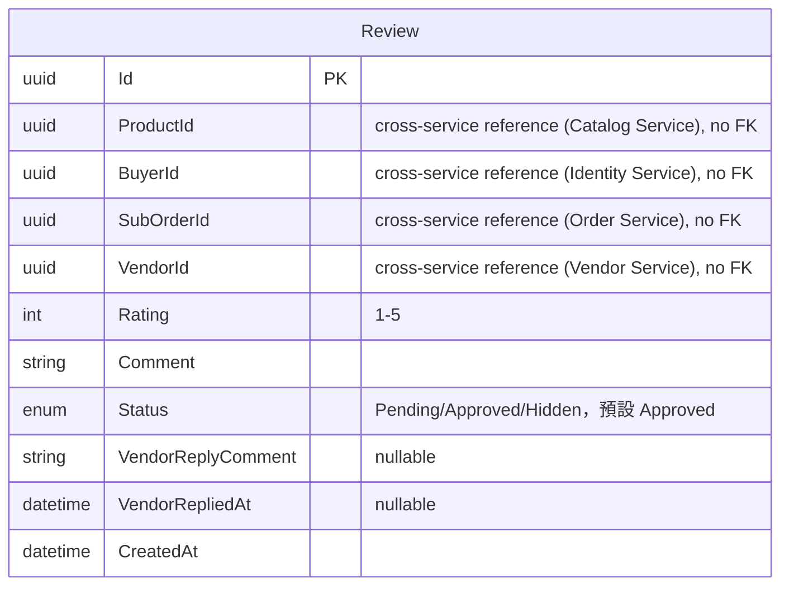

# 24 - Reviews Service

## 異動紀錄
| 版本 | 日期 | 作者 | 說明 |
|---|---|---|---|
| v0.1 | 2026-09-08 | ordinarycas | 從 [06-ecommerce-platform-architecture.md](06-ecommerce-platform-architecture.md) 拆分獨立，回應「微服務拆成多個規格」需求 |
| v0.2 | 2026-09-08 | ordinarycas | 補上賣家回覆評價機制（`Review` 新增回覆欄位、§4 新增管理/回覆端點），回應賣家後台評價管理需求（見 [08-vendor-admin-requirements.md](08-vendor-admin-requirements.md) §1、[10-gap-analysis.md](10-gap-analysis.md) §10） |
| v0.3 | 2026-09-09 | ordinarycas | §5 評價審核機制待決議項已解決：定案預設直接顯示（事後審核制），回應「將待決議事項列出來實作」需求 |
| v0.4 | 2026-09-10 | ordinarycas | §2 新增 2.1 ER 圖（Mermaid erDiagram）；依 `ecommerce-services/services/reviews` 實作程式碼補上 `Review` 的 `VendorId` 欄位（原表格未列，供 §4 賣家後台評價查詢範圍過濾使用）與 `Status` 預設值 `Approved` 的說明（呼應 §5 已定案的事後審核制） |

## 1. 職責

商品評價，僅限已完成訂單的買家可評價（防刷評機制基礎）。

## 2. 資料模型

| 實體 | 說明 |
|---|---|
| Review | ProductId/BuyerId/SubOrderId/VendorId（VendorId 原表格未列，供 §4 `GET /api/v1/vendor/reviews` 賣家依自己商店範圍過濾評價使用，因 Review 只存 ProductId、無法直接 join Catalog Service 判斷商品歸屬哪個賣家）、Rating（1-5）、Comment、Status（Pending/Approved/Hidden，預設 `Approved`——對應 §5 已定案的事後審核制，新建評價一律直接可見）、VendorReplyComment（可為 null）、VendorRepliedAt（可為 null） |

### 2.1 ER 圖

> 已對照 `ecommerce-services/services/reviews` 的 `Domain/Reviews/Review.cs` 與 `Infrastructure/Configurations/ReviewConfiguration.cs` 實作核對。本服務目前只有 `Review` 單一實體，schema 內沒有其他表可建立內部關聯，故 ER 圖只有一個實體區塊、沒有關聯線；`ProductId`/`BuyerId`/`SubOrderId`/`VendorId` 分屬 Catalog/Identity/Order/Vendor 四個不同服務的資料，依「跨服務不直接存取資料表」原則只建查詢索引，不建資料庫層級外鍵。`VendorId` 由 `AddVendorIdToReview` migration 補上（原 §2 表格未列），`Status` 的 EF Core 預設值已由程式碼確認為 `Approved`，與 §5 已定案的事後審核制一致。

## 3. 爸芭樂案例

芭樂口感/新鮮度評價，含買家已驗證購買標記；賣家可視需要回覆買家評價（如針對「口感偏澀」的評價說明採收批次差異）。

## 4. API 大綱

| Method & Path | 說明 | 認證 |
|---|---|---|
| `GET /api/v1/products/{id}/reviews` | 商品評價列表（含賣家回覆內容） | 公開 |
| `POST /api/v1/orders/{subOrderId}/review` | 買家對已完成訂單留下評價 | 需登入（本人） |
| `GET /api/v1/vendor/reviews` | 賣家查看自己商店所有評價（含待審核/已回覆狀態，供後台管理列表使用） | 賣家 |
| `POST /api/v1/vendor/reviews/{id}/reply` | 賣家回覆一則評價（寫入 `VendorReplyComment`） | 賣家 |

版本控管與文件格式沿用 [09-api-specification.md](09-api-specification.md) 的通用規範。

## 5. 待決議事項
- [x] ~~評價審核機制（是否需人工審核才顯示，或預設直接顯示）~~——**已解決：預設直接顯示（事後審核制），非事前人工審核**。理由：(1) 事前審核需要有人力常態盯著審核佇列，這個規模的平台（單一客戶、暫定單一賣家自營）沒有配置專職審核人力，事前審核會變成沒人處理、評價永遠卡著不顯示；(2) 賣家後台已有回覆評價機制（v0.2 新增），賣家可自行處理不當評價；(3) 若之後有濫用問題，可加賣家/`PlatformSupportStaff` 的下架權限（事後處理），比一開始就擋在事前審核更符合現有的營運能力。與 `StoreSettings.ReviewsVisible`（見 [14-service-vendor.md](14-service-vendor.md) §2）是不同層級的開關——那個控制的是「這家店要不要顯示評價區塊」，這裡定案的是「顯示的評價要不要先審核」
