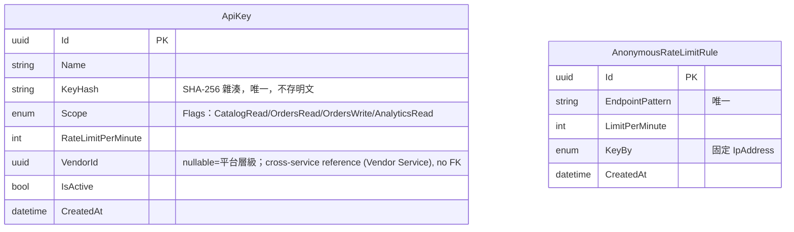

# 25 - Open API Gateway

## 異動紀錄
| 版本 | 日期 | 作者 | 說明 |
|---|---|---|---|
| v0.1 | 2026-09-08 | ordinarycas | 從 [06-ecommerce-platform-architecture.md](06-ecommerce-platform-architecture.md) 拆分獨立，回應「微服務拆成多個規格」需求 |
| v0.2 | 2026-09-08 | ordinarycas | 新增 §3.1 匿名端點速率限制，補上 [29-shared-service-conventions.md](29-shared-service-conventions.md) §4 已要求、但本文件先前只涵蓋持金鑰呼叫的限流缺口（見 [10-gap-analysis.md](10-gap-analysis.md) §11） |
| v0.3 | 2026-09-09 | ordinarycas | 回應「反向代理引擎選型（YARP vs 自建）已定案」指示：新增 §4.1 定案採用 `Yarp.ReverseProxy`（YARP）取代手刻 `HttpClient` 轉發的過渡實作（含定案理由與落地現況）；§7 補列該選型為待決議項並同步標記已解決——此選型先前只散見於實作，未曾正式列入待決議清單 |
| v0.4 | 2026-09-09 | ordinarycas | §4.1 訂正 Reviews 路由範例與 [24-service-reviews.md](24-service-reviews.md) §4 實際端點不一致的寫法（`/api/v1/orders/{id}/reviews` 誤植，應為 `/api/v1/orders/{subOrderId}/review`），[10-gap-analysis.md](10-gap-analysis.md) §14 第九輪複查發現的純格式錯誤，直接修正 |
| v0.5 | 2026-09-09 | ordinarycas | §7 解決 4 項待決議：速率限制採記憶體計數、Webhook 現階段不需要、不開放建立訂單的公開 API、聚合文件採單一 Swagger UI + 服務切換選單，回應「將待決議事項列出來實作」需求 |
| v0.6 | 2026-09-10 | ordinarycas | §5 新增 5.1 ER 圖（Mermaid erDiagram）；依 `ecommerce-services/services/gateway` 實作程式碼補上 `ApiKey` 的 `Name`／`IsActive` 欄位（原表格未列，分別供金鑰管理介面識別與撤銷狀態使用），核對 `AnonymousRateLimitRule` 欄位與程式碼一致 |
| v0.7 | 2026-09-10 | ordinarycas | 新增 §4.2：修正 [08-vendor-admin-requirements.md](08-vendor-admin-requirements.md) §6 列出的 5 個服務／6 個 `PlatformSupportStaff` 診斷端點先前完全不可達的問題（見 [10-gap-analysis.md](10-gap-analysis.md) 對應項目訂正說明）——路由表原本整個排除 `/internal/v1/*`，即使下游授權修好也沒有對外入口能到達；新增 6 條具名 `support-*` 路由，精確比對每個端點的完整路徑（不用萬用比對），是「`internal/v1/*` 不對外路由」原則唯一、範圍鎖死的例外；§2 補上第三種端點類型 |

## 1. 職責

所有對外流量的**唯一入口**：前台/賣家後台走的內部路由，以及供外部系統（ERP、POS、比價平台等）整合的公開 API（`/api/public/v1`），皆經過本服務。負責金鑰驗證、scope 權限控管、速率限制，並路由/聚合到內部各微服務。

## 2. 對內路由 vs 對外公開 API

| 對象 | 端點前綴 | 驗證方式 |
|---|---|---|
| 前台 / 賣家後台 | `/api/v1` | JWT（`Authorization: Bearer`） |
| 外部系統整合 | `/api/public/v1` | API 金鑰（`X-Api-Key`） |
| 拾夜科技支援人員（`PlatformSupportStaff`） | `/api/v1/support/...` | JWT（`Authorization: Bearer`），見 §4.2 |

`/api/v1/support/...` 與一般 `/api/v1` 前台/賣家後台路由同屬「使用者 JWT」這一類（Gateway 本身不做授權判斷，原樣轉發 `Authorization` Header，由下游服務驗證角色），不是獨立的第三種驗證機制——這裡拆成獨立一列只是讓路徑前綴一目了然，實際驗證邏輯見 §4.2。

## 3. 金鑰與權限

| 權限 (Scope) | 可存取 |
|---|---|
| `CatalogRead` | 查詢商品、分類 |
| `OrdersRead` | 查詢訂單（金鑰須綁定賣家） |
| `OrdersWrite` | 更新出貨資訊 |
| `AnalyticsRead` | 查詢報表 |

- 金鑰可綁定特定賣家，資料自動限縮於該賣家；**平台層級金鑰不開放批次拉取全站訂單**，避免消費者個資大量外流。
- 金鑰只在建立當下回傳一次明文，資料庫僅存 SHA-256 雜湊。
- 每把金鑰有獨立的速率上限設定（`RateLimitPerMinute`），**必須實際強制執行**，否則分級收費（若未來與 ShyeCMS 商業模式掛鉤）沒有意義。

### 3.1 匿名端點的速率限制（回應 29 §4）

[29-shared-service-conventions.md](29-shared-service-conventions.md) §4 明訂「未經認證的公開端點（登入、訪客結帳、訪客查單）也要有速率限制」，這類請求沒有 `X-Api-Key`，不能沿用 §3 的 `ApiKey.RateLimitPerMinute` 機制，需要 Gateway 額外**依來源 IP 位址**計數：

| 端點類型 | 端點範例 | 限制基準 | 建議上限（初估，待實測校正） |
|---|---|---|---|
| 登入 | `POST /api/v1/identity/login` | 來源 IP | 10 次/分鐘 |
| 訪客結帳 | `POST /api/v1/orders/checkout`（訪客） | 來源 IP | 20 次/分鐘 |
| 訪客查單 | `GET /api/v1/orders/lookup`（訂單編號 + Email） | 來源 IP | 20 次/分鐘 |

超過上限回應 `429 Too Many Requests`（沿用 [09-api-specification.md](09-api-specification.md) 的 Problem Details 格式）。這組規則是 Gateway 層級的固定設定（不像 `ApiKey` 是逐把金鑰動態調整），資料模型見 §5 新增的 `AnonymousRateLimitRule`。計數的實際儲存方式（記憶體 vs Redis）與 §3 持金鑰限流共用同一套機制，仍是 §7 既有待決議，本節只解決「規則涵蓋範圍」，不重複解決「用什麼存」。

## 4. 對內路由設計原則

Gateway 不新開一組「內部 API」給自己呼叫，而是直接路由到各微服務既有的端點（如 `/internal/v1/...` 或帶授權的 `/api/v1/vendor/...`），避免內部端點與對外契約不同步。公開、無需授權範圍的資料（如商品查詢）直接原始位元流轉發，不重複定義回應 DTO，避免型別漂移。

### 4.1 反向代理引擎：YARP（2026-09-09 定案）

路由/轉發引擎**選定 `Yarp.ReverseProxy`（YARP）**，取代先前手刻 `HttpClient` 轉發的過渡實作。定案理由：

1. 微軟官方維護，串流、hop-by-hop 標頭、HTTP/2 等轉發細節成熟，不需自行踩坑。
2. 路由表/叢集完全設定驅動（appsettings 的 `ReverseProxy` 區段），逐客戶部署可由環境變數覆寫下游位址，與 [06-ecommerce-platform-architecture.md](06-ecommerce-platform-architecture.md) §6 的部署模式相容。
3. 避免自建轉發隨聚合/重試/限流需求長成第二個框架——這些 YARP 都有現成擴充點。
4. 單一 VPS、單客戶流量規模下，自建的唯一優勢「省一個依賴」不敵維護成本。

落地現況：Gateway 已改用 YARP，路由表涵蓋全部 14 個領域服務的公開 `/api/v1/*` 前綴（Reviews 掛在 `/api/v1/products/{id}/reviews`、`/api/v1/orders/{subOrderId}/review` 的較特定路由，優先於 Catalog/Order 的字首路由——路徑訂正為與 [24-service-reviews.md](24-service-reviews.md) §4 實際端點一致，原文誤植為複數 `reviews` 且參數名寫成 `id`）；金鑰驗證（§3）、聚合、限流（§3.1）仍未實作，維持待辦。

### 4.2 PlatformSupportStaff 支援端點路由（2026-09-10 新增，修正先前完全不可達的缺陷）

[29-shared-service-conventions.md](29-shared-service-conventions.md) §3 訂的「`/internal/v1/...` 一律不對外路由」原則，原意是防止服務對服務專用的內部端點被外部直接打到。但 [08-vendor-admin-requirements.md](08-vendor-admin-requirements.md) §6 列出的 5 個服務、6 個 `PlatformSupportStaff` 診斷端點雖然路徑帶 `/internal/v1/...` 前綴，呼叫方實際上是**真人**拾夜科技支援人員（持使用者 JWT），不是服務對服務呼叫——這批端點被這條原則連帶一起擋在 Gateway 外面，導致 Gateway（唯一對外入口）完全沒有路徑能把請求轉發過去，是骨架階段留下、直到本輪才發現並修正的缺陷（詳見 [10-gap-analysis.md](10-gap-analysis.md) 對應項目的訂正說明）。

**做法**：新增 6 條具名路由，逐一精確比對每個端點的完整路徑（不用 `{**rest}` 這種會連帶吃進同一服務其他 internal 端點的萬用比對——如 Order 服務的 `internal/v1/orders/support/completed` 是 Analytics Service 的服務對服務批次拉取端點，不是 `PlatformSupportStaff` 診斷端點，不能被一併轉發），是「`internal/v1/*` 不對外路由」這條原則唯一、範圍鎖死的例外：

| 路由 | 對外路徑 | 轉發到（下游服務實際路徑） |
|---|---|---|
| `support-wms-stock-ledger` | `GET /api/v1/support/wms/stock-ledger/{productId}` | `internal/v1/wms/support/stock-ledger/{productId}` |
| `support-promotions-usage-log` | `GET /api/v1/support/promotions/{code}/usage-log` | `internal/v1/promotions/support/{code}/usage-log` |
| `support-notifications-failed-log` | `GET /api/v1/support/notifications/failed-log` | `internal/v1/notifications/support/failed-log` |
| `support-orders-trace` | `GET /api/v1/support/orders/{id}/trace` | `internal/v1/orders/support/{id}/trace` |
| `support-orders-compensation-failures` | `GET /api/v1/support/orders/compensation-failures` | `internal/v1/orders/support/compensation-failures` |
| `support-payments-callback-log` | `GET /api/v1/support/payments/{orderId}/callback-log` | `internal/v1/payments/support/{orderId}/callback-log` |

**授權模式**：掛在 `/api/v1/support/...`（不是 `/api/public/v1/...`），因此不經過 §3 的 `ApiKeyAuthenticationMiddleware`（該中介軟體只攔截 `/api/public/v1` 前綴）。Gateway 本身不對這批路由做授權判斷——比照既有 `/api/v1/vendor/...`（`VendorScoped`）路由的既有模式，原樣轉發 `Authorization` Header，由下游服務各自的 `PlatformSupportStaffOnly` Authorization Policy（`SuxoShop.Shared.Security`，驗證使用者 JWT 的 `Role == PlatformSupportStaff`）把關，Gateway 只負責「轉發到對的地方」，不重複做一次授權判斷。這與 Gateway 自己的 `POST /api/v1/gateway/api-keys`（金鑰簽發/撤銷，見 §5）用的 `GatewayAuthorizationPolicies.PlatformSupportStaffOnly` 是同名但各自獨立註冊的 Policy，語意一致（皆限定 `PlatformSupportStaff` 角色），互不影響。

**稽核**：5 個服務收到請求時皆輸出一行結構化 JSON log（`IsSystemVendorAccess`/`StaffUserId`/`StaffEmail`/`Endpoint`/`ResourceType`/`ResourceId`/`VendorId`/`AccessedAtUtc`），落實 [08](08-vendor-admin-requirements.md) §4.4 的稽核要求；Gateway 本身不重複記錄（避免同一次存取在兩個服務各留一筆、欄位還可能兜不起來）。

## 5. 資料模型

| 實體 | 說明 |
|---|---|
| ApiKey | Name（管理介面識別金鑰用途的名稱/備註，原表格未列）、Scope（Flags，一把金鑰可同時具備多個權限）、RateLimitPerMinute、VendorId（可為 null，代表平台層級）、KeyHash（SHA-256 雜湊，不存明文）、IsActive（是否已撤銷，原表格未列，程式碼已支援 `Revoke()` 動作） |
| AnonymousRateLimitRule（新增，見 §3.1） | EndpointPattern（如 `/api/v1/identity/login`）、LimitPerMinute、KeyBy=`IpAddress`（固定，不隨金鑰變化） |

### 5.1 ER 圖

> 已對照 `ecommerce-services/services/gateway` 的 `Domain/Entities/*.cs` 與 `Infrastructure/Persistence/Configurations/*.cs` 實作逐欄核對。`ApiKey` 與 `AnonymousRateLimitRule` 兩實體之間、以及各自與其他實體之間都沒有資料庫層級外鍵（`ApiKey.VendorId` 刻意不建跨服務外鍵，見程式碼註解「Vendor 實體屬於 Vendor Service 自己的 schema，微服務之間不能直接查表關聯」），ER 圖故意不畫任何關聯線。`Name`／`IsActive` 為程式碼補上但原 §5 表格未列出的欄位；金鑰的建立/撤銷端點（`POST /api/v1/gateway/api-keys/{id}/revoke` 等）目前僅存在於程式碼註解，本文件尚未有對應的 API 大綱小節，不在本次 ER 圖修訂範圍內。

## 6. API 文件

| 位置 | 內容 |
|---|---|
| `GET /docs` | 可讀的 HTML 文件頁 |
| `GET /openapi/v{n}.json` | 各服務聚合後的 OpenAPI 3 規格 |

## 7. 待決議事項
- [x] ~~速率限制的實際執行方式（記憶體計數 vs Redis 分散式計數）~~——**已解決：記憶體計數**。理由：本平台鎖定「單一 VPS、每客戶獨立部署」（[06-ecommerce-platform-architecture.md](06-ecommerce-platform-architecture.md)），Gateway 每個客戶環境只有單一執行個體，不存在多執行個體間需要共享計數的場景；Redis 分散式計數是為水平擴展設計的方案，會多引入一個 [29-shared-service-conventions.md](29-shared-service-conventions.md) 刻意排除的額外基礎設施依賴（本平台整體不引入訊息佇列/分散式快取，同樣的理由）。若未來改成多執行個體水平擴展，需重新評估，屆時再改用 Redis
- [x] ~~是否需要 Webhook 主動推播（訂單成立時通知外部系統），目前僅支援輪詢~~——**已解決（現階段不需要）**：目前沒有任何文件描述具體要接收 Webhook 的外部系統/場景（§1 列的 ERP/POS/比價平台是舉例，非已確認的整合對象），屬於沒有實際需求方的超前設計；先維持輪詢（`OrdersRead` scope 已可查詢），有實際外部系統提出整合需求時再評估要不要加 Webhook，不在此預先實作
- [x] ~~是否開放建立訂單的公開 API（目前只讀不寫，避免外部系統誤建訂單）~~——**已解決：不開放**。`/api/public/v1` 的 `OrdersWrite` scope 維持僅限「更新出貨資訊」，不新增訂單建立能力——結帳本身是刻意設計給第一方 storefront 使用的流程（`POST /api/v1/orders/checkout`，走 `/api/v1` 而非 `/api/public/v1`，見 §2），交給較低信任等級的 API 金鑰持有者會繞過 storefront 端的庫存/價格一致性把關，維持現狀（唯讀＋出貨更新）就是定案，不是暫時性的保守選擇
- [x] ~~Gateway 聚合文件的實際呈現方式（單一 Swagger UI 選單切換服務，或每服務各自子網址）~~——**已解決：單一 Swagger UI + 服務切換選單**（`swagger-ui` 原生支援的多 `urls` 設定，下拉選單切換不同服務各自的 OpenAPI JSON），而非每服務各自子網址——單一入口對使用文件的人（拾夜科技工程團隊、未來的外部整合方）更直覺，不需要記 15 個不同網址；[09-api-specification.md](09-api-specification.md) §4 對應項目同步標記已解決
- [x] ~~反向代理引擎選型：路由/轉發是採用現成的 YARP，還是維持自建 `HttpClient` 轉發~~——**已解決（2026-09-09）**：定案採用 **`Yarp.ReverseProxy`（YARP）**，取代手刻 `HttpClient` 轉發的過渡實作，理由與落地現況見 §4.1；金鑰驗證/聚合/限流不在此決策範圍內，維持本清單既有待辦
