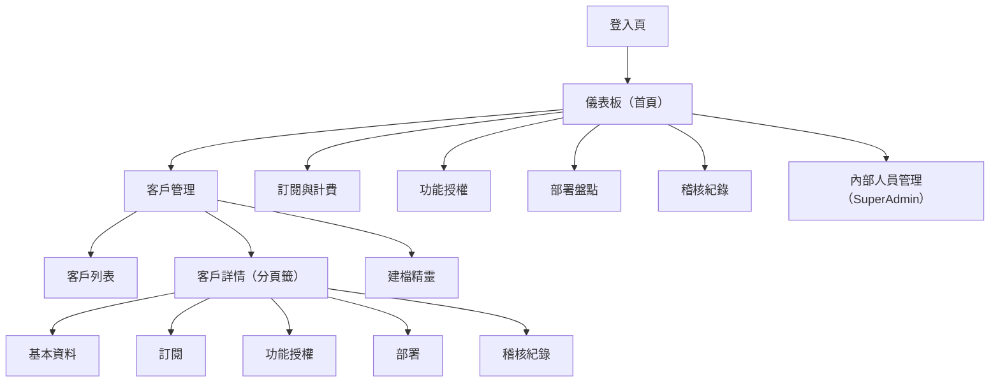

# 31 - ShyeCMS 前端需求 (ShyeCMS Frontend Requirements)

## 異動紀錄
| 版本 | 日期 | 作者 | 說明 |
|---|---|---|---|
| v0.1 | 2026-09-09 | ordinarycas | 初版建立，回應 [10-gap-analysis.md](10-gap-analysis.md) §6 標記的最高優先缺口——`shyecms-admin` 完全沒有前端頁面/操作流程規格，比照 [07-storefront-requirements.md](07-storefront-requirements.md)/[08-vendor-admin-requirements.md](08-vendor-admin-requirements.md) 的規格深度撰寫 |

> 本文件編號為 `31`（延續既有文件的附加慣例，見 [26-project-structure.md](26-project-structure.md) §7 已解決項）——內容上屬於 ShyeCMS（`00`–`05`），但因 `06`–`30` 已被電商平台文件佔用，比照本文件集一貫做法（新文件一律接在現有最大編號之後，不回頭重編既有檔案，避免牽動全部跨文件連結），故編號延續在 `30` 之後。[00-overview.md](00-overview.md) §6 的 ShyeCMS 文件索引已同步收錄本文件。

## 0. 定位聲明

本文件是 [02-data-model.md](02-data-model.md)（資料模型）與 [03-client-lifecycle.md](03-client-lifecycle.md)（生命週期流程）的 **UI/UX 落地規格**——那兩份文件回答「有哪些實體」「流程怎麼跑」，本文件回答「`shyecms-admin` 實際上有哪些頁面、拾夜科技員工在畫面上怎麼操作」。三份文件合起來才是 `shyecms-admin` 可以動工的完整依據。

**使用者範圍**：僅拾夜科技內部員工（`StaffUser`），依決策 B（[00-overview.md](00-overview.md) §3）客戶本身沒有 ShyeCMS 帳號，不在本文件討論範圍。**單一實例**，不是白牌多租戶產品——這點與電商平台前後台（`ecommerce-storefront`/`ecommerce-admin`，逐客戶各自部署一份）有本質差異，`shyecms-admin` 全公司只有一份部署，不需要考慮「同一份程式碼要適配不同客戶」的設計（比照 [26-project-structure.md](26-project-structure.md) §2 的既有定調）。

## 1. 使用者與登入

- 使用者只有 `StaffUser`（[02-data-model.md](02-data-model.md) §1），角色 `SalesOps`/`SupportOps`/`Finance`/`SuperAdmin`，帳號由 `SuperAdmin` 建立（無自助註冊）。
- **登入機制**：Email + 密碼 → JWT Bearer（Access Token 短效 + Refresh Token，比照電商平台 [11-service-identity.md](11-service-identity.md) 已驗證的既有模式），`shyecms-admin` 呼叫 `shyecms-api` 的 `/api/v1/auth/login` 取得 token 後存於記憶體（不落地 `localStorage`，降低 XSS 情境下 token 外洩風險）。
- **與電商平台零共用**：即使認證機制選型參考了電商平台的既有模式，`shyecms-api` 是**完全獨立簽發**的一套 JWT（自己的 `Jwt:SigningKey`），與任何客戶平台的 Identity Service **不共用金鑰、不共用帳號**——呼應決策 C 的零連接精神，ShyeCMS 自己的認證也不例外。
- **2FA**：登入畫面與 `StaffUser` 編輯頁預留 TOTP 欄位（QR Code 綁定＋驗證碼輸入），但**是否強制**沿用 [29-shared-service-conventions.md](29-shared-service-conventions.md) §5 既有待決議（該項同時涵蓋 `SuperAdmin` 與電商平台的 `PlatformSupportStaff`），本文件不重複決議，只確保介面有預留擴充空間，不因為未定案而擋住其餘頁面的規格撰寫。

## 2. 站台地圖

## 3. 頁面清單總覽

| 頁面 | 對應模組（`shyecms-admin/src/features/`） | 對應資料實體/文件 |
|---|---|---|
| 登入 | `auth/` | — |
| 儀表板 | 根路由，不獨立成 `features/` 子模組 | 彙整下列各模組的計數（見 §9） |
| 客戶列表/詳情/建檔精靈 | `clients/` | `Client`（[02](02-data-model.md) §1）、[03-client-lifecycle.md](03-client-lifecycle.md) |
| 訂閱方案管理、客戶訂閱調整 | `subscriptions/` | `SubscriptionPlan`、`ClientSubscription`（[02](02-data-model.md) §3） |
| 功能授權管理 | `entitlements/` | `FeatureFlag`、`ClientFeatureEntitlement`（[02](02-data-model.md) §4） |
| 部署盤點 | `deployments/` | `ClientDeployment`（[02](02-data-model.md) §2） |
| 稽核紀錄查詢 | `audit-log/` | `AuditLog`（[02](02-data-model.md) §1） |
| 內部人員管理 | `staff/`（**新增**，見 §10） | `StaffUser`（[02](02-data-model.md) §1） |

[26-project-structure.md](26-project-structure.md) §2.2 既有的 `features/` 樹狀圖已依此同步更新（見該文件本輪異動）。

## 4. 客戶管理（`clients/`）

### 4.1 客戶列表

- 依 `Client.Status`（`Prospect`/`Active`/`Suspended`/`Terminated`）篩選，關鍵字搜尋 `Name`/`ContactEmail`。
- 每列顯示：名稱、狀態（色塊標示）、目前方案（來自 `ClientSubscription`）、續約日（`RenewalAt`）。

### 4.2 客戶詳情頁（分頁籤）

單頁多頁籤呈現，避免員工需要在多個獨立頁面間來回查找同一客戶的完整狀態：

| 頁籤 | 內容 |
|---|---|
| 基本資料 | `Client` 欄位編輯、聯絡窗口 |
| 訂閱 | 見 §5 |
| 功能授權 | 見 §6 |
| 部署 | 見 §7 |
| 稽核紀錄 | 該客戶相關的 `AuditLog`，見 §8 |

### 4.3 建檔精靈（New Client Wizard）

對應 [03-client-lifecycle.md](03-client-lifecycle.md) §2：填寫基本資料 → 選擇 `SubscriptionPlan` → 送出後建立 `Client`（`Status=Prospect`）與 `ClientSubscription`（`Status=Active`）。**此步驟不建立 `ClientDeployment`**（沿用 03 §2 既有規則，部署要等環境實際開通才登記）。

### 4.4 狀態變更操作

`Client.Status` 的每一次變更（`Prospect→Active`、`Active→Suspended`、`Suspended→Active`、`→Terminated`）都對應 [03-client-lifecycle.md](03-client-lifecycle.md) 的一個階段。**介面設計上的硬性要求**：任何狀態變更的確認對話框，必須顯示與該階段一致的提醒文案（例如「此操作僅更新 ShyeCMS 內部紀錄，不會、也無法自動同步到客戶實際環境——功能開關/站台狀態需要維運人員另外手動處理」），不能讓操作人員誤以為按下按鈕就等同客戶環境同步生效（03 §3/§4/§5 已反覆強調的落差，是本文件必須在 UI 層級主動呈現、而非留給操作人員自行記憶的事）。

`Terminated` 屬不可逆操作，額外要求二次確認（輸入客戶名稱字串確認，比照常見高風險操作的 UI 慣例）。

## 5. 訂閱與計費（`subscriptions/`）

- **方案管理**：`SubscriptionPlan` CRUD（`Name`/`MonthlyFee`/`IncludedGmvPerMonth`/`OverageGmvRatePercent`/`ApiRateLimitPerMinute`/`StorageQuotaBytes`/`DefaultFeatureFlagKeys`）。
- **客戶訂閱調整**：於客戶詳情頁「訂閱」頁籤調整 `ClientSubscription.PlanId`/`RenewalAt`，變更方案時提示「`DefaultFeatureFlagKeys` 差異」（新方案多/少哪些預設功能，供人工核對是否要連動調整 `ClientFeatureEntitlement`，但不自動連動——是否自動連動不在本輪決定）。
- **`PastDue` 狀態**：僅呈現現況（列表可篩選 `Status=PastDue` 的客戶，供 Finance 角色主動追蹤），**不假設任何自動化 SOP**——[02-data-model.md](02-data-model.md) §6 已列「`ClientSubscription.Status = PastDue` 時的標準作業流程」為待決議，本文件不預先假設答案，避免介面設計綁死未定案的流程。

## 6. 功能授權（`entitlements/`）

- **`FeatureFlag` 清單管理**：全平台共用的功能定義清單（`Key`/`Description`），影響所有客戶，僅 `SuperAdmin` 可編輯（見 §11 權限矩陣）。
- **客戶功能授權調整**：於客戶詳情頁「功能授權」頁籤，列出該客戶的 `ClientFeatureEntitlement`，區分 `Source=FromPlan`（灰底，繼承自方案）與 `Source=Override`（提示已被人工覆寫），可勾選啟用/停用。
- **強制警語**：本頁籤最顯眼位置需固定顯示提示文案（如頁籤頂部常駐橫幅，不是一次性彈窗）：「這裡的設定是**合約紀錄**，不會被推送、同步或查詢到客戶平台。客戶環境要實際生效，需要維運人員依此紀錄手動修改該客戶環境的設定檔／環境變數（見 [01-architecture.md](01-architecture.md) §3）」——這是整份 ShyeCMS 規格集最容易被誤解為「技術強制」的一個頁面，UI 文案的責任是主動避免這個誤解，不能只依賴文件層級的說明。

## 7. 部署盤點（`deployments/`）

- `ClientDeployment` 列表/新增/編輯：`Environment`（Dev/Staging/Production）、`BaseDomain`、`CoreVersion`、`DeployedAt`、`LastCheckedInByStaffAt`。
- 明確標示「**非連線端點**，僅供拾夜科技內部掌握客戶現況的盤點紀錄」（如欄位旁的說明圖示），避免員工誤以為填了網域就能讓 ShyeCMS 主動連線該客戶環境做任何檢查（決策 C 的直接體現）。
- `LastCheckedInByStaffAt` 提供「標記已人工確認」按鈕（更新為目前時間），取代任何形式的自動健康檢查。

## 8. 稽核紀錄（`audit-log/`）

- 查詢 `AuditLog`，可依 `StaffUserId`/`ClientId`/`Action`/日期區間篩選。
- 每筆顯示 `DetailJson` 的可讀化呈現（變更前後值 diff），供事後追查「誰在什麼時候改了什麼」。
- 客戶詳情頁的「稽核紀錄」頁籤是本頁面依 `ClientId` 篩選後的子集，不是獨立的另一套查詢邏輯。

> 這裡稽核的是拾夜科技員工在 ShyeCMS 的操作，與客戶自己站台的 `PlatformSupportStaff` 稽核（[08-vendor-admin-requirements.md](08-vendor-admin-requirements.md) §4.4）是兩套完全獨立的紀錄，沿用 [02-data-model.md](02-data-model.md) §1 既有說明。

## 9. 儀表板（首頁）

登入後的預設頁面，最小可行版本，全部資料直接來自既有實體的計數/篩選查詢，**不新增任何後端彙總邏輯**：

| 區塊 | 內容 | 資料來源 |
|---|---|---|
| 客戶狀態分布 | 各 `Client.Status` 的客戶數量 | `Client` 計數 |
| 即將到期訂閱 | `ClientSubscription.RenewalAt` 未來 30 天內的清單 | `ClientSubscription` 篩選查詢 |
| `PastDue` 客戶 | `ClientSubscription.Status = PastDue` 的清單 | 同上 |
| 近期稽核事件 | 最新 10 筆 `AuditLog` | `AuditLog` 查詢 |

若未來需要更豐富的營運指標（如按月新增客戶趨勢圖），屬於功能性增強，列入 §12 待決議，本輪不展開。

## 10. 內部人員管理（`staff/`，新增模組）

- `StaffUser` 清單/新增/停用（`Email`/`Role`/`Status`），**僅 `SuperAdmin` 可存取**。
- 不提供自助修改密碼以外的自助功能（角色調整、帳號停用皆須 `SuperAdmin` 操作），降低內部權限誤調整的風險。
- [26-project-structure.md](26-project-structure.md) §2.2 原本的 `features/` 樹狀圖遺漏這個模組（先前是反推猜測），本文件確認後已於該文件補上。

## 11. 角色權限矩陣

| 功能 | SalesOps | SupportOps | Finance | SuperAdmin |
|---|---|---|---|---|
| 客戶建檔／基本資料編輯 | ✅ | ✅ | 唯讀 | ✅ |
| 客戶狀態變更（開通/暫停/恢復） | ✅ | ✅ | ❌ | ✅ |
| 客戶終止合作（Terminate） | ❌ | ❌ | ❌ | ✅（二次確認） |
| 訂閱方案管理（`SubscriptionPlan`） | 唯讀 | 唯讀 | ✅ | ✅ |
| 客戶訂閱調整（`ClientSubscription`） | ✅ | 唯讀 | ✅ | ✅ |
| `FeatureFlag` 清單管理 | 唯讀 | 唯讀 | 唯讀 | ✅ |
| 客戶功能授權調整（`ClientFeatureEntitlement`） | 唯讀 | ✅ | 唯讀 | ✅ |
| 部署盤點（`ClientDeployment`） | 唯讀 | ✅ | 唯讀 | ✅ |
| 稽核紀錄查詢 | ✅ | ✅ | ✅ | ✅ |
| 內部人員管理（`StaffUser`） | ❌ | ❌ | ❌ | ✅ |

此矩陣為本文件依角色定義（[02-data-model.md](02-data-model.md) §1 `StaffUser.Role`）推導出的**方向性建議**，非最終定案——實際權限框架（如是否要做成後端 Policy-based Authorization、粒度是否需要更細）留待實作階段確認，不阻塞本文件其餘頁面規格。

## 12. API 大綱（對照 `shyecms-api`）

`shyecms-api` 是單體（[00-overview.md](00-overview.md) 決策 F），**只有一個獨立的版本序號**，與電商平台 15 個服務各自版本化（[09-api-specification.md](09-api-specification.md)）是兩個互不相關的版本空間——沿用 `/api/v{n}/...` 的路徑慣例只是借用同一套風格，不代表兩者版本號會同步。

| Method & Path | 說明 |
|---|---|
| `POST /api/v1/auth/login` | StaffUser 登入，回傳 Access/Refresh Token |
| `GET /api/v1/clients` | 客戶列表，支援 `status`/關鍵字查詢參數 |
| `POST /api/v1/clients` | 建檔精靈送出 |
| `GET /api/v1/clients/{id}` | 客戶詳情（含關聯的訂閱/功能授權/部署摘要） |
| `PATCH /api/v1/clients/{id}/status` | 狀態變更（§4.4） |
| `GET/PUT /api/v1/subscription-plans` | 方案管理 |
| `PUT /api/v1/clients/{id}/subscription` | 客戶訂閱調整 |
| `GET/PUT /api/v1/feature-flags` | `FeatureFlag` 清單管理 |
| `GET/PUT /api/v1/clients/{id}/entitlements` | 客戶功能授權調整 |
| `GET/POST/PUT /api/v1/clients/{id}/deployments` | 部署盤點 |
| `GET /api/v1/audit-log` | 稽核紀錄查詢（支援 `staffUserId`/`clientId`/`action`/日期範圍） |
| `GET/POST/PATCH /api/v1/staff-users` | 內部人員管理（`SuperAdmin` 限定） |
| `GET /api/v1/dashboard/summary` | 儀表板彙總（§9 四個區塊） |

## 13. RWD / PWA

**明確排除**：`shyecms-admin` 是拾夜科技內部員工使用的桌面辦公工具，不做響應式設計、不做 PWA 安裝支援，沿用 [27-pwa-and-accessibility.md](27-pwa-and-accessibility.md) §4 既有的「ShyeCMS 自己的前端是否也要 RWD/PWA（暫定不需要）」——本文件確認採納該暫定判斷（桌面優先、無行動裝置使用情境），該處待決議可視為已由本文件呼應。無障礙（WCAG）規範同樣不適用（僅電商平台前台需要，見 [07-storefront-requirements.md](07-storefront-requirements.md) §6）。

## 14. 待決議事項
- [ ] §11 角色權限矩陣是方向性建議，實作時是否需要更細粒度（如「僅能操作自己名下的客戶」）尚未確認
- [ ] §1 高權限帳號 2FA 是否強制，沿用 [29-shared-service-conventions.md](29-shared-service-conventions.md) §5 既有待決議，本文件不重複決議
- [ ] §5 `PastDue` 狀態的標準作業流程仍未定案（[02-data-model.md](02-data-model.md) §6），本文件僅提供呈現介面，流程本身待該處決議後可能需要回頭調整頁面設計
- [ ] §9 儀表板是否需要更豐富的營運指標（如趨勢圖），本輪僅做最小可行版本
- [ ] 建檔精靈（§4.3）與 [03-client-lifecycle.md](03-client-lifecycle.md) §7「開通部署是否要自動化」仍是待決議，本文件的精靈流程假設全程人工，若未來決定自動化需回頭調整
